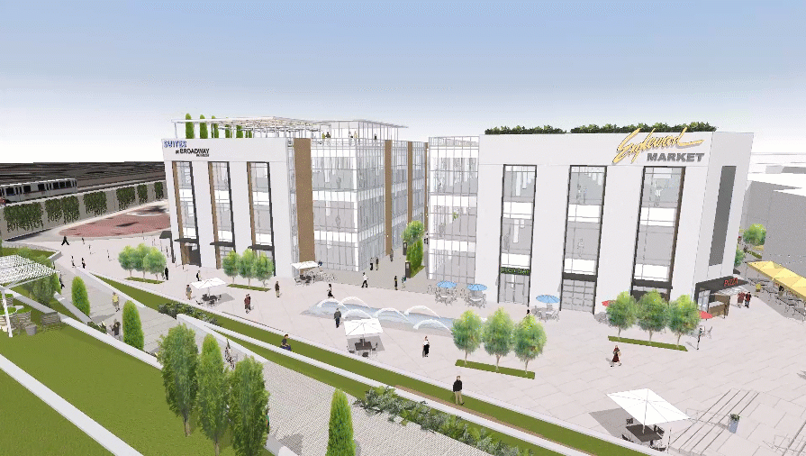

# Funktionen in FormIt

## Funktionen in FormIt

Erstellen Sie konzeptuelle Gebäudeentwürfe mit einem leistungsstarken integrierten Volumenkörper-Modellierungssystem, beeindruckenden Visualisierungsoptionen und nativer Dynamo-Integration, während Sie gleichzeitig einen BIM-Arbeitsablauf initiieren.

Verwenden Sie Autodesk® FormIt®, um Ihre Ideen sofort in Konzepten für Gebäudeentwürfe festzuhalten. Die präzise und einfache Volumenkörper-Modellierung unterstützt Sie bei der Organisation Ihrer Ideen in Gruppen und Layern. Mithilfe von realen Standortdaten, z. B. Satellitenbildern, können Sie Ihre Entwürfe mit Schatten, Solar- und Energieanalysen richtig ausrichten und analysieren. Übertragen Sie Ihre Vorentwürfe in zentrale Datenspeicher, um mit Autodesk® Revit®-Software oder anderen Anwendungen auf sie zuzugreifen und sie weiterzuentwickeln.

