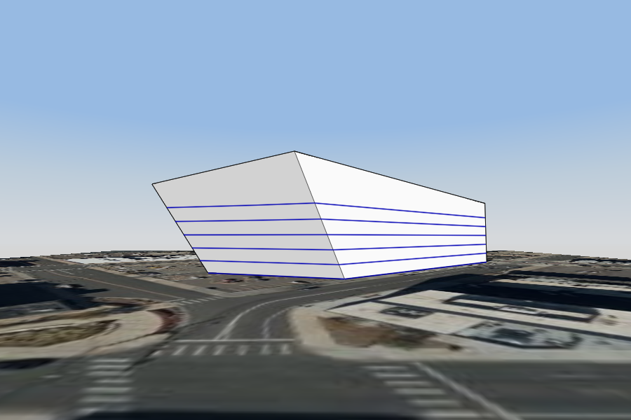

# Расчет инсоляции и энергопотребления

\

## Расчет энергопотребления в FormIt

Анализ энергоэффективности модели здания на ранних этапах процесса проектирования.

[Перейти к проектам Insight](https://gbs.autodesk.com/OneEnergy/Insight)

## Расчет энергопотребления с помощью Insight

Подписка на **FormIt Pro**, доступная в составе коллекции [AEC Collection](https://www.autodesk.com/collections/architecture-engineering-construction/overview), включает в себя возможность расчета энергопотребления с помощью **Insight**.

* Выполняйте расчет моделей на ранних стадиях проектирования с помощью модуля анализа Green Building Studio.
* Подключайтесь к панели управления для просмотра результатов анализа и сравнения вариантов проектирования.
* Настраивайте виджеты коэффициента расчета энергопотребления, такие как «Отношение окон к стенам», «Ориентация здания» и т. д.
* Сводите воедино все данные по энергопотреблению здания в формате числа, рассчитываемого как стоимость на единицу площади.
* Сохраняйте результаты расчета энергопотребления для последующего просмотра с клиентами и другими заинтересованными лицами.

## Новые возможности FormIt и Insight 

### **Повышение надежности Insight** 

* Теперь [FormIt 2021](https://formit.autodesk.com/blog/post/introducing-formit-2021) позволяет проверить модель на наличие типичных проблем с моделированием перед запуском Insight и устранить типичные ошибки Insight для повышения надежности работы.
* Кроме того, FormIt 2021 обеспечивает более надежное соединение между FormIt и Insight, что позволяет устранить многие известные ошибки и повысить процент успешных запусков.

## Начало работы 

### **Принцип работы** 

* Модуль расчета энергопотребления Insight позволяет выгрузить данные модели FormIt, а затем выполнить несколько сотен расчетов в облаке для определения различных показателей энергопотребления.
* Для анализа модели в модуле расчета энергопотребления используется Revit, поэтому, как и при отправке данных FormIt в Revit, необходимо [убедиться, что модель FormIt является непроницаемой и однородной](https://formit.autodesk.com/blog/post/repairing-solid-models).

### **Подготовка модели FormIt** 

* В Insight будет использоваться любая видимая геометрия из эскиза FormIt.
  * Убедитесь, что оболочка здания, которую требуется проанализировать, является единственной видимой геометрией.
  * Разместите вспомогательную геометрию, например элементы антуража, мебели и площадки, на отдельном [слое](../tool-library/layers.md) и отключите этот слой.
* Лучше всего для работы в Insight подходят простые, сплошные модели здания.
  * Убедитесь, что формообразующий элемент здания является [сплошным и непроницаемым](https://formit.autodesk.com/blog/post/repairing-solid-models).
  * Если в проекте здания уже имеются проемы для окон и дверей, рекомендуется создать новый формообразующий элемент без проемов специально для расчета энергопотребления, а более детализированную версию скрыть с помощью слоев.
* К простому формообразующему элементу требуется применить [уровни](../tool-library/levels-and-area.md).
* Для модели FormIt требуется задать [местоположение](../tool-library/setting-location.md).

### **Запуск расчета энергопотребления** 

* Найдите кнопку «Расчет энергопотребления» на панели инструментов.

* Щелкните «Создать расчет Insight», чтобы запустить процесс.
* Видимые данные модели выгружаются, и в облаке запускается несколько сотен процессов моделирования.
* По завершении в верхней части экрана появится сообщение, а меню обновится, указывая на то, что новый расчет Insight готов к просмотру.
  * Щелкните «Показать расчет Insight» для просмотра результатов расчета в веб-браузере.
  * Все выполненные расчеты Insight также можно найти на странице [Autodesk Insight](https://gbs.autodesk.com/OneEnergy/Insight).

## Устранение неполадок 

### **Распространенные ошибки** 

* «Невозможно создать проект Insight. Повторите попытку позже».
  * Войдите в систему через [пульт управления Green Building Studio](https://gbs.autodesk.com/GBS/Project), а затем перезапустите FormIt.
    * Если войти в систему не удается или отображается страница «Доступ запрещен», возможно, требуется [купить подписку на Green Building Studio](https://knowledge.autodesk.com/search-result/caas/CloudHelp/cloudhelp/ENU/BPA-Help/files/GUID-7FCFF904-F943-4020-BF7F-53AA7148673D-htm.html).
  * Убедитесь, что модель является [сплошной и непроницаемой](https://formit.autodesk.com/blog/post/repairing-solid-models).
  * Убедитесь в отсутствии проблем в работе служб FormIt с помощью [пульта управления состояниями Autodesk](https://health.autodesk.com/).
* Чтобы проверить, насколько успешно в Green Building Studio выполнялись расчеты энергопотребления по данному проекту, откройте [пульт управления Green Building Studio](https://gbs.autodesk.com/GBS/Project).
  * Последний проект должен отображаться в верхней части списка и содержать 248 выполненных расчетов.
  * Если проект содержит 0 расчетов, [напишите об этом на форумах FormIt](https://forums.autodesk.com/t5/formit-forum/bd-p/142), и мы предложим дополнительные меры для устранения проблемы.

### **Подробные журналы** 

* Веб-приложение FormIt позволяет получить дополнительные сведения при сбое расчета энергопотребления.
  * Перейдите в [веб-приложение FormIt](https://formit.autodesk.com/app).
  * Откройте модель, в которой возникли проблемы с расчетом энергопотребления.
  * Запустите расчет энергопотребления.
  * Откройте панель инструментов разработчика (нажмите клавишу F12 в Google Chrome или Firefox).
  * Перейдите на вкладку «Консоль».
  * Скопируйте текст ошибок или сделайте снимки экрана и [опубликуйте их на форумах FormIt](https://forums.autodesk.com/t5/formit-forum/bd-p/142).

## Расчет инсоляции

Подписка на **FormIt Pro**, доступная в составе коллекции [AEC Collection](https://www.autodesk.com/collections/architecture-engineering-construction/overview), позволяет визуализировать воздействие солнечного света на здание.

* Укажите нужные грани для расчета воздействия солнечного света.
* Результаты визуализируются в рабочей области приложения всего за несколько секунд.
* Наведите курсор на точку ввода, чтобы увидеть конкретные значения воздействия солнечного света, полученные в результате вычислений.
* Можно выбрать просмотр результатов в виде месячного исследования остекления либо в виде годового технико-экономического обоснования применения солнечных панелей.

Подробнее о [расчете инсоляции](../tool-library/solar-analysis.md) в FormIt Pro.
