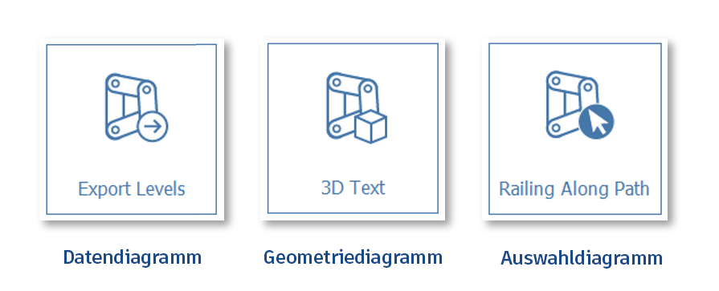
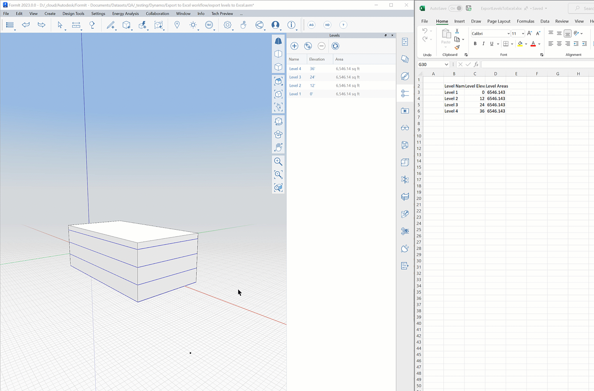
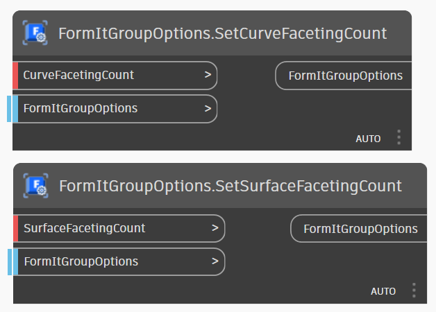
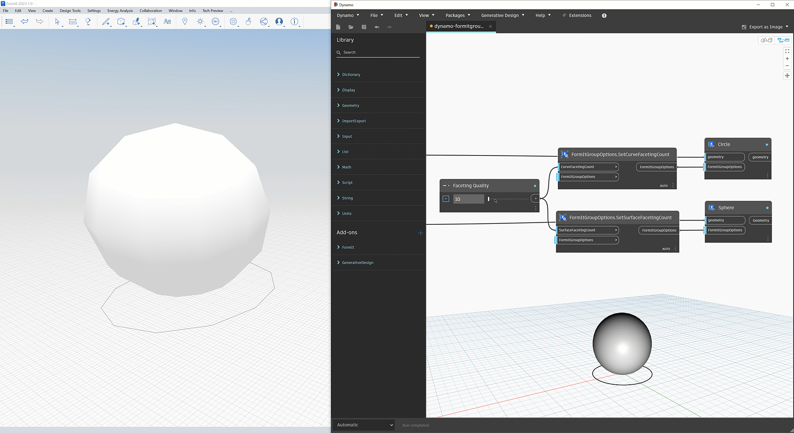

# FormIt + Dynamo

\

O FormIt para Windows tem o Dynamo incorporado, possibilitando realizar ótimos fluxos de trabalho de projetos de cálculo.

## Novidades do FormIt + Dynamo

O FormIt 2024 está atualizado com a versão 2.17 mais recente do Dynamo.

### **Gráficos de dados, Enviar níveis para o Excel e Controle de facetamento**

O [FormIt 2023](https://formit.autodesk.com/blog/post/introducing-formit-2023/) permite executar gráficos do Dynamo[ sem um nó SendToFormIt](formit-+-dynamo.md#graph-types), inclui a capacidade de [enviar níveis do FormIt para o Excel](formit-+-dynamo.md#send-formit-levels-to-excel) e oferece controle de [facetamento de curvas e superfícies por meio dos novos nós FormItGroupOptions](../tool-library/curve-+-surface-faceting.md).

### **Entradas de cota e acesso antecipado à API JS**

O [FormIt 2022.1](https://formit.autodesk.com/blog/post/introducing-formit-2022-1) adiciona a capacidade de usar [cotas familiares do FormIt como entradas](https://formit.autodesk.com/page/formit-dynamo#dynamo-input-nodes), apresenta [opções no nível do objeto](https://formit.autodesk.com/page/formit-dynamo#dynamo-formit-options-nodes) e oferece uma visualização prévia do [acesso à API JavaScript](https://formit.autodesk.com/page/formit-dynamo#dynamo-js-api-nodes). Obtenha-o [aqui](https://formit.autodesk.com/page/download).

### **Vários nós SendToFormIt**

O [FormIt 2021.3](https://formit.autodesk.com/blog/post/introducing-formit-2021-3) adiciona a capacidade de usar [vários nós SendToFormIt e gráficos do Dynamo aninhados](https://formit.autodesk.com/page/formit-dynamo#dynamo-groups).

### **Nó SelectFromFormIt**

O [FormIt 2021](https://formit.autodesk.com/blog/post/introducing-formit-2021) adiciona o nó [SelectFromFormIt](https://formit.autodesk.com/page/formit-dynamo#dynamo-formit-nodes) e permite sessões sempre conectadas, edição de várias instâncias e muito mais.

## Introdução

Saiba mais sobre a interface e vincule os diretórios do Dynamo ao FormIt.

### **Primeira configuração**

É a primeira vez que você usa o FormIt + Dynamo? Talvez seja preciso [configurar o sistema](https://formit.autodesk.com/page/formit-dynamo#dynamo-important-notes) primeiro para ver a tela 3D no Dynamo.

### **Painel do Dynamo**

Use o painel do Dynamo para iniciar o Dynamo, inserir grupos do Dynamo e editar gráficos do Dynamo:

\.png>)

### **Adicionar e gerenciar diretórios locais do Dynamo**

* O painel do Dynamo funciona da mesma forma que a [Biblioteca de conteúdo](https://windows.help.formit.autodesk.com/building-the-farnsworth-house/import-export-and-content-library), permitindo vincular e gerenciar diretórios locais que contêm arquivos do Dynamo.
* Clique no botão “Vincular diretório” no painel do Dynamo e, em seguida, clique em (+) novamente, na caixa de diálogo Preferências, para selecionar um diretório para vincular ao FormIt: 
* Alterne entre diretórios vinculados usando o menu suspenso:

* Só será possível visualizar arquivos .dyn e subpastas usando o painel do Dynamo.
* Use a barra de filtro para filtrar arquivos e subpastas do Dynamo, para que você possa encontrar facilmente o que precisa:

## Diferentes maneiras de usar o Dynamo

Crie e edite gráficos no Dynamo ou parâmetros flexíveis no FormIt sem nunca ver o gráfico. Ou faça as duas coisas de uma vez.

### **Tipos de gráficos**

O FormIt suporta três tipos de gráficos do Dynamo:

* Gráfico de dados: os gráficos de dados não têm nós _SendToFormIt_ e são usados para dados de superfície ou para passar dados através do FormIt. Por exemplo, é possível usar gráficos de dados para enviar dados para o Excel ou calcular dados não geométricos e exibi-los em um nó de inspeção.
* Gráfico de geometria: esses gráficos geram a geometria imediatamente e precisam ser colocados na tela para que seus parâmetros sejam exibidos. Após clicar na miniatura, a geometria aparece no cursor para ser posicionada na cena 3D. Esse gráfico requer pelo menos um nó _SendToFormIt_ com a geometria no final do gráfico.
* Gráfico de seleção: esses gráficos requerem seleções no FormIt antes de serem executados. Aparece um prompt no canto superior esquerdo do FormIt para indicar o que precisa ser selecionado. Após fornecer a seleção, o gráfico é executado e gera a geometria relativa à seleção. Esse gráfico requer pelo menos um nó _SendToFormIt_ com a geometria no final do gráfico.

### **Gráfico de geometria: inserir grupo do Dynamo no FormIt**

* No painel do Dynamo, clique na miniatura do gráfico do Dynamo que você deseja executar.
  * É possível usar as amostras incorporadas ou [vincular uma biblioteca](https://formit.autodesk.com/page/formit-dynamo#dynamo-getting-started) de seus próprios arquivos do Dynamo.
* Se inserir a geometria no FormIt, será incorporada uma cópia do gráfico do Dynamo ao arquivo do FormIt.
  * Para gerar a geometria, um nó [SendToFormIt](https://formit.autodesk.com/page/formit-dynamo#dynamo-formit-nodes) precisa ser anexado aos nós de geometria de saída no gráfico.
* A geometria do nó SendToFormIt estará disponível no cursor para ser posicionada.
  * Quando o gráfico tiver nós [SelectFromFormIt](https://formit.autodesk.com/page/formit-dynamo#dynamo-formit-nodes) marcados como É de entrada, o FormIt solicitará primeiro a seleção (cada nó de seleção na ordem vertical) e, em seguida, gerará a geometria no local correto em relação à seleção.
* Uma cópia do arquivo original do Dynamo agora está incorporada ao grupo do FormIt e é independente do gráfico de origem.
* Após o posicionamento, o painel Propriedades exibe os parâmetros disponíveis alternando automaticamente.

### **Gráfico de geometria: modificar parâmetros**

* Após inserir um grupo do Dynamo, selecione-o e alterne para o painel Propriedades ou simplesmente clique duas vezes no grupo para alternar automaticamente para Propriedades.
  * Todos os nós de entrada marcados como “É de entrada” no Dynamo são listados aqui.
  * Os nós de entrada [**SelectFromFormIt**](https://formit.autodesk.com/page/formit-dynamo#dynamo-formit-nodes) serão exibidos como botões na parte superior e poderão ser usados para atualizar a seleção usada para controlar o gráfico.
  * O FormIt suporta os seguintes nós de entrada: controles deslizantes de número, controles deslizantes de número inteiro, alternâncias booleanas e campos Número/Sequência de caracteres.
* Faça alterações nas entradas do FormIt e clique em Executar. O botão Executar fica azul para indicar que os parâmetros foram modificados e que o gráfico precisa ser executado.
  * O Dynamo é executado em segundo plano para processar as alterações e retornar a geometria atualizada no FormIt.
  * No FormIt 2022 e versões mais recentes, a primeira execução do painel Propriedades gira uma instância específica do Dynamo, tornando as edições subsequentes muito mais rápidas.
  * É possível continuar usando o FormIt enquanto o Dynamo estiver em execução. 
* Observe que toda a geometria dentro de cada grupo SendToFormIt será excluída e substituída quando o gráfico do Dynamo for executado.

### Gráfico de dados: enviar níveis do FormIt para o Excel

No FormIt 2023 e versões mais recentes, é possível usar o Dynamo para enviar níveis do FormIt para o Excel: 

* Faça o download do [gráfico de amostra do Dynamo aqui](https://formit-help.s3.amazonaws.com/Send+Levels+to+Excel.dyn).
* Aponte a paleta do Dynamo para o diretório local onde o gráfico do Dynamo foi salvo.
* Clique com o botão direito do mouse na miniatura e clique em _Editar gráfico incorporado._
* Crie uma planilha vazia do Excel em algum lugar.
* Edite o campo Localização da planilha para usar o caminho para a planilha do Excel.
* Edite qualquer outro campo que você queira, como o Nome da folha.
* Feche o Dynamo e salve o gráfico.

Agora você pode simplesmente clicar no arquivo de exemplo na paleta e ele será executado no FormIt sem precisar gerar geometria. 

As entradas do Dynamo aparecem na paleta do Dynamo e o Excel aberto exibe os resultados do gráfico. 

Quando você faz alterações no modelo, é possível clicar na miniatura do gráfico novamente ou no botão _Executar_ para atualizar a planilha com os dados de nível da versão mais recente do esboço do FormIt.

### Iniciar uma nova janela do Dynamo

* No FormIt 2021 e versões mais recentes, se clicar no botão Iniciar Dynamo, no painel Dynamo, uma sessão conectada com o FormIt será iniciada automaticamente.
  * Isso abre um modelo de gráfico no Dynamo e gera automaticamente a geometria do modelo no FormIt.
  * A geometria resultante aparece em um novo grupo, na origem do contexto de edição do grupo atual. É preferível estar no contexto de grupo desejado antes de iniciar o Dynamo. 
  * O modelo inclui os nós do FormIt e alguns exemplos de geometria. Se os controles deslizantes forem ajustados, o tamanho do cubo em ambos os aplicativos será ajustado.
  * A partir daí, será possível abrir diferentes gráficos do Dynamo ou criar algo novo usando esses componentes básicos no modelo e usar a opção Salvar como no Dynamo para salvar em uma nova localização.

### **Editar gráficos incorporados + gráficos de origem**

Os gráficos do Dynamo existentes podem ser editados de duas maneiras distintas: editando gráficos incorporados que já foram colocados no FormIt ou editando o gráfico de origem que foi salvo no computador.

### **Gráficos incorporados**

Após inserir um objeto do Dynamo no FormIt, o gráfico subjacente é copiado e incorporado ao arquivo atual do FormIt. Para editar isso no Dynamo, deve ser usado o botão **Editar gráfico incorporado**.

* Selecione o grupo do Dynamo e alterne para o painel Propriedades ou clique duas vezes no grupo para alternar automaticamente para Propriedades.
* Clique no botão **Editar gráfico incorporado**.
* No Dynamo, você pode observar que o nome do arquivo na parte superior agora contém “(FormIt)”, o que significa que você está editando um gráfico que está incorporado nesse arquivo do FormIt, e não modificando o Gráfico de origem.
* Assegure-se de que um ou mais nós [SendToFormIt](https://formit.autodesk.com/page/formit-dynamo#dynamo-formit-nodes) estejam conectados à geometria que você deseja enviar para o FormIt.
* O FormIt exibe atualizações da geometria em tempo real à medida que o gráfico é ajustado.
* Se você não salvar as alterações no Dynamo, o FormIt retornará para a versão salva por último do gráfico do Dynamo.
* Observe que toda a geometria dentro de cada grupo SendToFormIt será excluída e substituída quando o gráfico do Dynamo for executado.

### **Gráficos de origem**

Os gráficos de origem são exibidos no painel do Dynamo após [vincular os diretórios locais](https://formit.autodesk.com/page/formit-dynamo#dynamo-getting-started). Esses gráficos são armazenados no computador e podem ser editados no Dynamo clicando no botão Editar gráfico de origem.

* [Vincule um diretório](https://formit.autodesk.com/page/formit-dynamo#dynamo-getting-started) que contém arquivos do Dynamo ao painel do Dynamo e, em seguida, navegue para a localização no painel. 
* Clique com o botão direito do mouse na miniatura do gráfico do Dynamo que você quer editar (ou clique na seta) e selecione o botão **Editar gráfico de origem**.
* O Dynamo é iniciado com o gráfico solicitado aberto e, no FormIt, aparecerá a geometria da saída final do gráfico.
  * Para gráficos que usam um ou mais nós [SelectFromFormIt](https://formit.autodesk.com/page/formit-dynamo#dynamo-formit-nodes) como uma entrada, você pode não ver a geometria resultante até que os nós SelectFromFormIt sejam preenchidos com seleções.
* A geometria resultante aparece em um novo grupo, na origem do contexto de edição do grupo atual.
  * É preferível estar no contexto de grupo desejado antes de clicar em Editar gráfico de origem.
* Quando terminar de editar, salve e feche o Dynamo. No FormIt, o gráfico de origem foi copiado e incorporado ao arquivo do FormIt.
  * Se você precisar fazer mais edições no **Gráfico de origem**, exclua a cópia incorporada e siga as etapas novamente.

### **Controlar o facetamento de curvas + superfícies**

*   A partir do FormIt 2023, é possível controlar o facetamento de curvas e superfícies anexadas aos nós SendToFormIt usando os nós FormItGroupOptions: SetCurveFacetingCount e SetSurfaceFacetingCount.

    
* Esses nós substituirão as configurações globais de facetamento de curvas e superfícies, que são definidas em Editar -> Preferências -> Unidades + Precisão.
* Isso será muito útil se o gráfico do Dynamo precisar gerar objetos curvos usando valores de facetamento específicos, o que elimina a necessidade de alterar a configuração global para cada gráfico do Dynamo executado na sessão atual.

* Também é possível definir globalmente as configurações de facetamento em Editar -> Preferências -> Unidades + Precisão
* Após ajustar a qualidade de facetamento em Preferências, execute novamente o gráfico para usar as novas configurações de facetamento global.

[Saiba mais sobre as configurações de facetamento de curvas e superfícies no FormIt.](https://windows.help.formit.autodesk.com/tool-library/curve-+-surface-faceting)

## Usar grupos do FormIt com o Dynamo

Aproveite os eficazes grupos do FormIt para organizar melhor a geometria do Dynamo e obter ótimos fluxos de trabalho.

### **Grupos e o nó SelectFromFormIt**

* Se selecionar a geometria para um nó [SelectFromFormIt](https://formit.autodesk.com/page/formit-dynamo#dynamo-formit-nodes), será útil armazenar a geometria em um grupo FormIt e selecionar o grupo.
  * Isso proporciona flexibilidade para alterar o conteúdo do grupo do FormIt selecionado e, em seguida, executar novamente o gráfico referenciado no grupo para ver o resultado atualizado.
* Durante a seleção de uma geometria não agrupada, as alterações feitas nessa geometria podem fazer com que o FormIt solicite que você selecione novamente a geometria na próxima vez que o gráfico for executado.

### **Gerar geometria em grupos**

* Quando um gráfico do Dynamo é executado no FormIt, os resultados geométricos estão contidos em um grupo do FormIt.
* Cada nó [SendToFormIt](https://formit.autodesk.com/page/formit-dynamo#dynamo-formit-nodes) no gráfico cria um subgrupo para conter a geometria da porta de entrada do nó.
* Após gerar um objeto do Dynamo no FormIt, todo o gráfico e seus parâmetros são incorporados como uma cópia ao arquivo do FormIt.
* Quando o gráfico é executado, a geometria dentro de cada subgrupo é excluída e gerada novamente.
  * Tenha cuidado ao modificar a geometria ou pintar superfícies em subgrupos, pois essas alterações serão perdidas quando o gráfico do Dynamo for executado da próxima vez.
  * No entanto, se você pintar subgrupos (e não a geometria dentro deles) com materiais do FormIt, esses materiais persistirão nas execuções. Veja abaixo.

### **Trabalhar com grupos e materiais**

* Quando são usados vários nós **SendToFormIt**, é possível organizar os nós por material, para que você possa pintar diferentes subgrupos do FormIt com diferentes materiais.
* Neste exemplo, toda a construção é gerada com base em planos simples no FormIt. Cada componente de construção que requer materiais únicos obtém seu próprio nó **SendToFormIt**:

\.png>)

* Após aplicar materiais a cada um dos subgrupos, os materiais persistem nas execuções do Dynamo:

### **Aninhar grupos do Dynamo**

* É possível usar o nó **SelectFromFormIt** para selecionar os resultados do subgrupo de um gráfico do Dynamo para controlar os resultados de outro gráfico. 
* Com base no exemplo acima, a saída de vidraça do gráfico do gerador de construção é usada como a geometria de seleção para a amostra integrada de vitrine-parede cortina:

* Quando a forma da construção é alterada, é possível simplesmente selecionar o grupo do sistema de montante e clicar em Executar no painel Propriedades.
  * Embora o conteúdo do grupo de vidraça tenha sido alterado, o próprio grupo não sofreu alteração; portanto, não há necessidade de selecionar novamente a vidraça ao executar o gráfico de novo.
* O modelo acima está disponível no FormIt 2022 e versões mais recentes como “Construção de planos de telhado” na subpasta **Massas de construção** das **Amostras do Dynamo**.
* Em combinação com os diversos recursos do FormIt, é possível usar o Dynamo para criar e flexibilizar um projeto totalmente paramétrico, com materiais e lógica aninhada, no contexto amplo de um modelador conceitual eficaz:

### **O comportamento padrão do grupo do FormIt ainda se aplica**

* Ao contrário do que foi descrito acima, os grupos do Dynamo no FormIt operam com as mesmas regras que os outros grupos:
  * Inserir um novo objeto do Dynamo no painel do Dynamo cria um grupo único e não afeta as instâncias do mesmo objeto já inseridas no esboço.
  * Copiar e colar grupos do Dynamo permite mantê-los idênticos. Todas as alterações feitas no gráfico do Dynamo de uma cópia também são atualizadas na geometria de suas instâncias idênticas, a não ser que sejam feitas como únicas.
  * É possível tornar os grupos do Dynamo únicos com o atalho MU ou através do menu de contexto:

\.png>)

## Nós essenciais do FormIt

Os nós mais eficazes para enviar dados entre o FormIt e o Dynamo.

### **Nó SendToFormIt**

* Para gerar objetos do Dynamo no FormIt, anexe as saídas do nó geométrico desejado à entrada de _geometria_ de pelo menos um nó SendToFormIt:

\.png>)

* FormItGroupOptions é uma nova porta (opcional) no FormIt 2022 e é detalhada na seção **Nós FormItGroupOptions**, abaixo.
* No FormIt 2021.3 e versões mais recentes, é possível usar vários nós SendToFormIt para organizar os resultados do Dynamo em grupos e subgrupos do FormIt.
* [Veja como o Dynamo funciona com grupos do FormIt](https://formit.autodesk.com/page/formit-dynamo#dynamo-groups).

\.png>)

* O nó SendToFormIt respeita o indicador É de saída, que está marcado por padrão. É possível clicar com o botão direito do mouse no nó para verificar:

\.png>)

* Quando estiver marcada, a geometria anexada ao nó SendToFormIt aparecerá no FormIt, dentro de um subgrupo.
* Quando estiver desmarcada, nenhuma geometria será enviada para o FormIt e o subgrupo correspondente (se houver) será excluído.

### **Nó SelectFromFormIt**

* O FormIt 2021 e versões mais recentes oferecem a capacidade de selecionar a geometria do FormIt para usar como entradas em gráficos do Dynamo:

\.png>)

* O nome do nó SelectFromFormIt será usado para prompts no FormIt. Portanto, você deve nomeá-lo de forma que descreva o tipo de geometria do FormIt que deve ser selecionada:

\.png>)

* Quando clicar no botão Selecionar do FormIt, no editor de gráficos do Dynamo ou no painel Propriedades, o FormIt iniciará um modo de assistente de seleção para guiar você para selecionar a geometria:

* O nó SelectFromFormIt respeita o indicador É de entrada, que está marcado por padrão. É necessário verificar se isso está selecionado para trabalhar no FormIt. Clique com o botão direito do mouse no nó a ser verificado.

\.png>)

* Quando a opção É de entrada está marcada:
  * A miniatura do gráfico do painel do Dynamo indica que é necessário selecionar:

* Quando o gráfico for executado, o assistente de seleção do FormIt guiará você através das seleções de configuração de cada nó SelectFromFormIt, começando na parte superior do gráfico.
* Após a primeira geração, aparece um botão para cada nó SelectFromFormIt no painel Propriedades do FormIt.

* Quando clicar neles, o assistente de seleção será iniciado, para que você possa alterar a seleção usada para gerar a geometria final. O gráfico será executado de novo automaticamente após a nova seleção.

### **Dicas, truques e observações**

* Nomeie o nó SelectFromFormIt para indicar o tipo de geometria que é esperado. Por exemplo, “Selecionar limite do terreno (arestas)”
  * É possível selecionar qualquer tipo de geometria FormIt, mas frequentemente é melhor conter a seleção em um grupo FormIt e [selecioná-la em vez da geometria original](https://formit.autodesk.com/page/formit-dynamo#dynamo-groups).
* Se for necessário mover os resultados de um gráfico do Dynamo com base na seleção, será melhor mover a geometria de seleção primeiro e, em seguida, executar novamente o gráfico, o que permitirá retomar a geometria de seleção atualizada e fazer o reposicionamento de forma apropriada. 
  * Também é possível agrupar os resultados do Dynamo **e** a seleção e, em seguida, mover o grupo em questão.
* Quando a geometria do FormIt é enviada para o Dynamo, todos os atributos, materiais ou grupos aninhados são perdidos ao retornar a geometria para o FormIt.
* Se você estiver editando um gráfico no Dynamo com base na seleção e a geometria selecionada no FormIt for alterada, será necessário selecionar novamente a geometria clicando no botão “Selecionar do FormIt” no nó SelectFromFormIt. 
* Ao selecionar no FormIt, o [Filtro de seleção](https://windows.help.formit.autodesk.com/tool-library/select-edge-face-or-object#selection-filtering) ativo é aplicado. Por exemplo, se você desejar selecionar vértices do FormIt, será necessário ativá-los no Filtro de seleção.

## Outros nós de entrada

Uma ampla gama de opções de entrada para facilitar a personalização de gráficos do Dynamo no FormIt.

### **Nó FormItLengthString**

No FormIt 2022.1.0 ou versões mais recentes, é possível usar o nó **FormItLengthString** para especificar as cotas em qualquer tipo de unidade suportada do FormIt (pés-polegadas, polegadas, m, cm, mm), independentemente da configuração de unidade do FormIt no esboço ativo.

Como ocorre com outros nós de entrada suportados, o _FormItLengthString_ aparece na paleta Propriedades do FormIt quando marcado como É de entrada e, quando renomeado, seu novo nome aparece no FormIt:

É possível usar cada instância do nó _FormItLengthString_ em qualquer tipo de unidade, de modo que um único gráfico do Dynamo possa empregar uma combinação de unidades, como mostrado acima.

### **Alternar de números brutos para FormItLengthString**

No FormIt 2022.1.1 e versões mais recentes, se alternar um gráfico para usar os nós FormItLengthString (colocando o primeiro em um gráfico) ou alternar um gráfico para usar somente números brutos (removendo o último FormItLengthString), determinados comportamentos serão alterados durante a edição de um gráfico no Dynamo:

* Quando o nó [SelectFromFormIt](https://formit.autodesk.com/page/formit-dynamo#dynamo-formit-nodes) for usado durante a edição de um gráfico, a capacidade de alternar entre números brutos e o nó _FormItLengthString_, como acima, exigirá uma nova seleção da geometria para cada _SelectFromFormItNode_, para que os resultados continuem a ser dimensionados corretamente no FormIt.
* Após inserir o primeiro nó FormItLengthString em um gráfico, todos os números no gráfico que se destinam a cotas (incluindo entradas de número bruto) fazem referência a metros (unidade nativa do Dynamo).
  * O nó [SendToFormIt](https://formit.autodesk.com/page/formit-dynamo#dynamo-formit-nodes) considerará a alteração e garantirá que a geometria gerada no FormIt permaneça com o tamanho correto.
  * Por outro lado, a remoção de todos os nós FormItLengthString do gráfico permite alternar os números brutos para fazer referência a qualquer que seja a configuração de unidade do FormIt (comportamento antigo).
* A saída numérica dos nós _FormItLengthString_ também será em metros, mas isso não altera o tamanho dos resultados geométricos no FormIt:

\.png>)

### **Outros nós de entrada suportados**

Os nós de entrada padrão do Dynamo são exibidos no painel Propriedades do FormIt quando marcados como “É de entrada” no Dynamo:

* Número do controle deslizante
* Controle deslizante de números inteiros
* Number
* Sequência
* Alternância booleana

É possível renomear os nós de entrada (recomendado para obter maior clareza) e o novo nome aparece no FormIt:

\.png>)

## Outros nós de saída

Diferentes métodos para exibir resultados não geométricos do Dynamo para o FormIt.

### **Nó de inspeção**

Os nós de inspeção marcados como “É de saída” são exibidos na seção “Saídas dos nós de inspeção” do painel Propriedades no FormIt 2022 e versões mais recentes:

\.png>)

### **Mostrar notificações do FormIt**

No FormIt 2022.1 ou versões mais recentes, é possível mostrar notificações no FormIt de um gráfico do Dynamo usando o nó **UI.ShowNotification**: 

### **Fazer login no console do FormIt**

No FormIt 2022.1 ou versões mais recentes, é possível registrar dados adicionais diretamente no console do aplicativo do FormIt (janela Saída de script) com o nó **FormIt.ConsoleLog**:

## Nós de opções do FormIt

Controle como os dados são enviados para o FormIt, em termos de geometria individual ou de grupo.

### **FormItGeometryOptions**

O FormIt 2022.1 e versões mais recentes oferecem a capacidade de personalizar como as geometrias individuais do Dynamo são enviadas para o FormIt com nós **FormItGeometryOptions**.

* Especifique a camada para geometrias individuais dentro do grupo do Dynamo gerado.
* Especifique um atributo de sequência de caracteres para as geometrias individuais dentro do grupo do Dynamo gerado.

Os nós _FormItGeometryOptions_ podem ser usados a montante com base no nó _SendToFormIt_:

\.png>)

### **FormItGroupOptions**

O FormIt 2022 e versões mais recentes oferecem a capacidade de personalizar como o grupo do Dynamo com base no nó _SendToFormIt_ é gerado no FormIt com os nós **FormItGroupOptions**.

* Especifique se o nó SendToFormIt envia a geometria para o FormIt como uma malha ou um objeto.
* Especifique a camada para o grupo criado pelo nó SendToFormIt.
* Especifique um atributo de sequência de caracteres para o grupo criado pelo nó SendToFormIt.

É possível usar qualquer combinação de nós FormItGroupOptions em qualquer ordem ao organizá-los em cadeia em série (daisy-chaining):

## Nós da API JavaScript

O FormIt 2022.1 e versões mais recentes oferecem acesso a APIs JavaScript e funções personalizadas do Dynamo por meio de dois novos nós:

### **CallJSAPI**

O nó **CallJSAPI** permite que você chame APIs JavaScript do FormIt diretamente do Dynamo.

\.png>)

Para nomes de funções e parâmetros, consulte a nossa documentação JavaScript, que é dividida em duas partes: [API FormIt](https://formit3d.github.io/FormItExamplePlugins/docs/FormItJSAPI/group\_\_mod\_\_jsapi\_\_formit.html) e [API WSM](https://formit3d.github.io/FormItExamplePlugins/docs/FormItJSAPI/group\_\_mod\_\_jsapi\_\_wsm.html) (kernel de modelagem).

**CallPluginJS**

Inversamente, o nó **CallPluginJS** permite chamar funções personalizadas de um plug-in carregado ou de um fragmento de script que foi executado na janela do Editor de script.

\.png>)

## Observações importantes

### **Requisitos do sistema**

* Para usar o Dynamo no FormIt, será necessário o [FormIt para Windows](https://formit.autodesk.com/page/download) v17.0 ou posterior.
  * A integração do FormIt + Dynamo recebe novos recursos e correções regularmente; portanto, é sempre melhor fazer o download da atualização mais recente quando disponível.
* Também é necessário ter o Windows 10. Por razões técnicas, as versões mais antigas do Windows não são mais suportadas.

**Solução de problemas**

* Se você tiver um sistema com uma [placa gráfica NVIDIA ou AMD](https://www.howtogeek.com/414201/how-to-check-what-graphics-card-gpu-is-in-your-pc/) ou várias placas, talvez seja necessário definir o FormIt e o Dynamo para usar a GPU de alta potência:
  * _C:/Arquivos de Programas/Autodesk/FormIt/FormIt.exe_
  * _C:/Arquivos de Programas/Autodesk/FormIt/DynamoSandbox/FormItDynamoSandbox.exe_
  * Se você tiver uma placa NVIDIA, [verifique se o painel de controle NVIDIA está instalado](https://whatsabyte.com/blog/find-nvidia-control-panel/)
  * Use os painéis de controle [NVIDIA](https://nvidia.custhelp.com/app/answers/detail/a\_id/2615/\~/how-do-i-customize-optimus-profiles-and-settings%3F) ou [AMD](https://www.amd.com/en/support/kb/faq/dh-017) para definir os seguintes aplicativos para usar a placa gráfica discreta:
* Se você estiver em um local cujo idioma oficial não seja o inglês, talvez seja necessário definir as configurações de região do Windows 10 para inglês, a fim de evitar problemas com determinados nós do Dynamo:
  * Pesquise “Idioma” em Iniciar e escolha “Configurações de idioma”
  * Na parte superior direita da caixa de diálogo Idioma, clique em “Configurações administrativas de idioma”
  * Clique no botão “Alterar localidade do sistema...”
  * Escolha “English (United States)”
* Se os gráficos não conseguirem gerar resultados no FormIt ao trabalhar com geometria ou números pequenos, tente alterar a configuração de escala do Dynamo para "Pequena":
  * Menu Dynamo > Preferências > Geral > Escala da geometria > Pequena

### **Obter suporte**

Precisa de ajuda com o FormIt + Dynamo? [Envie uma mensagem nos fóruns](https://forums.autodesk.com/t5/formit-forum/bd-p/142).
