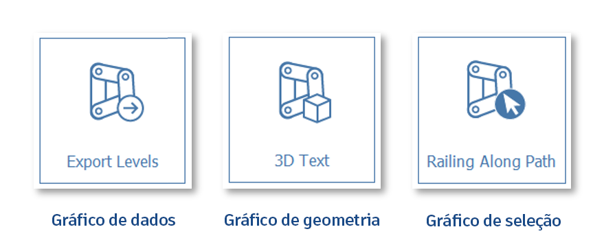

# FormIt + Dynamo

W programie FormIt dla systemu Windows wprowadzono dodatek Dynamo, który zapewnia niezwykłe procesy projektowania obliczeniowego.

## Co nowego w połączeniu produktów FormIt + Dynamo

### **Wykresy danych, wysyłanie poziomów do programu Excel i kontrola fasetowania**

Program [FormIt 2023](https://formit.autodesk.com/blog/post/introducing-formit-2023/) umożliwia uruchamianie wykresów Dynamo[ bez węzła SendToFormIt](formit-+-dynamo.md#graph-types), zapewnia nową możliwość [wysyłania poziomów FormIt do programu Excel](formit-+-dynamo.md#send-formit-levels-to-excel) oraz nową kontrolę [płaszczyzn krzywych i powierzchni za pomocą nowych węzłów FormItGroupOptions](../tool-library/curve-+-surface-faceting.md).

### **Dane wejściowe wymiarów i wczesny dostęp do interfejsu API JS**

W programie [FormIt 2022.1](https://formit.autodesk.com/blog/post/introducing-formit-2022-1) dodano możliwość użycia [znanych wymiarów programu FormIt jako danych wejściowych](https://formit.autodesk.com/page/formit-dynamo#dynamo-input-nodes), wprowadzono [opcje na poziomie obiektu](https://formit.autodesk.com/page/formit-dynamo#dynamo-formit-options-nodes) i udostępniono wczesną wersję zapoznawczą [dostępu do interfejsu API JavaScript](https://formit.autodesk.com/page/formit-dynamo#dynamo-js-api-nodes). Pobierz go [tutaj](https://formit.autodesk.com/page/download).

### **Wiele węzłów SendToFormIt**

W programie [FormIt 2021.3](https://formit.autodesk.com/blog/post/introducing-formit-2021-3) dodano możliwość korzystania z [wielu węzłów SendToFormIt i zagnieżdżonych wykresów Dynamo](https://formit.autodesk.com/page/formit-dynamo#dynamo-groups).

### **Węzeł SelectFromFormIt**

W programie [FormIt 2021](https://formit.autodesk.com/blog/post/introducing-formit-2021) dodano węzeł [SelectFromFormIt](https://formit.autodesk.com/page/formit-dynamo#dynamo-formit-nodes) oraz umożliwiono korzystanie z sesji zawsze połączonych, edycję wielu wystąpień i nie tylko.

## Pierwsze kroki

Dowiedz się więcej na temat interfejsu i połącz katalogi dodatku Dynamo z programem FormIt.

### **Konfiguracja przy korzystaniu po raz pierwszy**

Pierwszy raz korzystasz z połączenia produktów FormIt + Dynamo? Może być konieczne wcześniejsze [skonfigurowanie systemu](https://formit.autodesk.com/page/formit-dynamo#dynamo-important-notes), aby wyświetlać obszar roboczy 3D w dodatku Dynamo.

### **Panel Dynamo**

Używaj panelu Dynamo, aby uruchamiać dodatek Dynamo, umieszczać grupy Dynamo i edytować wykresy Dynamo:

.png>)

### **Dodawanie lokalnych katalogów Dynamo i zarządzanie nimi**

* Panel Dynamo działa podobnie jak [Biblioteka elementów](https://windows.help.formit.autodesk.com/building-the-farnsworth-house/import-export-and-content-library), umożliwiając łączenie lokalnych katalogów zawierających pliki Dynamo i zarządzanie nimi.
* Kliknij przycisk „Połącz katalog” w panelu Dynamo, a następnie ponownie kliknij przycisk (+) w oknie dialogowym Preferencje, aby wybrać katalog do połączenia z programem FormIt: 
* Przełączaj między połączonymi katalogami, korzystając z listy rozwijanej:

* Za pomocą panelu Dynamo można wyświetlać tylko pliki .dyn i podfoldery.
* Użyj paska filtrowania, aby odfiltrować pliki i podfoldery dodatku Dynamo i łatwo znaleźć potrzebne elementy:

## Różne sposoby korzystania z dodatku Dynamo

Twórz i edytuj wykresy w dodatku Dynamo lub dostosowuj parametry w programie FormIt bez oglądania wykresu. Możesz też korzystać z obu możliwości.

### **Typy wykresów**

Program FormIt obsługuje trzy typy wykresów Dynamo:

* Wykres danych: wykresy danych nie zawierają węzłów _SendToFormIt_ i służą do prezentowania lub przekazywania danych za pośrednictwem programu FormIt. Za pomocą wykresów danych można na przykład wysłać dane do programu Excel lub obliczyć dane niegeometryczne i wyświetlić je w węźle obserwacyjnym (Watch).
* Wykres geometrii: te wykresy umożliwiają natychmiastowe utworzenie geometrii i należy je umieszczać w obszarze rysunku, aby wyświetlić ich parametry. Po kliknięciu miniatury geometria zostanie wyświetlona na kursorze w celu umieszczenia w scenie 3D. Ten wykres wymaga obecności co najmniej jednego węzła _SendToFormIt_, a na końcu wykresu musi znajdować się geometria odbierająca dane.
* Wykres wyboru: przed uruchomieniem wykresy te wymagają wyborów w programie FormIt. W lewym górnym rogu okna programu FormIt zostanie wyświetlony monit wskazujący, co należy wybrać. Po dokonaniu wyboru wykres zostanie uruchomiony i wygenerowana zostanie geometria odpowiednia do wyboru. Ten wykres wymaga obecności co najmniej jednego węzła _SendToFormIt_, a na końcu wykresu musi znajdować się geometria odbierająca dane.

### **Wykres geometrii: umieszczanie grupy Dynamo w programie FormIt**

* W panelu Dynamo kliknij miniaturę wykresu Dynamo, który chcesz uruchomić.
   * Można użyć wbudowanych przykładów lub [połączyć bibliotekę](https://formit.autodesk.com/page/formit-dynamo#dynamo-getting-started) własnych plików Dynamo.
* Umieszczenie geometrii w programie FormIt spowoduje osadzenie kopii wykresu Dynamo w pliku programu FormIt.
   * Aby wygenerować geometrię, do węzłów geometrii wyjściowej na wykresie musi być dołączony węzeł [SendToFormIt](https://formit.autodesk.com/page/formit-dynamo#dynamo-formit-nodes).
* Geometria z węzła SendToFormIt będzie dostępna w miejscu umieszczenia kursora.
   * Gdy na wykresie węzły [SelectFromFormIt](https://formit.autodesk.com/page/formit-dynamo#dynamo-formit-nodes) są oznaczone jako będące danymi wejściowymi (Is Input), program FormIt najpierw poprosi o wybór (dla każdego węzła wyboru w kolejności pionowej), a następnie wygeneruje geometrię we właściwym miejscu względem wyboru.
* W grupie programu FormIt jest teraz osadzona kopia oryginalnego pliku Dynamo i jest ona niezależna od wykresu źródłowego.
* Po umieszczeniu panel Właściwości zostanie automatycznie przełączony, aby wyświetlić dostępne parametry.

### **Wykres geometrii: modyfikowanie parametrów**

* Po umieszczeniu grupy Dynamo wybierz ją i przejdź do panelu Właściwości lub kliknij dwukrotnie grupę, aby automatycznie przełączyć się do panelu Właściwości.
   * Tutaj będą wyświetlone wszystkie węzły wejściowe oznaczone jako będące danymi wejściowymi (Is Input) w dodatku Dynamo.
   * Węzły wejściowe [**SelectFromFormIt**](https://formit.autodesk.com/page/formit-dynamo#dynamo-formit-nodes) będą wyświetlane jako przyciski u góry i mogą służyć do aktualizacji wyboru używanego do sterowania wykresem.
   * Program FormIt obsługuje następujące węzły wejściowe: Number Sliders, Integer Sliders, Boolean Toggles oraz Number/String fields.
* Wprowadź zmiany w danych wejściowych w programie FormIt, a następnie kliknij przycisk Uruchom. Przycisk Uruchom zmieni kolor na niebieski, co oznacza, że parametry zostały zmodyfikowane, a wykres musi zostać uruchomiony.
   * Dodatek Dynamo zostanie uruchomiony w tle w celu przetworzenia zmian i zwrócenia zaktualizowanej geometrii w programie FormIt.
   * W programie FormIt 2022 i w nowszych wersjach pierwsze uruchomienie z panelu Właściwości powoduje utworzenie dedykowanego wystąpienia dodatku Dynamo, co znacznie przyspiesza kolejne operacje edycji.
   * Można kontynuować korzystanie z programu FormIt, gdy działa dodatek Dynamo.&#x20;
* Należy pamiętać, że po uruchomieniu wykresu Dynamo cała geometria w każdej grupie SendToFormIt zostanie usunięta i zastąpiona.

### Wykres danych: wysyłanie poziomów programu FormIt do programu Excel

W programie FormIt 2023 i w nowszych wersjach można za pomocą dodatku Dynamo wysyłać poziomy programu FormIt do programu Excel:&#x20;

* Pobierz [przykładowy wykres dodatku Dynamo stąd](https://formit-help.s3.amazonaws.com/Send+Levels+to+Excel.dyn).
* Wskaż paletę dodatku Dynamo w lokalnym katalogu, w którym zapisano wykres Dynamo.
* Kliknij prawym przyciskiem myszy miniaturę i kliknij opcję _ Edytuj osadzony wykres._
* Utwórz pusty arkusz kalkulacyjny Excel.
* Edytuj pole Położenie arkusza kalkulacyjnego, aby użyć ścieżki do arkusza kalkulacyjnego programu Excel.
* Edytuj wszystkie inne pola, które chcesz zmienić, na przykład pole nazwy arkusza.
* Zamknij dodatek Dynamo i zapisz wykres.

Teraz można po prostu kliknąć ten przykładowy plik na palecie i uruchomić go w programie FormIt bez konieczności generowania geometrii.&#x20;

Na palecie Dynamo zostaną wyświetlone dane wejściowe dodatku Dynamo i zostanie otwarty program Excel, aby wyświetlić wyniki z wykresu.&#x20;

Po wprowadzeniu zmian w modelu można ponownie kliknąć miniaturę wykresu lub przycisk _Uruchom_, aby zaktualizować arkusz kalkulacyjny o dane poziomów z najnowszej wersji szkicu programu FormIt.

### Uruchamianie nowego okna dodatku Dynamo

* W programie FormIt 2021 i w nowszych wersjach kliknięcie przycisku Uruchom dodatek Dynamo w panelu Dynamo spowoduje automatyczne rozpoczęcie połączonej sesji z programem FormIt.
   * Spowoduje to otwarcie szablonu wykresu w dodatku Dynamo i automatyczne wygenerowanie geometrii szablonu w programie FormIt.
   * Wynikowa geometria pojawi się w nowej grupie w początku bieżącego kontekstu edycji grupy. Najlepiej przed uruchomieniem dodatku Dynamo przejść do żądanego kontekstu grupy.&#x20;
   * Szablon zawiera węzły programu FormIt i przykładową geometrię. Dopasowanie suwaków spowoduje dostosowanie rozmiaru sześcianu w obu aplikacjach.
   * W tym miejscu można otworzyć różne wykresy Dynamo lub utworzyć coś nowego za pomocą tych podstawowych komponentów w szablonie i zapisać tą zawartość przy użyciu polecenia Zapisz jako w dodatku Dynamo w nowej lokalizacji.

### **Edytowanie wykresów osadzonych i źródłowych**

Istniejące wykresy Dynamo można edytować na dwa różne sposoby: przez edycję wykresów osadzonych, które zostały już umieszczone w programie FormIt, lub przez edycję wykresu źródłowego zapisanego na komputerze.

### **Wykresy osadzone**

Po umieszczeniu obiektu Dynamo w programie FormIt jego wykres źródłowy jest kopiowany i osadzany w bieżącym pliku programu FormIt. Edycja w dodatku Dynamo odbywa się za pomocą przycisku **Edytuj osadzony wykres**.

* Wybierz grupę Dynamo i przejdź do panelu Właściwości lub kliknij dwukrotnie grupę, aby automatycznie przełączyć się do panelu Właściwości.
* Kliknij przycisk **Edytuj osadzony wykres**.
* W dodatku Dynamo nazwa pliku u góry będzie teraz zawierać tekst „(FormIt)”, co oznacza, że edytujesz wykres osadzony w tym pliku programu FormIt, a nie wykres źródłowy.
* Upewnij się, że co najmniej jeden węzeł [SendToFormIt](https://formit.autodesk.com/page/formit-dynamo#dynamo-formit-nodes) jest połączony z geometrią, którą chcesz wysłać do programu FormIt.
* W miarę dopasowywania wykresu w programie FormIt są wyświetlane aktualizacje geometrii w czasie rzeczywistym.
* Jeśli zmiany w dodatku Dynamo nie zostaną zapisane, program FormIt przywróci ostatnio zapisaną wersję wykresu Dynamo.
* Należy pamiętać, że po uruchomieniu wykresu Dynamo cała geometria w każdej grupie SendToFormIt zostanie usunięta i zastąpiona.

### **Wykresy źródłowe**

Wykresy źródłowe są wyświetlane w panelu Dynamo po [połączeniu katalogów lokalnych](https://formit.autodesk.com/page/formit-dynamo#dynamo-getting-started). Wykresy te są przechowywane na komputerze i można je edytować w dodatku Dynamo, klikając przycisk Edytuj wykres źródłowy.

* [Połącz katalog](https://formit.autodesk.com/page/formit-dynamo#dynamo-getting-started) zawierający pliki dodatku Dynamo z panelem Dynamo, a następnie przejdź do tego położenia w panelu.&#x20;
* Kliknij prawym przyciskiem myszy miniaturę wykresu Dynamo, który chcesz edytować (lub kliknij strzałkę), a następnie wybierz przycisk **Edytuj wykres źródłowy**.
* Dodatek Dynamo zostanie uruchomiony z otwartym żądanym wykresem, a w programie FormIt zostanie wyświetlona geometria z końcowego wyniku wykresu.
   * W przypadku wykresów, w których jako danych wejściowych użyto co najmniej jednego węzła [SelectFromFormIt](https://formit.autodesk.com/page/formit-dynamo#dynamo-formit-nodes), dopóki węzły SelectFromFormIt nie zostaną wypełnione wybranymi elementami, może nie być widoczna wynikowa geometria.
* Wynikowa geometria pojawi się w nowej grupie w początku bieżącego kontekstu edycji grupy.
   * Najlepiej przed kliknięciem przycisku Edytuj wykres źródłowy przejść do żądanego kontekstu grupy.
* Po zakończeniu edycji zapisz i zamknij dodatek Dynamo. W programie FormIt wykres źródłowy został skopiowany i osadzony w pliku programu FormIt.
   * Jeśli zachodzi potrzeba wprowadzenia dodatkowych zmian w **wykresie źródłowym**, usuń osadzoną kopię i wykonaj ponownie te czynności.

### **Kontrolowanie płaszczyzn krzywych i powierzchni**

*   Od wersji FormIt 2023 można sterować płaszczyznami krzywych i powierzchni dołączonych do węzłów SendToFormIt, używając funkcji SetCurveFacetingCount i SetSurfaceFacetingCount węzłów FormItGroupOptions.

    
* Węzły te nadpiszą globalne ustawienia płaszczyzn krzywej i powierzchni, które są zdefiniowane w obszarze Edycja -> Preferencje -> Jednostki i dokładność.
* Jest to bardzo przydatne, jeśli wykres Dynamo wymaga wygenerowania zakrzywionych obiektów przy użyciu określonych wartości płaszczyzny, co zmniejsza potrzebę zmiany ustawień globalnych dla każdego przebiegu wykresu dodatku Dynamo w bieżącej sesji.

* Ustawienia płaszczyzn można również globalnie ustawić w obszarze Edycja -> Preferencje -> Jednostki i dokładność
* Po dopasowaniu jakości płaszczyzn w obszarze Preferencje ponownie uruchom wykres, aby użyć nowych globalnych ustawień płaszczyzn.

[Dowiedz się więcej na temat ustawień płaszczyzn krzywej i powierzchni w programie FormIt.](https://windows.help.formit.autodesk.com/tool-library/curve-+-surface-faceting)

## Korzystanie z grup programu FormIt z dodatkiem Dynamo

Wykorzystaj możliwości grup programu FormIt, aby lepiej zorganizować geometrię dodatku Dynamo i zapewnić niesamowite procesy projektowe.

### **Grupy i węzeł SelectFromFormIt**

* W przypadku wybierania geometrii dla węzła [SelectFromFormIt](https://formit.autodesk.com/page/formit-dynamo#dynamo-formit-nodes) przydatne jest zapisanie geometrii w grupie programu FormIt i wybranie tej grupy.
   * Dzięki temu można elastycznie zmieniać zawartość wybranej grupy programu FormIt, a następnie ponownie uruchamiać wykres odwołujący się do tej grupy, aby oglądać zaktualizowane wyniki.
* Jeśli zostanie wybrana niezgrupowana geometria, zmiany w tej geometrii mogą spowodować wyświetlenie monitu programu FormIt o ponowne wybranie geometrii przy następnym uruchomieniu wykresu.

### **Generowanie geometrii w grupach**

* Gdy wykres Dynamo jest uruchamiany w programie FormIt, jego wyniki geometryczne są zawarte w grupie programu FormIt.
* Każdy węzeł [SendToFormIt](https://formit.autodesk.com/page/formit-dynamo#dynamo-formit-nodes) na wykresie tworzy podgrupę, która zawiera geometrię z portu wejściowego węzła.
* Po wygenerowaniu obiektu Dynamo w programie FormIt cały wykres i jego parametry są osadzane jako kopia w pliku programu FormIt.
* Po uruchomieniu wykresu geometria wewnątrz każdej podgrupy jest usuwana i ponownie generowana.
   * Należy zachować ostrożność podczas modyfikowania geometrii lub rysowania powierzchni wewnątrz podgrup, ponieważ zmiany te zostaną utracone po następnym uruchomieniu wykresu Dynamo.
   * Jednak w przypadku rysowania podgrup (nie geometrii wewnątrz nich) przy użyciu materiałów programu FormIt materiały te będą zachowywane między przebiegami. Zobacz poniżej.

### **Praca z grupami i materiałami**

* W przypadku używania wielu węzłów **SendToFormIt** można organizować węzły według materiału, aby można było rysować różne podgrupy programu FormIt za pomocą różnych materiałów.
* W tym przykładzie cały budynek jest generowany z prostych płaszczyzn w programie FormIt. Każdy komponent budynku wymagający unikatowych materiałów otrzymuje własny węzeł **SendToFormIt**:

.png>)

* Po zastosowaniu materiałów do każdej podgrupy materiały są zachowywane między przebiegami dodatku Dynamo:

### **Zagnieżdżanie grup Dynamo**

* Za pomocą węzła **SelectFromFormIt** można wybrać wyniki podgrupy z jednego wykresu Dynamo w celu sterowania wynikami innego wykresu.&#x20;
* W powyższym przykładzie dane wyjściowe przeszklenia z wykresu kreatora budynku są używane jako geometria wyboru dla wbudowanego przykładu ściany kurtynowej witryny:

* Po zmianie kształtu budynku można po prostu wybrać grupę systemu szprosów i kliknąć przycisk Uruchom w panelu Właściwości.
   * Mimo że zawartość grupy przeszklenia uległa zmianie, sama grupa się nie zmieniła, więc nie ma potrzeby ponownego wybierania przeszklenia podczas ponownego uruchamiania wykresu.
* Powyższy model jest dostępny w programie FormIt 2022 i w nowszych wersjach jako „Roof Planes Building” (Budynek z płaszczyznami dachu) w podfolderze **Building Masses** folderu **Dynamo Samples**.
* W połączeniu z rozbudowanymi możliwościami programu FormIt można używać dodatku Dynamo do tworzenia i modelowania całkowicie parametrycznego projektu, wraz z materiałami i zagnieżdżoną logiką, w bogatym kontekście zaawansowanego narzędzia do modelowania koncepcyjnego:

### **Nadal ma zastosowanie standardowe zachowanie grupy programu FormIt**

* Oprócz tego, co opisano powyżej, grupy Dynamo w programie FormIt działają według tych samych reguł co inne grupy:
   * Umieszczenie nowego obiektu Dynamo z panelu Dynamo powoduje utworzenie niepowtarzalnej grupy i nie ma wpływu na żadne wystąpienia tego samego obiektu już umieszczone w szkicu.
   * Kopiowanie i wklejanie grup Dynamo powoduje zachowanie ich identyczności. Wszelkie zmiany wprowadzone w jednej kopii wykresu Dynamo spowodują również aktualizację geometrii w jego identycznych wystąpieniach, chyba że zostaną ona ustawione jako niepowtarzalne.
   * Grupy Dynamo można ustawić jako niepowtarzalne za pomocą skrótu MU lub za pomocą menu kontekstowego:

.png>)

## Podstawowe węzły programu FormIt

Najskuteczniejsze węzły do przesyłania danych między programem FormIt i dodatkiem Dynamo.

### **Węzeł SendToFormIt**

* Aby wygenerować obiekty Dynamo w programie FormIt, dołącz żądane wyjście węzła geometrycznego do wejścia _geometry_ co najmniej jednego węzła SendToFormIt:

.png>)

* FormItGroupOptions jest nowym (opcjonalnym) portem w programie FormIt 2022 i został szczegółowo opisany w sekcji **Węzły FormItGroupOptions** poniżej.
* W programie FormIt 2021.3 i w nowszych wersjach można użyć wielu węzłów SendToFormIt w celu zorganizowania wyników dodatku Dynamo w uporządkowane grupy i podgrupy programu FormIt.
* [Zobacz, jak dodatek Dynamo współdziała z grupami programu FormIt](https://formit.autodesk.com/page/formit-dynamo#dynamo-groups).

.png>)

* Węzeł SendToFormIt uwzględnia flagę Is Output, która jest domyślnie zaznaczona. Kliknięcie węzła prawym przyciskiem myszy umożliwia sprawdzenie:

.png>)

* Gdy ta opcja jest zaznaczona, geometria dołączona do tego węzła SendToFormIt będzie wyświetlana w programie FormIt wewnątrz podgrupy.
* Gdy ta opcja nie jest zaznaczona, do programu FormIt nie zostanie wysłana żadna geometria, a odpowiednia podgrupa (jeśli istnieje) zostanie usunięta.

### **Węzeł SelectFromFormIt**

* W programie FormIt 2021 i w nowszych wersjach można wybrać geometrię z programu FormIt do użycia jako dane wejściowe w wykresach Dynamo:

.png>)

* Nazwa węzła SelectFromFormIt będzie używana w monitach w programie FormIt, dlatego należy ustawić nazwę dobrze wskazującą, jaki typ geometrii programu FormIt powinien zostać wybrany:

.png>)

* Po kliknięciu przycisku Wybierz z programu FormIt w edytorze wykresów Dynamo lub w panelu Właściwości program FormIt uruchomi tryb kreatora wyboru umożliwiający przejście przez proces wyboru geometrii:

* Węzeł SelectFromFormIt uwzględnia flagę Is Input, która jest domyślnie zaznaczona. Należy sprawdzić, czy ta opcja jest włączona, aby można było pracować w programie FormIt. Kliknij prawym przyciskiem myszy węzeł, aby to sprawdzić.

.png>)

* Gdy jest zaznaczone pole wyboru Is Input:
   * Miniatura wykresu w panelu Dynamo wskazuje, że wymagany jest wybór:

* Podczas uruchamiania wykresu kreator wyboru programu FormIt przeprowadzi użytkownika przez wybór ustawień dla każdego węzła SelectFromFormIt, począwszy od górnej części wykresu.
* Po wygenerowaniu po raz pierwszy w panelu Właściwości w programie FormIt zostanie wyświetlony przycisk dla każdego węzła SelectFromFormIt.

* Kliknięcie tych przycisków powoduje uruchomienie kreatora wyboru, co pozwala zmienić wybór użyty do wygenerowania końcowej geometrii. Po ponownym wybraniu wykres zostanie automatycznie uruchomiony ponownie.

### **Porady, wskazówki i uwagi**

* Nadaj węzłowi SelectFromFormIt nazwę wskazującą oczekiwany typ geometrii. Na przykład: „Wybierz obwiednię obszaru (krawędzie)”
   * Można wybrać dowolny typ geometrii programu FormIt, ale często najlepiej jest umieścić wybór w grupie programu FormIt i [wybrać ją zamiast geometrii nieprzetworzonej](https://formit.autodesk.com/page/formit-dynamo#dynamo-groups).
* Jeśli zachodzi potrzeba przesunięcia wyników wykresu Dynamo opartego na wyborze, najlepiej jest najpierw przesunąć geometrię wyboru, a następnie ponownie uruchomić wykres, który uwzględni zaktualizowaną geometrię wyboru i odpowiednio zmieni własne położenie.&#x20;
   * Można również zgrupować wyniki dodatku Dynamo **i** wybór, a następnie przesuwać grupę je zawierającą.
* W przypadku wysłania geometrii programu FormIt do dodatku Dynamo wszelkie atrybuty, materiały lub zagnieżdżone grupy zostaną utracone po późniejszym zwróceniu geometrii do programu FormIt.
* W przypadku edycji wykresu opartego na wyborze w dodatku Dynamo i zmiany wybranej geometrii w programie FormIt należy ponownie wybrać geometrię, klikając przycisk „Wybierz z programu FormIt” w węźle SelectFromFormIt.&#x20;
* Podczas wybierania w programie FormIt stosowany jest aktywny [filtr wyboru](https://windows.help.formit.autodesk.com/tool-library/select-edge-face-or-object#selection-filtering). Aby przykładowo wybrać wierzchołki programu FormIt, należy włączyć tę opcję w filtrze wyboru.

## Inne węzły wejściowe

Szeroki wachlarz opcji wprowadzania danych ułatwiających dostosowanie wykresów Dynamo w programie FormIt.

### **Węzeł FormItLengthString**

W programie FormIt 2022.1.0 i w nowszych wersjach można użyć węzła **FormItLengthString**, aby określić wymiary w dowolnym obsługiwanym typie jednostki programu FormIt (stopy-cale, cale, m, cm, mm) niezależnie od ustawienia jednostki programu FormIt w aktywnym szkicu.

Podobnie jak w przypadku innych obsługiwanych węzłów wejściowych, węzeł _FormItLengthString_ będzie wyświetlany na palecie Właściwości programu FormIt, gdy zostanie oznaczony jako dane wejściowe (Is Input), a po zmianie nazwy jego nowa nazwa będzie wyświetlana w programie FormIt:

Każde wystąpienie węzła _FormItLengthString_ może być używane z dowolnym typem jednostki, więc pojedynczy wykres Dynamo może zawierać połączenie różnych jednostek, jak pokazano powyżej.

### **Przełączanie z liczb nieprzetworzonych na węzeł FormItLengthString**

W programie FormIt 2022.1.1 i w nowszych wersjach przełączenie wykresu w celu używania węzłów FormItLengthString (przez umieszczenie pierwszego na wykresie) lub przełączenie wykresu w celu używania tylko liczb nieprzetworzonych (przez usunięcie ostatniego węzła FormItLengthString) spowoduje zmianę niektórych zachowań podczas edycji wykresu w dodatku Dynamo:

* W przypadku korzystania z węzła [SelectFromFormIt](https://formit.autodesk.com/page/formit-dynamo#dynamo-formit-nodes) podczas edycji wykresu przełączenie między liczbami nieprzetworzonymi a węzłem _FormItLengthString_ w powyższy sposób wymaga ponownego wybrania geometrii dla każdego węzła _SelectFromFormItNode_, aby wyniki były nadal poprawnie skalowane w programie FormIt.
* Po umieszczeniu pierwszego węzła FormItLengthString na wykresie wszystkie liczby mające być wymiarami (w tym dane wejściowe w postaci liczb nieprzetworzonych) będą opisywać wartości w metrach (jest to jednostka macierzysta dodatku Dynamo).
   * Węzeł [SendToFormIt](https://formit.autodesk.com/page/formit-dynamo#dynamo-formit-nodes) uwzględni tę zmianę i zapewni zachowanie właściwego rozmiaru wygenerowanej geometrii w programie FormIt.
   * I na odwrót: usunięcie wszystkich węzłów FormItLengthString z wykresu spowoduje przełączenie liczb nieprzetworzonych na odpowiednie ustawienia jednostek programu FormIt (jest to stare zachowanie).
* Liczbowe dane wyjściowe węzłów _FormItLengthString_ będą również wyrażone w metrach, ale nie spowoduje to zmiany rozmiaru wyników geometrycznych w programie FormIt:

.png>)

### **Inne obsługiwane węzły wejściowe**

Standardowe węzły wejściowe dodatku Dynamo są wyświetlane w panelu Właściwości programu FormIt, gdy w dodatku Dynamo są oznaczone jako dane wejściowe (Is Input):

* Suwaka liczby
* Suwak liczby całkowitej
* Liczba
* Ciąg
* Boolean Toggle

Można zmienić nazwę węzłów wejściowych: jest to zalecane dla zachowania przejrzystości. Ich nowe nazwy będą wyświetlane w programie FormIt:

.png>)

## Inne węzły wyjściowe

Różne metody wyświetlania wyników niegeometrycznych z dodatku Dynamo w programie FormIt.

### **Węzeł Watch**

Węzły Watch oznaczone jako będące wyjściami (Is Output) są wyświetlane w sekcji wyjść węzłów obserwacyjnych w panelu Właściwości w programie FormIt 2022 i w nowszych wersjach:

.png>)

### **Pokazywanie powiadomień programu FormIt**

W programie FormIt 2022.1 i w nowszych wersjach można wyświetlać powiadomienia po stronie programu FormIt z wykresu Dynamo za pomocą węzła **UI.ShowNotification**:&#x20;

### **Logowanie do konsoli programu FormIt**

W programie FormIt 2022.1 i w nowszych wersjach można rejestrować dodatkowe dane bezpośrednio w konsoli aplikacji FormIt (w oknie danych Wynik skryptu) za pomocą węzła **FormIt.ConsoleLog**:

## Węzły opcji programu FormIt

Kontroluj sposób przesyłania danych do programu FormIt na poziomie poszczególnych geometrii lub na poziomie zawierających je grup.

### **FormItGeometryOptions**

W programie FormIt 2022.1 i w nowszych wersjach istnieje możliwość dostosowania sposobu wysyłania poszczególnych geometrii Dynamo do programu FormIt za pomocą węzłów **FormItGeometryOptions**.

* Określ warstwę dla poszczególnych geometrii w wygenerowanej grupie Dynamo.
* Określ atrybut ciągu dla poszczególnych geometrii w wygenerowanej grupie Dynamo.

Węzły _FormItGeometryOptions_ mogą być używane przed węzłem _SendToFormIt_:

.png>)

### **FormItGroupOptions**

W programie FormIt 2022 i w nowszych wersjach można dostosować sposób generowania grupy Dynamo z węzła _SendToFormIt_ w programie FormIt za pomocą węzłów **FormItGroupOptions**.

* Określ, czy węzeł SendToFormIt wysyła geometrię do programu FormIt jako siatkę, czy jako obiekt.
* Określ warstwę dla grupy utworzonej przez węzeł SendToFormIt.
* Określ atrybut ciągu dla grupy utworzonej przez węzeł SendToFormIt.

Można użyć dowolnej kombinacji węzłów FormItGroupOptions w dowolnej kolejności, łącząc je ze sobą szeregowo:

## Węzły interfejsu API języka JavaScript

Program FormIt w wersji 2022.1 i nowszych zapewnia dostęp do interfejsów API języka JavaScript i funkcji niestandardowych z dodatku Dynamo za pośrednictwem dwóch nowych węzłów:

### **CallJSAPI**

Węzeł **CallJSAPI** umożliwia wywoływanie interfejsów API języka JavaScript programu FormIt bezpośrednio z dodatku Dynamo.

.png>)

Nazwy funkcji i parametry można znaleźć w dokumentacji języka JavaScript, która jest podzielona na dwie części: [Interfejs API programu FormIt](https://formit3d.github.io/FormItExamplePlugins/docs/FormItJSAPI/group\_\_mod\_\_jsapi\_\_formit.html) oraz [Interfejs API WSM](https://formit3d.github.io/FormItExamplePlugins/docs/FormItJSAPI/group\_\_mod\_\_jsapi\_\_wsm.html) (jądro modelowania).

**CallPluginJS**

Natomiast węzeł **CallPluginJS** umożliwia wywoływanie funkcji niestandardowych z wczytanej wtyczki lub fragmentu skryptu wykonywanego z poziomu okna Edytor skryptów.

.png>)

## Ważne uwagi

### **Wymagania systemowe**

* Aby można było używać dodatku Dynamo w programie FormIt, potrzebny jest program [FormIt dla systemu Windows](https://formit.autodesk.com/page/download) w wersji 17.0 lub nowszej.
   * Integracja programu FormIt i dodatku Dynamo jest regularnie uzupełniana o nowe funkcje i poprawki, dlatego najlepiej jest pobrać najnowszą aktualizację, gdy jest dostępna.
* Potrzebny jest również system Windows 10. Ze względów technicznych starsze wersje systemu Windows nie są już obsługiwane.

**Rozwiązywanie problemów**

* Jeśli masz system z [kartą graficzną NVIDIA lub AMD](https://www.howtogeek.com/414201/how-to-check-what-graphics-card-gpu-is-in-your-pc/) lub wieloma kartami, może być konieczne skonfigurowanie w programie FormIt i dodatku Dynamo używania posiadanego procesora graficznego o wysokiej mocy:
   * _C:/Program Files/Autodesk/FormIt/FormIt.exe_
   * _C:/Program Files/Autodesk/FormIt/DynamoSandbox/FormItDynamoSandbox.exe_
   * Jeśli masz kartę NVIDIA, [upewnij się, że masz zainstalowany panel sterowania NVIDIA](https://whatsabyte.com/blog/find-nvidia-control-panel/)
   * Za pomocą panelu sterowania [NVIDIA](https://nvidia.custhelp.com/app/answers/detail/a\_id/2615/\~/how-do-i-customise-optimus-profiles-and-settings%3F) lub [AMD](https://www.amd.com/en/support/kb/faq/dh-017) ustaw korzystanie przez następujące aplikacje z oddzielnej karty graficznej:
* Jeśli używasz nieanglojęzycznych ustawień regionalnych, może być konieczne skonfigurowanie ustawień regionu systemu Windows 10 z językiem angielskim, aby uniknąć problemów z niektórymi węzłami Dynamo:
   * Wyszukaj w menu Start wyraz „językowe” i wybierz pozycję „Ustawienia językowe”.
   * W prawym górnym rogu okna dialogowego Język kliknij opcję „Administracyjne ustawienia języka”
   * Kliknij przycisk „Zmień ustawienia regionalne systemu...”
   * Wybierz opcje „Angielski (Stany Zjednoczone)”
* Jeśli za pomocą wykresów nie można wygenerować wyników w programie FormIt podczas pracy z małą geometrią lub liczbami, spróbuj zmienić ustawienie skalowania dodatku Dynamo na „Małe”:
   * Menu Dynamo > Preferencje > Ogólne > Skalowanie geometrii > Małe

### **Uzyskaj pomoc techniczną**

Potrzebujesz pomocy dotyczącej połączenia produktów FormIt + Dynamo? [Poinformuj nas na forach](https://forums.autodesk.com/t5/formit-forum/bd-p/142).
