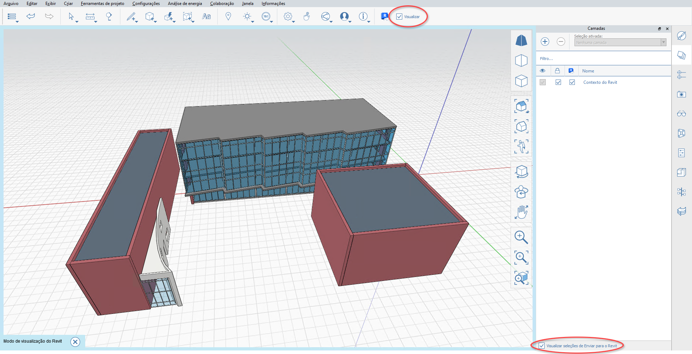

# FormIt und Revit

## Benutzerfreundlichkeit von FormIt kombiniert mit der Leistung von Revit 

FormIt for Windows stellt eine direkte Verbindung mit Revit her und ermöglicht so eine nahtlose Kommunikation zwischen dem ersten Konzept und dem detaillierten Entwurf.

## Neue Funktionen in FormIt und Revit 

### **Verbesserungen in FormIt 2023.1** 

* Der in Revit festgelegte Speicherort wird jetzt beim Start über die Schaltfläche 3D-Skizze mit FormIt synchronisiert.
* Verbesserte Synchronisierung von DWG-Liniengrafiken beim Starten von FormIt über die Schaltfläche 3D-Skizze.
* Optionale Synchronisierung der Kamera zwischen FormIt und Revit, wenn Sie sich in einer 3D-Skizze befinden oder ein verknüpftes FormIt-Objekt bearbeiten.

### Vorteile der Verknüpfung für Version 2023 

* Verknüpfen Sie ein FormIt-Modell (AXM-Format) mit Revit, indem Sie auf der Registerkarte Einfügen in Revit auf die Schaltfläche _**CAD verknüpfen**_ klicken.
* Wählen Sie ein verknüpftes FormIt-Element in Revit aus, und verwenden Sie die neue Schaltfläche _**In FormIt bearbeiten**_, um es in FormIt zu öffnen und sofort zu bearbeiten.
* Verwenden Sie die neue Spalte _**An Revit senden**_ in der Palette Layer, um zu steuern, welche Layer an Revit gesendet werden, wenn die FormIt-Skizze in Revit verknüpft wird. 
* Zeigen Sie eine Vorschau der Geometrie an, die an Revit gesendet wird. Verwenden Sie dazu den neuen Modus _**Vorschau zum Senden an Revit**_, der unten in der Gruppe Layer und neben der Schaltfläche An Revit senden verfügbar ist.
* Silhouettenkanten werden jetzt für FormIt-Objekte in Revit gezeichnet.

### **Verbesserungen in FormIt 2022.1** 

Starten Sie FormIt über die Schaltfläche 3D-Skizze in Revit, und nehmen Sie alle oder ausgewählte Revit-Ebenendaten in die FormIt-Palette Ebenen auf.

### **Alle neuen Funktionen in Version 2022** 

* Starten Sie FormIt direkt aus Revit mit der neuen Schaltfläche _**3D-Skizze**_ auf der Registerkarte Körpermodell & Grundstück in Revit.
* Erstellen Sie einen Entwurf in FormIt, und senden Sie die Skizze mithilfe der Schaltfläche _**An Revit senden**_ in FormIt zurück an Revit, wenn Sie sie über die Schaltfläche _3D-Skizze_ starten.
* Importieren Sie ein FormIt-Modell in Revit mithilfe der Schaltfläche _**CAD importieren**_ auf der Registerkarte Einfügen in Revit (zuverlässiger und bis zu **30x schneller** als mit der vorherigen Schaltfläche _FormIt in RVT importieren_).
* Für FormIt-Funktionen ist es nicht erforderlich, ein separates Zusatzmodul herunterzuladen.

### **Verbesserungen in Revit 2021.1** 

* Verbesserte Konsistenz der Kantensichtbarkeit: Geglättete/verdeckte Kanten in FormIt bleiben in Revit verdeckt.
* Verbesserte Konsistenz der Materialausrichtung: Materialien mit benutzerdefinierten Überschreibungen für Maßstab/Drehung auf FormIt-Flächen behalten diese Überschreibungen in Revit bei.
* Es wurden Probleme in mehreren Fällen behoben, bei denen das Konvertieren von FormIt-Geometrie aus Revit fehlschlug oder Revit nicht mehr reagierte.

## Erste Schritte mit FormIt und Revit 

### **Intuitives 3D-Skizzieren direkt in Revit** 

Wenn Sie sowohl in frühen Entwurfsphasen als auch mit detaillierten Entwürfen arbeiten, können Sie Entwürfe schnell und einfach zwischen FormIt und Revit iterieren und prüfen.

* Übertragen Sie kontextabhängige Geometrie mit einem Klick aus Revit nach FormIt.
* Entwerfen und modellieren Sie in FormIt, und senden Sie Ihren Entwurf innerhalb der Sitzung an dasselbe Revit-Projekt zurück.
* Referenzieren Sie ein FormIt-Modell in Revit mithilfe des Werkzeugs _CAD verknüpfen_, und fahren Sie mit der Visualisierung und Detaillierung in Revit fort.
* Verwenden Sie _In FormIt bearbeiten_, um eine FormIt-Verknüpfung aus Revit zu starten.

### **3D-Skizze, In FormIt bearbeiten und An Revit senden für Entwurfsiterationen** 

### **Empfohlene Arbeitsabläufe**

* Definieren Sie einen Innenteil des Revit-Modells mithilfe eines Schnittbereichs, und klicken Sie dann auf die Schaltfläche _**3D-Skizze**_, um FormIt zu öffnen und Innenlayouts oder benutzerdefinierte Entwurfsfunktionen zu prüfen. Senden Sie den neuen Entwurf mit einem Klick an Revit.
* Beginnen Sie mit einem bereits in Revit modellierten städtischen Kontext, und klicken Sie auf die Schaltfläche _**3D-Skizze**_, um den Umgebungskontext als fangbare Referenzen nach FormIt zu importieren. Senden Sie den neuen Entwurf mit einem Klick an Revit.
* Öffnen Sie ein vorhandenes Revit-Gebäudemodell, und verwenden Sie die Schaltfläche _**3D-Skizze**_, um FormIt zu starten. Modellieren Sie einige Entwürfe für eine neue Ergänzung, und platzieren Sie jeden Entwurf auf einem anderen FormIt-Layer.
* Wählen Sie ein FormIt-Objekt in Revit aus, und starten Sie das Modell in FormIt, indem Sie auf die Schaltfläche _**In FormIt bearbeiten**_ klicken.

* Im _**Revit-Vorschaumodus**_ können Sie eine Vorschau der Geometrie anzeigen, die an Revit gesendet wird, um sicherzustellen, dass Sie den richtigen Entwurf für die detaillierte Entwicklung freigeben.
* Wählen Sie die gewünschten Elemente aus Ihren Entwürfen aus, und senden Sie jeden Entwurf mithilfe der Schaltfläche _**An Revit senden**_ an Revit, oder speichern Sie das verknüpfte Modell. 

### **Verwenden der Werkzeuge**

* Die Schaltflächen _**3D-Skizze**_ und _**In FormIt bearbeiten**_ sowie der Arbeitsablauf _**An Revit senden**_ stehen Abonnenten der Autodesk Architecture, Engineering & Construction (AEC) Collection und Kunden mit bestimmten Zugriffstypen zur Verfügung. Sie sind in Revit LT nicht verfügbar. [Hier erfahren Sie mehr über die AEC Collection.](https://www.autodesk.com/collections/architecture-engineering-construction/overview)

### Die Schaltfläche 3D-Skizze

* Beim Starten von Revit 2022.0 oder höher wird auf der Registerkarte Körpermodell & Grundstück eine neue Schaltfläche namens **3D-Skizze** angezeigt. Die Schaltfläche ist nur in 3D-Ansichten verfügbar. Sie wird in 2D-Ansichten in Revit deaktiviert.
* Stellen Sie sicher, dass Sie mit Ihren Autodesk-Anmeldedaten bei Revit angemeldet sind. Beim Starten der Schaltfläche _**3D-Skizze**_ werden Sie möglicherweise aufgefordert, sich erneut bei Ihrem Konto bei Autodesk Account anzumelden. Damit wird sichergestellt, dass Sie über die richtigen Berechtigungen verfügen.
* Wenn FormIt 2022.0 oder höher nicht installiert ist (oder eine FormIt-Version vor 2022.0 genutzt wird), wird FormIt nicht gestartet, und Sie werden aufgefordert, die richtige Version von FormIt herunterzuladen.

#### Das Dialogfeld FormIt öffnen für die 3D-Skizze

* Klicken Sie auf die Schaltfläche _**3D-Skizze**_, um FormIt zu starten. Wählen Sie, ob Sie alle sichtbaren Objekte oder nur ausgewählte Objekte in FormIt importieren möchten. 
  * Die Auswahl, nur ausgewählte Objekte einzubeziehen, ist hilfreich, wenn das Revit-Modell groß ist und die Konstruktion nur einen Teil des Revit-Modells referenziert. 
  * Außerdem können Sie mithilfe eines Schnittbereichs in Revit einen Innenbereich des Revit-Modells isolieren, um ihn in FormIt zu importieren.

#### 3D-Skizze und Ebenen

* Wenn alle sichtbaren Revit-Objekte ausgewählt sind, werden alle sichtbaren Revit-Ebenen zu FormIt-Ebenen, die [in der Ebenen-Palette angezeigt](../tool-library/levels-and-area.md#creating-and-configuring-levels) oder [über die Eigenschaftenpalette auf Objekte angewendet](../tool-library/levels-and-area.md#applying-levels) werden können.
* Wenn ausgewählte Revit-Objekte ausgewählt sind, werden nur ausgewählte Ebenen zu FormIt-Ebenen.

#### Nach dem Start von FormIt

* Beim Starten von FormIt wird die enthaltene Revit-Geometrie auf einem eigenen Layer in FormIt angezeigt. Der Layer heißt Revit-Kontext und ist vorgabemäßig gesperrt.
* Modellieren Sie in FormIt, indem Sie Formen hinzufügen oder Materialien, Inhalte und mehr anwenden.
* Wenden Sie Ebenen über die [Palette Ebenen](../tool-library/levels-and-area.md#applying-levels) auf FormIt-Objekte an.

### Der Arbeitsablauf An Revit senden

* Verwenden Sie die Spalte _**An Revit senden**_ in der Palette Layer, um Geometrie einzuschließen, die an Revit übertragen werden soll, bzw. diese auszuschließen.

* Im _**Revit-Vorschaumodus**_ können Sie optional eine Vorschau der Geometrie anzeigen, die an Revit gesendet werden soll. Aktivieren Sie den Revit-Vorschaumodus, indem Sie das Kontrollkästchen unten in der Palette Layer oder neben der Schaltfläche An Revit senden verwenden.

* Übertragen Sie die FormIt-Geometrie mithilfe der Schaltfläche _**An Revit senden**_ im Werkzeugkasten von FormIt nach Revit.
  * Sie werden aufgefordert, die Datei zu speichern, wodurch das Modell mit Revit verknüpft wird.
    * **Anmerkung:** Es wird empfohlen, die Datei lokal zu speichern, da durch das Speichern in Autodesk Docs die Verbindung zwischen FormIt und Revit unterbrochen wird. Verwenden Sie stattdessen [Autodesk Desktop Connector](https://help.autodesk.com/view/CONNECT/DEU/), um Modelle in der Cloud freizugeben.
  * Wenn die Verknüpfung erstellt wurde, können Sie jedes Mal, wenn Sie Änderungen an Revit übertragen möchten, das Modell erneut speichern oder auf die Schaltfläche An Revit senden klicken.

.png>)

* Die Layer und Materialien aus FormIt werden zusammen mit der Geometrie an Revit übertragen.
  * Sie können die FormIt-Materialien im Revit-Dialogfeld Materialien anzeigen, indem Sie die Liste nach FormIt filtern.
  * FormIt-Layer finden Sie in Revit-Ansichten über die Registerkarte Importieren unter Sichtbarkeit/Grafiken. Dies ist eine hervorragende Möglichkeit, um verschiedene FormIt-Entwurfsoptionen in Revit anzuzeigen.
  * Um Ebenen an Revit zu senden, müssen Sie die AXM-Datei über das Dialogfeld CAD importieren importieren und unten die Option Ebenen importieren aktivieren.

### Die Schaltfläche In FormIt bearbeiten

* Nach dem Verknüpfen eines FormIt-Modells in Revit oder nach dem Erstellen eines neuen FormIt-Modells mithilfe von _**3D-Skizze**_ und dem Speichern des Modells wird das FormIt-Element in Revit gespeichert und kann später erneut bearbeitet werden.
* Wählen Sie ein FormIt-Element in Revit aus, und klicken Sie auf der Registerkarte Ändern auf die Schaltfläche _**In FormIt bearbeiten**_, um das Modell in FormIt zu öffnen.

* In der FormIt-Einführung finden Sie ein [Lernprogramm zum Arbeitsablauf für FormIt und Revit](../formit-primer/part-ii/2.8-advanced-revit-workflows.md).

### **Importieren und Verknüpfen von FormIt-Modellen: Entwurfszusammenarbeit zwischen FormIt und Revit** 

#### **Empfohlene Arbeitsabläufe**

* Geben Sie das FormIt-Modell für Kollegen frei, die das FormIt-Modell anschließend zur Referenz, Visualisierung und Detaillierung in ihre Revit-Projekte importieren können.
* Importieren Sie das FormIt-Modell direkt in eine Revit-Entwurfsoption, um Entwürfe weiter zu prüfen und zu vergleichen. Da FormIt-Layer über den Import-Arbeitsablauf in Revit importiert werden, kann der Revit-Benutzer steuern, welche FormIt-Layer in welcher Revit-Entwurfsoption sichtbar sind.
* Importieren Sie das FormIt-Modell in eine Kategorienfamilie für Körper (und laden Sie es anschließend in ein Revit-Projekt), um die Werkzeuge Ebenen, Körpergeschosse und Nach Fläche zu nutzen und Revit-Systemfamilien auf FormIt-Geometrie anzuwenden.

.png>)

* Verknüpfen Sie ein vorhandenes FormIt-Modell mit Revit, um Änderungen hin und her zu senden, die Geometrien und die Materialdarstellung beim Neuladen zu aktualisieren und die Sichtbarkeit der Geometrie mithilfe von FormIt-Layern zu steuern.

#### **Verwenden der Werkzeuge**

* Geben Sie eine FormIt-Datei an, die in das aktuelle Revit-Projekt importiert werden soll. Öffnen Sie das Revit-Werkzeug _**CAD importieren**_. Wählen Sie .AXM aus der Liste der verfügbaren Dateitypen. Navigieren Sie zu einer AXM-Datei, und klicken Sie auf _Öffnen_.
* FormIt-Materialien werden nach Revit übertragen und im Revit-Dialogfeld Materialien angezeigt. Filtern Sie die Liste nach FormIt-Materialien.
  * Materialien, die in FormIt skaliert oder gedreht wurden, behalten in Revit die richtige Skalierung und Drehung bei.
* Ebenen werden aus FormIt nach Revit übertragen.
  * Klicken Sie im Dialogfeld CAD importieren auf die Schaltfläche FormIt-Ebenen importieren.
* Verdeckte Kanten gekrümmter/facettierter Geometrie in FormIt werden mit verdeckten Kanten in Revit übernommen.
  * Bekanntes Problem: Die Silhouettenkanten werden in Revit in der Ansicht Verdeckte Linie ebenfalls ausgeblendet.
* Der Ursprungspunkt in FormIt und der Basispunkt in Revit werden für die zuverlässige Platzierung importierter FormIt-Objekte verwendet.
* In Revit importierte FormIt-Geometrie wird mit allen FormIt-Layern übertragen.
  * Die FormIt-Layer sind über Registerkarte Sichtbarkeit/Grafiken > Importierte Kategorien verfügbar. Hier sehen Sie eine Liste der FormIt-Layer, die Sie über die Kontrollkästchen aktivieren und deaktivieren können.
* Mit den Werkzeugen Nach Fläche in Revit (auch als Gebäudemodellierer-Werkzeuge bezeichnet) können Sie Revit-Elemente aus FormIt-Geometrie generieren.
  * Dazu muss die FormIt-Geometrie zunächst in eine Körperfamilie oder allgemeine Modellfamilie importiert und dann in die Projektumgebung geladen werden.
* FormIt-Geometrie wird als eine Importinstanz importiert.
  * Um ein FormIt-Modell in separaten Importvorgängen zu importieren, isolieren Sie Teile des Modells in FormIt und importieren jedes Teil als separate AXM-Datei.
* Weitere Informationen finden Sie in der [Revit-Dokumentation](https://help.autodesk.com/view/RVT/2023/DEU/?guid=GUID-A5F4B6C1-94CD-4433-A4E2-6B39B4BA8E6D).

#### **Arbeiten mit Revit-Ebenen und FormIt-Importen**

* Beim Importieren von FormIt-Geometrie in Revit können sich die resultierenden Objekte aufgrund von Revit-Ebenen auf einer unerwarteten Höhe befinden.
  * In Ansichten/Draufsichten wird importierte FormIt-Geometrie in Revit auf der aktuellen Ebene angezeigt.
  * In 3D-Ansichten wird importierte FormIt-Geometrie vorgabemäßig auf der niedrigsten Ebene angezeigt, die möglicherweise unterirdisch verläuft.
  * Wenn die Geometrie in Revit in einer unerwarteten Höhe angezeigt wird, wählen Sie das importierte Objekt aus und passen die Basisebene in Revit an die entsprechende Ebene an.

#### **Konvertieren von Revit-Familien** 

* Revit-Familien werden mithilfe der Schaltfläche _**RFA in FormIt konvertieren**_ auf der Registerkarte Zusatzmodule in Revit in FormIt-Inhalte konvertiert. Dies macht es effizient, vorhandene Revit-Inhalte im Kontext von FormIt wiederzuverwenden.
* Geben Sie einen Ordner mit RFA-Dateien an, die in FormIt-Dateien konvertiert und in einen Ordner Ihrer Wahl ausgegeben werden sollen.
* So können Sie bereits vorhandene Revit-Inhalte problemlos wiederverwenden. Konvertieren Sie den Inhalt einfach in FormIt, und verweisen Sie die Inhaltsbibliothek von FormIt auf den Ordner mit den konvertierten Dateien. Klicken Sie dann in der Palette Inhaltsbibliothek auf eine Miniaturvorschau, und platzieren Sie sie im Modell.

#### **Vorbereiten von SketchUp-Dateien für Revit** 

* Verwenden Sie FormIt for Windows zum Öffnen oder Importieren von SketchUp-Inhalten.
* Verwenden Sie optional die [integrierten Diagnose- und Reparaturwerkzeuge für Geometrie](https://formit.autodesk.com/blog/post/using-formit-to-get-sketchup-data-into-revit), sodass sie besser für nachfolgende Operationen geeignet sind.
* Speichern Sie die FormIt-Datei, und importieren Sie sie mithilfe der oben beschriebenen Arbeitsabläufe **CAD importieren** oder **An Revit senden**.

## Umstellung des Zusatzmoduls FormIt-Konverter 

FormIt und Revit 2022 bzw. neuere Versionen bieten integrierte Synergien ohne zusätzlich erforderliche Downloads.

Mit diesen Änderungen beginnt eine Umstellung des Zusatzmoduls. Erfahren Sie, wie sich frühere Arbeitsabläufe geändert haben.

### **Neue Methode zum Importieren von AXM-Dateien** 

Als Ersatz für die Schaltfläche _FormIt in RVT importieren_ im Zusatzmodul können Sie FormIt-Dateien (.AXM) nun über das Werkzeug CAD importieren auf der Revit-Registerkarte Einfügen importieren. 

Dieser Arbeitsablauf ist nicht nur **30x schneller**, sondern generell auch **zuverlässiger**. Außerdem haben sich einige Verhaltensweisen geändert:

### **Geometrie beim Importieren**

* FormIt-Geometrie wird als eine Importinstanz importiert. FormIt-Kategorien werden nicht mehr zu Revit-Kategorien. Wir arbeiten daran, dies in einem zukünftigen Update zu verändern.
  * FormIt-Kategorien werden derzeit nur für die Energieanalyse verwendet.
* Sie müssen das Modell nicht mehr in kleinere Teile aufteilen – versuchen Sie, ein komplettes FormIt-Modell auf einmal zu senden.
* Um ein FormIt-Modell in separaten Importvorgängen zu importieren, isolieren Sie Teile des Modells in FormIt und importieren jedes Teil als separate AXM-Datei.

### **Materialien beim Import**

* FormIt-Materialien lassen sich besser als je zuvor nach Revit übertragen und können im Dialogfeld Materialien sortiert werden.

### **Arbeitsabläufe nach dem Import**

* Bei Arbeitsabläufen mit Körpergeschossen und den Werkzeugen Nach Fläche (Gebäudemodellierer) importieren Sie zunächst das FormIt-Modell in eine Revit-Körper- oder allgemeine Modellfamilie und laden es dann in die Projektumgebung.
* Profitieren Sie von flüssigeren Arbeitsabläufen, indem Sie direkt in Revit auf die neue 3D-Skizzierumgebung für die frühe Entwicklungsphase zugreifen.

### **Änderungen an Revit-Familien** 

Verwenden Sie in FormIt weiterhin Revit-Familieninhalte, indem Sie auf der Registerkarte Zusatzmodule in Revit auf die Schaltfläche _RFA in FormIt konvertieren_ klicken. Dieser Arbeitsablauf bleibt unverändert.

Die Schaltfläche _Familien neu laden_ wurde entfernt, um die Benutzererfahrung zu verbessern.

## Wichtige Anmerkungen 

### **Unterstützung erhalten** 

Benötigen Sie Hilfe bei FormIt und Revit? [Nehmen Sie über die Foren Kontakt mit uns auf](https://forums.autodesk.com/t5/formit-forum/bd-p/142).

Herunterladen des alten Revit-Zusatzmoduls\
 (2021 oder älter) 
------------------------------------------------------------------

Wenn Sie FormIt und Revit 2022 oder höhere Versionen verwenden, müssen Sie kein separates Zusatzmodul herunterladen.

Für Revit 2021 oder frühere Versionen finden Sie alte Versionen des Zusatzmoduls unter dem folgenden Link:

[Alte Downloads für Revit-Zusatzmodule anzeigen](https://formit.autodesk.com/page/download#download-revit-add-in)
