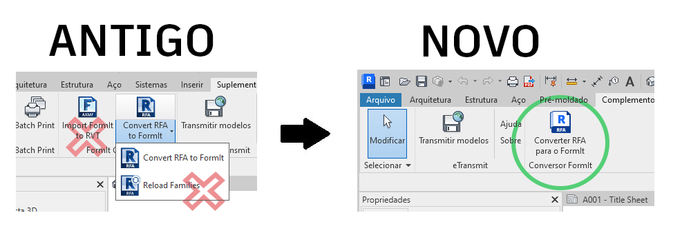

# FormIt + Revit

## The Ease of FormIt Meets the Power of Revit 

FormIt for Windows connects directly to Revit for seamless communication between early concept and detailed design.

## What's New With FormIt + Revit 

### The Power of Linking for 2023 

* Link a FormIt model (AXM format) to Revit by using the _**Link CAD**_ button in Revit's Insert tab.
* Select a linked FormIt element in Revit and use the new _**Edit in FormIt**_ button to launch it in FormIt for immediate editing.
* Use the new _**Send to Revit column**_ in the Layers palette to control which layers are sent to Revit when the FormIt sketch is linked in Revit.&#x20;
* Preview geometry that will be sent to Revit with the new _**Preview Send to Revit Selections**_ mode, available at the bottom of the Layers panel and next to the Send to Revit button.
* Silhouette edges are now drawn for FormIt objects in Revit.

### **FormIt 2022.1 Improvements** 

Launch FormIt from Revit with the 3D Sketch button and include all or selected Revit level data in the FormIt Levels palette.

### **All New for 2022** 

* Launch FormIt directly from Revit with the new _**3D Sketch**_ button on Revit's Massing & Site tab.
* Design in FormIt and send your sketch back to Revit using the _**Send to Revit**_ button in FormIt when launched from the _3D Sketch_ button.
* Import a FormIt model into Revit using the _**Import CAD**_ button in Revit’s Insert tab (more reliable and up to **30x faster** than the former _Import FormIt to RVT_ button).
* No need to download a separate Add-In for FormIt capabilities.

### **Revit 2021.1 Improvements** 

* Improved edge visibility consistency: Smoothed/hidden edges in FormIt remain hidden in Revit.
* Improved material orientation consistency: Materials with custom scale/rotation overrides on FormIt faces will maintain those overrides in Revit.
* Fixed several cases where converting FormIt geometry from Revit would fail or cause Revit to hang.

## Getting Started with FormIt + Revit 

### **Intuitive 3D Sketching Directly from Revit** 

If you're working in both early stage and detailed design, you can quickly iterate and explore designs smoothly between FormIt and Revit.

* Push contextual geometry from Revit to FormIt with one click.
* Design and model in FormIt and send your design back to the same Revit project while in the same session.
* Reference a FormIt model in Revit using the _Link CAD_ tool and continue with visualization and detailing in Revit.
* Use _Edit in FormIt_ to launch a FormIt link from Revit.

### **3D Sketch, Edit in FormIt, and Send to Revit for Design Iteration** 

### **Suggested Workflows**

* Define an interior portion of the Revit model using a Section Box, then click the _**3D Sketch**_ button to open FormIt and explore interior layouts or bespoke design features. Send the new design to Revit with one click.
* Start with an urban context already modeled in Revit and click the _**3D Sketch**_ button to bring the surrounding context into FormIt as snappable references. Send the new design to Revit with one click.
* Open an existing Revit building model and use the _**3D Sketch**_ button to launch FormIt. Model a few designs for a new addition, putting each design on a different FormIt Layer.
* Select a FormIt object in Revit and launch the model in FormIt by using the _**Edit in FormIt**_ button.

* Use the _**Revit Preview mode**_ to preview the geometry that will be sent to Revit to make sure you are sharing the right design to be used for detailed development.
* Select the elements you want from your designs and send each design to Revit using the _**Send to Revit**_ button or saving the linked model.&#x20;

### **Using the Tools**

* The _**3D Sketch**_ button, _**Edit in FormIt**_ button, and _**Send to Revit**_ workflow is available to subscribers of the Autodesk Architecture, Engineering, & Construction (AEC) Collection and to customers with specific types of access. It is not available through Revit LT. [Learn more about the AEC Collection here.](https://www.autodesk.com/collections/architecture-engineering-construction/overview)

### The 3D Sketch Button

* When you launch Revit 2022.0 or a later version, there is a new button on the Massing & Site tab called **3D Sketch**. The button is available from 3D views only; it will appear disabled in 2D views in Revit.
* Ensure that you are signed in to Revit with your Autodesk credentials. Launching the _**3D Sketch**_ button may prompt you to sign into your Autodesk account again. This is to check that you have the correct entitlements.
* If FormIt 2022.0 or a later version is not installed (or there is a pre-2022.0 FormIt version installed), FormIt will not launch and you will be prompted to download the correct version of FormIt.

#### The 3D Sketch "Open FormIt" dialog

* Click on the _**3D Sketch**_ button to launch FormIt. Choose between bringing all visible objects or just selected objects into FormIt.&#x20;
  * Choosing to bring only selected objects is helpful if the Revit model is large and the design will reference only a portion of the Revit model.&#x20;
  * Additionally, use a Section Box in Revit to isolate an interior area of the Revit model to bring into FormIt.

#### 3D Sketch and levels

* If "all visible Revit objects" is selected, any visible Revit levels will become FormIt levels, which can be [viewed in the Levels palette](../tool-library/levels-and-area.md#creating-and-configuring-levels) or [applied to objects via the Properties palette](../tool-library/levels-and-area.md#applying-levels).
* if "selected Revit objects" is selected, only selected levels will become FormIt levels.

#### After FormIt launches

* When FormIt launches, the included Revit geometry will display on its own layer in FormIt. The layer is called “Revit Context” and is locked by default.
* Model in FormIt by adding forms or applying materials, content, and more.
* Apply levels to FormIt objects from the [Levels palette](../tool-library/levels-and-area.md#applying-levels).

### The Send to Revit Workflow

* Use the _**Send to Revit column**_ in the Layers palette to include or exclude geometry to be sent to Revit.

* With the _**Revit Preview Mode**_, you can optionally preview the geometry to be sent to Revit. Activate the Revit Preview Mode by using checkbox at the bottom of the Layers palette or next to the Send to Revit button.

* Transfer the FormIt geometry into Revit using the _**Send to Revit**_ button on FormIt’s toolbar.
  * This will prompt you to save the file, which links the model to Revit.
    * **Note:** We recommend saving the file locally, as saving to Autodesk Docs will break the connection between FormIt and Revit. Instead, use [Autodesk Desktop Connector](https://help.autodesk.com/view/CONNECT/ENU/) to share models to the cloud.
  * Once the link has been created, any time you want to transfer changes to Revit, you can resave the model or click the Send to Revit button.

.png>)

* FormIt layers and materials will transfer to Revit along with the geometry.
  * You can view the FormIt materials in Revit's Materials dialog box by filtering the list by “FormIt.”
  * You can find FormIt layers in a Revit view through the import tab of Visibility Graphics. This is a great way to show different FormIt design options in Revit.
  * In order to send levels to Revit, you'll need to import the AXM via the Import CAD dialog, and check "Import levels" at the bottom.

### The Edit in FormIt Button

* After linking a FormIt model in Revit, or after creating a new FormIt model using _**3D Sketch**_ and saving the model, the FormIt element is saved to Revit and can be edited again later.
* Select a FormIt element in Revit, then click the _**Edit in FormIt**_ button in the Modify tab to launch the model in FormIt.

* See the FormIt Primer for a [FormIt-Revit workflow tutorial.](../formit-primer/part-ii/2.8-advanced-revit-workflows.md)

### **Importing and Linking FormIt Models: Design Collaboration between FormIt and Revit** 

#### **Suggested Workflows**

* Share the FormIt model with a colleague, who can then import the FormIt model into their Revit project for reference, visualization, and detailing.
* Import the FormIt model directly into a Revit Design Option to further explore and compare designs. Since FormIt layers come into Revit through the import workflow, the Revit user can control which FormIt layers are visible in which Revit Design Option.
* Import the FormIt model into a Mass-category family (then load it into a Revit project) to take advantage of Levels, Mass Floors, and By Face tools and apply Revit system families to FormIt geometry.

.png>)

* Link an existing FormIt model into Revit to send changes back and forth, update geometries and material appearance during reload, and use FormIt layers to control geometry visibility.

#### **Using the Tools**

* Specify a FormIt file to import into the current Revit project. Open Revit’s _**Import CAD**_ tool. Choose .AXM from the list of available file types. Browse to an .AXM file and click _Open_.
* FormIt materials transfer to Revit and display in Revit’s materials dialog box. Filter the list for FormIt materials.
  * Materials that were scaled or rotated in FormIt retain the correct scale and rotation in Revit.
* Levels from FormIt transfer to Revit.
  * Click the “Import FormIt Levels” button in the Import CAD dialog box.
* Hidden edges of curved/faceted geometry in FormIt come into Revit with hidden edges.
  * Known Issue: the silhouette edges also appear hidden in Hidden Line view in Revit.
* The FormIt origin point and the Revit base point are used for reliable placement of imported FormIt objects.
* FormIt geometry imported into Revit will come in with all FormIt Layers.
  * The FormIt Layers are accessible from the Visibility Graphics > Imported Categories tab. Here the user will see a list of FormIt layers and can turn them on and off with the checkboxes.
* Revit's "By Face” tools (also known as Building Maker tools) can generate Revit elements from FormIt geometry
  * This requires the FormIt geometry to be imported into a Mass Family or Generic Model family first, then loaded into the project environment.
* FormIt geometry comes in as one import instance.
  * To import a FormIt model as separate imports, isolate parts of the model in FormIt, and import each part as a separate .AXM file.
* Learn more in [Revit's documentation.](https://help.autodesk.com/view/RVT/2023/ENU/?guid=GUID-A5F4B6C1-94CD-4433-A4E2-6B39B4BA8E6D)

#### **Working with Revit Levels and FormIt Imports**

* When importing FormIt geometry into Revit, the resulting objects may be at an unexpected elevation due to Revit levels.
  * In elevation/plan views, imported FormIt geometry will appear in Revit at the current level.
  * In 3D views, imported FormIt geometry will default to the lowest level, which may be below grade.
  * If your geometry appears at an unexpected height in Revit, select the imported object, and adjust the Base Level to the appropriate level in Revit.

#### **Converting Revit Families** 

* Revit families convert to FormIt content using the _**Convert RFA to FormIt**_ button on Revit's Add-Ins tab, making it efficient to reuse existing Revit content in the context of FormIt.
* Specify a folder of RFA files which will be converted to FormIt files and output to a folder of your choice.
* This is a great way to reuse all of the Revit content you already have. Just convert the content to FormIt and point FormIt’s content library to the folder containing the converted files. Then from the Content Library Palette, click a thumbnail preview and place it in the model.

#### **Preparing SketchUp files for Revit** 

* Use FormIt for Windows to open or import SketchUp content
* Optionally use the [built-in diagnostics and repair tools to fix geometry](https://formit.autodesk.com/blog/post/using-formit-to-get-sketchup-data-into-revit) so it's solid better for downstream operations
* Save the FormIt file and import it using **Import CAD** or **Send to Revit** workflows outlined above

## Transitioning from the FormIt Converter Add-In 

FormIt + Revit 2022 and newer offer built-in synergy with no extra download required.

With these changes, the Add-In begins a transition. Learn how previous workflows have changed.

### **A New Way to Import AXM Files** 

Replacing the _Import FormIt to RVT_ button in the Add-In is the ability to import FormIt (.AXM) files via the Import CAD tool in Revit's Insert tab.&#x20;

In addition to being up to **30x faster**, you'll find this workflow is generally **more reliable**, too. Along with this, some behaviors have changed:

### **Geometry on Import**

* FormIt geometry imports as one import instance. FormIt categories no longer become Revit categories. We're working to address this in a future update.
  * FormIt categories are currently used only for Energy Analysis.
* You no longer have to break up the model into smaller pieces - try sending an entire FormIt model at once!
* To import a FormIt model as separate imports, isolate parts of the model in FormIt and import each part as a separate .AXM file.

### **Materials on Import**

* FormIt materials transfer better than ever to Revit and can be sorted in the Materials dialog.

### **Post-Import Workflows**

* For workflows involving Mass Floors and By Face (Building Maker) tools, first import the FormIt model into a Revit Mass or Generic Model family, then load it into the project environment.
* Additionally, take advantage of a more fluid working by accessing the new 3D sketching environment for early stage design directly from Revit!

### **Changes to Revit Families** 

Continue to use Revit family content in FormIt by using the _Convert RFA to FormIt_ button on Revit’s Add-Ins tab; there is no change to this workflow.

The _Reload Families_ button has been removed as we work to provide a better experience.

## Important Notes 

### **Get Support** 

Need help with FormIt + Revit? [Let us know on the forums](https://forums.autodesk.com/t5/formit-forum/bd-p/142).

Download the Old Revit Add-In\
(2021 or older) 
------------------------------------------------------------------

If you're using FormIt and Revit 2022 or newer, there's no need to download a separate Add-In.

For Revit 2021 or previous releases, you can find old versions of the Add-In at the link below:

[See Old Revit Add-In Downloads](https://formit.autodesk.com/page/download#download-revit-add-in)
