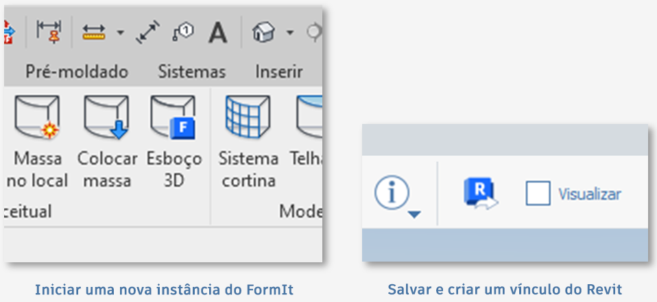

# FormIt и Revit

## Простота использования FormIt и мощные возможности Revit 

FormIt для ОС Windows напрямую подключается к Revit, что обеспечивает бесперебойную связь между первоначальными концептуальными эскизами и детальным проектированием.

## Новые возможности FormIt и Revit 

### Возможности создания связей в версии 2023 

* Модель FormIt (в формате AXM) можно привязать к Revit с помощью кнопки _**Связь САПР**_ на вкладке «Вставить» в Revit.
* Выбрав связанный элемент FormIt в Revit, можно открыть его в FormIt для оперативного редактирования с помощью новой кнопки _**Редактировать в FormIt**_.
* Используя новый столбец _**Отправить в Revit**_ на палитре слоев, можно управлять тем, какие слои отправляются в Revit при наличии связи между эскизом FormIt и Revit.&#x20;
* Геометрию, отправляемую в Revit, можно предварительно просматривать с помощью нового режима _**Предварительный просмотр перед отправкой в набор объектов Revit**_, который доступен в нижней части панели «Слои» и рядом с кнопкой «Отправить в Revit».
* Теперь для объектов FormIt в Revit наносятся кромки силуэта.

### **Усовершенствования в FormIt 2022.1** 

Можно запустить FormIt из Revit с помощью кнопки «3D-эскиз» и добавить все или только выбранные данные уровней Revit на палитру «Уровни» в FormIt.

### **Все новые возможности версии 2022** 

* FormIt можно запустить напрямую из Revit с помощью новой кнопки _**3D-эскиз**_ на вкладке «Формы и генплан» в Revit.
* Можно работать над проектом в FormIt, а затем отправить эскиз обратно в Revit с помощью кнопки _**Отправить в Revit**_ в FormIt, если запуск FormIt был осуществлен с помощью кнопки _3D-эскиз_.
* Модель FormIt можно импортировать в Revit с помощью кнопки _**Импорт САПР**_ на вкладке «Вставить» в Revit (более надежная и **в 30 раз более быстрая**, чем ранее использовавшаяся кнопка _Импорт FormIt в RVT_).
* Скачивать отдельную надстройку для доступа к возможностям FormIt не требуется.

### **Усовершенствования в Revit 2021.1** 

* Улучшена согласованность видимости ребер: сглаженные/скрытые ребра в FormIt остаются скрытыми в Revit.
* Улучшена согласованность ориентации материалов: материалы на гранях FormIt с пользовательскими переопределениями масштаба/угла поворота сохраняют эти переопределения в Revit.
* Исправлено несколько неполадок, из-за которых преобразование геометрии FormIt из Revit приводило к сбою или зависанию Revit.

## Начало работы с FormIt и Revit 

### **Интуитивно понятное создание 3D-эскизов напрямую из Revit** 

Пользователи, занимающиеся и концептуальными эскизами, и детальным проектированием, могут быстро выполнять итерации и изучать проекты, легко переключаясь между FormIt и Revit.

* Переносите контекстную геометрию из Revit в FormIt одним щелчком мыши.
* Проектируйте и моделируйте в FormIt, а затем отправляйте конструкции обратно в тот же проект Revit в рамках одного сеанса.
* Создайте ссылку на модель FormIt в Revit с помощью инструмента _Связь САПР_ и продолжайте работу над визуализацией и детализацией в Revit.
* Запустите связь с FormIt из Revit с помощью функции _Редактировать в FormIt_.

### **3D-эскиз, редактирование в FormIt и отправка в Revit для выполнения итераций по проекту** 

#### **Предлагаемые рабочие процессы**

* Задайте внутреннюю часть модели Revit с помощью секущей рамки, затем нажмите кнопку _**3D-эскиз**_, чтобы открыть FormIt и изучить внутренние варианты компоновки или специализированные элементы конструкции. Отправьте новую конструкцию в Revit одним щелчком мыши.
* Начните работу с уже смоделированного в Revit городского контекста, затем нажмите кнопку _**3D-эскиз**_, чтобы перенести окружающий контекст в FormIt в качестве привязываемых ссылок. Отправьте новую конструкцию в Revit одним щелчком мыши.
* Откройте существующую модель здания Revit и используйте кнопку _**3D-эскиз**_, чтобы запустить FormIt. Смоделируйте несколько новых конструкций для добавления, размещая каждую конструкцию на отдельном слое FormIt.
* Выберите объект FormIt в Revit и запустите модель в FormIt с помощью кнопки _**Редактировать в FormIt**_.

* Используйте _**режим предварительного просмотра Revit**_ для просмотра геометрии, отправляемой в Revit, чтобы убедиться в корректности проекта, к которому предоставляется доступ для последующего детального проектирования.
* Выберите в проектах необходимые элементы и отправьте каждый проект в Revit с помощью кнопки _**Отправить в Revit**_ или путем сохранения связанной модели.&#x20;

#### **Работа с инструментами**

* Рабочий процесс с использованием функций _**3D-эскиз**_, _**Редактировать в FormIt**_ и _**Отправить в Revit**_ доступен пользователям с подпиской на Autodesk Architecture, Engineering, & Construction (AEC) Collection и клиентам с особыми типами доступа. Он недоступен в Revit LT. [Узнайте больше об AEC Collection здесь.](https://www.autodesk.ru/collections/architecture-engineering-construction/overview)

* При запуске Revit 2022.0 или более поздней версии на вкладке «Формы и генплан» отображается новая кнопка **3D-эскиз**. Кнопка доступна только на 3D-видах. На 2D-видах в Revit она отображается как неактивная.
* Убедитесь, что вы вошли в Revit с использованием учетных данных Autodesk. При нажатии кнопки _**3D-эскиз**_ может появиться запрос на повторный вход в учетную запись на портале Autodesk Account. Это требуется для проверки наличия необходимых прав.
* Если программа FormIt 2022.0 или более поздней версии не установлена (или установлена версия FormIt, предшествующая версии 2022.0), FormIt не запускается и отображается запрос на скачивание нужной версии FormIt.
* Нажмите кнопку _**3D-эскиз**_, чтобы запустить FormIt. Укажите объекты, которые будут перенесены в FormIt: все видимые или только выбранные. Вариант переноса только выбранных объектов удобен, если модель Revit имеет большой размер, а проект будет ссылаться только на часть модели Revit. Кроме того, можно использовать секущую рамку в Revit, чтобы изолировать внутреннюю область модели Revit и перенести ее в FormIt.

* Если выбрать уровни в Revit, только они будут переданы в FormIt. В противном случае в FormIt передаются все видимые уровни Revit.
* При запуске FormIt включенная в передачу геометрия Revit отображается в FormIt на отдельном слое. Этот слой называется «Контекст Revit», по умолчанию он заблокирован.
* Выполните моделирование в FormIt путем добавления форм или применения материалов, содержимого и т. д.
* Примените уровни к объектам FormIt, используя палитру уровней.
* Используйте столбец _**Отправить в Revit**_ на палитре слоев, чтобы включить или исключить геометрию, отправляемую в Revit.

* С помощью _**режима предварительного просмотра Revit**_ можно при необходимости выполнить предварительный просмотр геометрии, отправляемой в Revit. Активируйте режим предварительного просмотра Revit, установив соответствующий флажок в нижней части палитры слоев или рядом с кнопкой «Отправить в Revit».

* Перенесите геометрию FormIt в Revit с помощью кнопки _**Отправить в Revit**_ на панели инструментов FormIt.
   * Появится запрос на сохранение файла, и модель будет привязана к Revit.
      * **Примечание.** Рекомендуется сохранить файл локально, так как при сохранении файла в Autodesk Docs связь между FormIt и Revit разрывается. Вместо этого для предоставления общего доступа к моделям в облаке используйте [Autodesk Desktop Connector](https://help.autodesk.com/view/CONNECT/RUS/).
   * После создания связи перенести изменения в Revit можно в любой момент, повторно сохранив модель или нажав кнопку «Отправить в Revit».

.png>)

* Уровни, слои и материалы FormIt переносятся в Revit вместе с геометрией.
   * Материалы FormIt можно просмотреть в диалоговом окне «Материалы» в Revit, отфильтровав список по параметру FormIt.
   * Слои FormIt можно найти на виде Revit с помощью вкладки «Импорт» диалогового окна «Видимость/графика». Это отличный способ показать различные варианты конструкций из FormIt в Revit.
* При запуске Revit 2023.0 или более поздней версии и выборе объекта FormIt можно использовать кнопку _**Редактировать в FormIt**_, чтобы запустить модель в FormIt.
* См. руководство FormIt Primer для доступа к [учебному пособию по рабочему процессу FormIt — Revit](../formit-primer/part-ii/2.8-advanced-revit-workflows.md).

### **Импорт и привязывание моделей FormIt: совместная работа над проектами в FormIt и Revit** 

#### **Предлагаемые рабочие процессы**

* Предоставьте доступ к модели FormIt коллегам, которые затем смогут импортировать модель FormIt в проект Revit для использования в качестве справки, а также для визуализации и детализации.
* Импортируйте модель FormIt напрямую в вариант конструкции Revit для дальнейшего изучения и сравнения конструкций. Поскольку слои FormIt попадают в Revit путем импорта, пользователь Revit может управлять видимостью слоев FormIt в конкретном варианте конструкции Revit.
* Импортируйте модель FormIt в семейство категории формообразующих элементов и загрузите ее в проект Revit, чтобы воспользоваться инструментами «Уровни», «Формообразующие элементы-перекрытия» и «По граням», а также применить системные семейства Revit к геометрии FormIt.

.png>)

* Привяжите существующую модель FormIt к Revit для передачи изменений между этими программами, обновления элементов геометрии и представления материалов при повторной загрузке, а также для использования слоев FormIt при управлении видимостью геометрии.

#### **Работа с инструментами**

* Укажите файл FormIt, который требуется импортировать в текущий проект Revit. Откройте инструмент _**Импорт САПР**_ в Revit. Выберите AXM в списке доступных типов файлов. Перейдите к файлу AXM и нажмите кнопку _Открыть_.
* Материалы FormIt переносятся в Revit и отображаются в диалоговом окне «Материалы» в Revit. Отфильтруйте список для отображения материалов FormIt.
   * Материалы, которые были отмасштабированы или повернуты в FormIt, сохраняют заданный масштаб и угол поворота в Revit.
* Уровни из FormIt переносятся в Revit.
   * Нажмите кнопку «Импорт уровней FormIt» в диалоговом окне «Импорт САПР».
* Скрытые ребра криволинейной/многогранной геометрии в FormIt передаются в Revit как скрытые.
   * Известная проблема: кромки силуэта также отображаются как скрытые на виде «Скрытые линии» в Revit.
* Исходная точка FormIt и базовая точка Revit используются для точного размещения импортированных объектов FormIt.
* Геометрия FormIt, импортированная в Revit, передается вместе со всеми слоями FormIt.
   * Слои FormIt доступны в разделе «Видимость/графика» > вкладка «Импортированные категории». Здесь отображается список слоев FormIt, которые можно включать и отключать с помощью флажков.
* Инструменты Revit «По грани» (также известные как инструменты конструктора зданий) позволяют создавать элементы Revit на основе геометрии FormIt.
   * Для этого требуется сначала импортировать геометрию FormIt в семейство формообразующих элементов или семейство обобщенных моделей, а затем загрузить их в среду проекта.
* Геометрия FormIt передается как один экземпляр импорта.
   * Чтобы импортировать модель FormIt как отдельные элементы, изолируйте детали модели в FormIt, а затем импортируйте каждую деталь как отдельный файл AXM.
* Дополнительные сведения см. в [документации по Revit](https://help.autodesk.com/view/RVT/2023/RUS/?guid=GUID-A5F4B6C1-94CD-4433-A4E2-6B39B4BA8E6D).

#### **Работа с уровнями Revit и импортированными элементами FormIt**

* При импорте геометрии FormIt в Revit полученные объекты могут иметь непредвиденную отметку из-за уровней Revit.
   * На видах фасада и видах в плане импортированная геометрия FormIt отображается в Revit на текущем уровне.
   * На 3D-видах импортированная геометрия FormIt размещается по умолчанию на самом низком уровне, который может быть ниже уровня грунта.
   * Если геометрия отображается в Revit на непредвиденной высоте, выберите импортированный объект и задайте для базового уровня соответствующий уровень в Revit.

#### **Преобразование семейств Revit** 

* Семейства Revit можно преобразовать в компоненты FormIt с помощью кнопки _**Преобразовать из RFA в FormIt**_ на вкладке «Надстройки» в Revit, что позволяет повторно использовать имеющиеся компоненты Revit в контексте FormIt.
* Укажите папку с файлами RFA, которые будут преобразованы в файлы FormIt и выведены в нужную папку.
* Это отличный способ повторного использования всех имеющихся компонентов Revit. Просто преобразуйте компоненты в формат FormIt и задайте для библиотеки компонентов FormIt папку, содержащую преобразованные файлы. Затем на палитре библиотеки компонентов щелкните миниатюру и разместите ее в модели.

#### **Подготовка файлов SketchUp для Revit** 

* Используйте FormIt для ОС Windows, чтобы открывать и импортировать компоненты SketchUp.
* Дополнительно можно использовать [встроенные средства диагностики и исправления геометрии](https://formit.autodesk.com/blog/post/using-formit-to-get-sketchup-data-into-revit), чтобы сделать ее сплошной и более подходящей для последующих операций.
* Сохраните файл FormIt и импортируйте его с помощью рабочих процессов **Импорт САПР** или **Отправить в Revit**, описанных выше.

## Переход с надстройки FormIt Converter 

Приложения FormIt и Revit 2022 или более поздней версии обеспечивают встроенную интеграцию, не требующую скачивания дополнительных компонентов.

В связи с этими изменениями мы начинаем переход с данной надстройки. Узнайте, как изменились прежние рабочие процессы.

### **Новый способ импорта файлов AXM** 

Вместо кнопки _Импорт из FormIt в RVT_ в составе надстройки теперь доступна возможность импорта файлов FormIt (AXM) с помощью инструмента «Импорт САПР» на вкладке «Вставить» в Revit.&#x20;

Этот рабочий процесс не только выполняется в **30 раз быстрее**, но и в целом **более надежен**. Кроме того, изменились некоторые процессы.

### **Поведение геометрии при импорте**

* Геометрия FormIt передается как один экземпляр импорта. Категории FormIt больше не становятся категориями Revit. Данный вопрос будет решен в рамках будущих обновлений.
   * В настоящее время категории FormIt используются только для расчета энергопотребления.
* Больше не нужно разбивать модель на более мелкие детали: теперь можно отправить всю модель FormIt сразу.
* Чтобы импортировать модель FormIt как отдельные элементы, изолируйте детали модели в FormIt, а затем импортируйте каждую деталь как отдельный файл AXM.

### **Поведение материалов при импорте**

* Процесс переноса материалов FormIt в Revit эффективен как никогда. Теперь их можно сортировать в диалоговом окне «Материалы».

### **Рабочие процессы, выполняемые после импорта**

* При использовании рабочих процессов, включающих формообразующие элементы-перекрытия и инструменты «По грани» (инструменты конструктора зданий) сначала импортируйте модель FormIt в семейство формообразующих элементов или обобщенных моделей Revit, а затем загрузите ее в среду проекта.
* Кроме того, благодаря доступу к новой 3D-среде для создания эскизов на ранних этапах проектирования напрямую из Revit обеспечивается плавность и непрерывность рабочих процессов.

### **Изменения в семействах Revit** 

Использовать компоненты семейств Revit в FormIt можно по-прежнему с помощью кнопки _Преобразовать из RFA в FormIt_ на вкладке «Надстройки» в Revit. Этот рабочий процесс оставлен без изменений.

Кнопка _Загрузить семейства повторно_ была удалена в рамках работы над повышением удобства работы с программой.

## Важные замечания 

### **Получить поддержку** 

Требуется помощь в работе с FormIt и Revit? [Напишите нам на форумах](https://forums.autodesk.com/t5/formit-forum/bd-p/142?profile.language=ru).

Скачивание старой надстройки Revit \
(2021 или более ранние версии) 
------------------------------------------------------------------

При использовании FormIt и Revit 2022 или более поздней версии скачивать отдельную надстройку не требуется.

Пользователи Revit 2021 или более ранней версии могут найти старые версии надстройки по ссылке ниже.

[См. страницу скачивания старых надстроек Revit.](https://formit.autodesk.com/page/download#download-revit-add-in)
