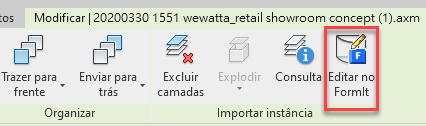

# FormIt + Revit

\

## La facilità di FormIt incontra la potenza di Revit 

FormIt per Windows si connette direttamente a Revit per una comunicazione fluida tra la fase concettuale iniziale e la progettazione dettagliata.

## Novità di FormIt + Revit 

### **Miglioramenti di FormIt 2023.1** 

* La posizione impostata in Revit viene ora sincronizzata con FormIt quando viene avviata tramite il pulsante Disegno 3D.
* È stata migliorata la sincronizzazione del disegno al tratto DWG quando FormIt viene avviato tramite il pulsante Disegno 3D.
* È disponibile la sincronizzazione facoltativa della cinepresa tra FormIt e Revit quando si è in modalità di disegno 3D o si modifica un oggetto di FormIt collegato.

### La potenza del collegamento per la versione 2023 

* Collegare un modello di FormIt (formato AXM) a Revit utilizzando il pulsante _**Collega CAD**_ nella scheda Inserisci di Revit.
* Selezionare in Revit un elemento di FormIt collegato e utilizzare il nuovo pulsante _**Modifica in FormIt**_ per avviarlo in FormIt per la modifica immediata.
* Utilizzare la nuova _**colonna Invia a Revit**_ nella tavolozza Layer per controllare quali layer vengono inviati a Revit quando il disegno di FormIt è collegato in Revit. 
* Visualizzare in anteprima la geometria che verrà inviata a Revit con la nuova modalità _**Invio in anteprima alle selezioni di Revit**_, disponibile nella parte inferiore del pannello Layer e accanto al pulsante Invia a Revit.
* I bordi della silhouette vengono ora disegnati per gli oggetti di FormIt in Revit.

### **Miglioramenti di FormIt 2022.1** 

Avviare FormIt da Revit con il pulsante Disegno 3D e includere nella tavolozza Livelli di FormIt tutti i dati o quelli dei livelli di Revit selezionati.

### **Tutte le novità della versione 2022** 

* Avviare FormIt direttamente da Revit con il nuovo pulsante _**Disegno 3D**_ nella scheda Volumetrie e planimetria di Revit.
* Progettare in FormIt e inviare nuovamente il disegno a Revit utilizzando il pulsante _**Invia a Revit**_ presente in FormIt quando viene avviato dal pulsante _Disegno 3D_.
* Importare un modello di FormIt in Revit utilizzando il pulsante _**Importa CAD**_ nella scheda Inserisci di Revit (più affidabile e fino a **30 volte più veloce** rispetto al pulsante precedente _Importa FormIt in RVT_).
* Non è necessario scaricare un modulo aggiuntivo separato per le funzionalità di FormIt.

### **Miglioramenti di Revit 2021.1** 

* Maggiore coerenza nella visibilità dei bordi: i bordi levigati/nascosti in FormIt restano nascosti in Revit.
* Maggiore coerenza nell'orientamento dei materiali: i materiali con sostituzioni personalizzate di scala/rotazione sulle superfici di FormIt manterranno tali sostituzioni in Revit.
* Risoluzione di diversi casi in cui la conversione della geometria di FormIt da Revit non riusciva o causava un arresto anomalo di Revit.

## Introduzione a FormIt + Revit 

### **Disegni 3D intuitivi direttamente da Revit** 

Se si lavora sia nella fase iniziale che nella progettazione dettagliata, è possibile iterare ed esplorare rapidamente i progetti tra FormIt e Revit.

* Eseguire il push della geometria contestuale da Revit a FormIt con un solo clic.
* Progettare e modellare in FormIt e inviare nuovamente la progettazione allo stesso progetto di Revit durante la stessa sessione.
* Fare riferimento ad un modello di FormIt in Revit mediante lo strumento _Collega CAD_ e continuare con la visualizzazione e la creazione di dettagli in Revit.
* Utilizzare _Modifica in FormIt_ per avviare un collegamento di FormIt da Revit.

\

### **Disegno 3D, Modifica in FormIt e Invia a Revit per l'iterazione di progetto** 

### **Workflow consigliati**

* Definire una parte interna del modello di Revit utilizzando un riquadro di sezione, quindi fare clic sul pulsante _**Disegno 3D**_ per aprire FormIt ed esplorare i layout interni o le funzionalità di progettazione su misura. Inviare il nuovo progetto a Revit con un solo clic.
* Iniziare con un contesto urbano già modellato in Revit e fare clic sul pulsante _**Disegno 3D**_ per importare il contesto circostante in FormIt come riferimenti su cui si può eseguire lo snap. Inviare il nuovo progetto a Revit con un solo clic.
* Aprire un modello di edificio di Revit esistente e utilizzare il pulsante _**Disegno 3D**_ per avviare FormIt. Modellare alcuni progetti per aggiungere un nuovo elemento, inserendo ogni progetto in un layer di FormIt diverso.
* Selezionare un oggetto di FormIt in Revit e avviare il modello in FormIt utilizzando il pulsante _**Modifica in FormIt**_.

* Utilizzare _**Modalità anteprima di Revit**_ per visualizzare in anteprima la geometria che verrà inviata a Revit per assicurarsi di condividere il progetto corretto da utilizzare per lo sviluppo dettagliato.
* Selezionare gli elementi desiderati dai progetti e inviare ogni progetto a Revit utilizzando il pulsante _**Invia a Revit**_ o salvando il modello collegato. 

### **Utilizzo degli strumenti**

* Il pulsante _**Disegno 3D**_, il pulsante _**Modifica in FormIt**_ e il workflow _**Invia a Revit**_ sono disponibili per gli abbonati alla Architecture, Engineering, & Construction (AEC) Collection Autodesk e per i clienti con tipi di accesso specifici. Non sono disponibili in Revit LT. [Ulteriori informazioni sulla AEC Collection si trovano qui.](https://www.autodesk.com/collections/architecture-engineering-construction/overview)

### Pulsante Disegno 3D

* Quando si avvia Revit 2022.0 o una versione successiva, è disponibile un nuovo pulsante nella scheda Volumetrie e planimetria denominato **Disegno 3D**. Il pulsante è disponibile solo nelle viste 3D e viene visualizzato disattivato nelle viste 2D in Revit.
* Assicurarsi di aver eseguito l'accesso a Revit con le credenziali Autodesk. All'avvio del pulsante _**Disegno 3D**_ potrebbe essere richiesto di accedere nuovamente ad Autodesk Account. Questo serve per verificare di disporre dei diritti corretti.
* Se non è installato FormIt 2022.0 o una versione successiva (o è installato FormIt in una versione precedente alla 2022.0), FormIt non si avvia e viene richiesto di scaricare la versione corretta di FormIt.

#### Finestra di dialogo Apri di FormIt di Disegno 3D

* Fare clic sul pulsante _**Disegno 3D**_ per avviare FormIt. Scegliere di importare in FormIt tutti gli oggetti visibili o solo gli oggetti selezionati. 
  * La scelta di importare solo gli oggetti selezionati è utile se il modello di Revit è di grandi dimensioni e il progetto farà riferimento solo ad una parte del modello di Revit. 
  * Inoltre, utilizzare un riquadro di sezione in Revit per isolare un'area interna del modello di Revit da importare in FormIt.

#### Disegno 3D e livelli

* Se è selezionata l'opzione Avviare FormIt con tutti gli oggetti di Revit visibili, tutti i livelli visibili di Revit diventeranno i livelli di FormIt, che possono essere [visualizzati nella tavolozza Livelli](../tool-library/levels-and-area.md#creating-and-configuring-levels) o [applicati agli oggetti tramite la tavolozza Proprietà](../tool-library/levels-and-area.md#applying-levels).
* Se è selezionata l'opzione Avviare FormIt con gli oggetti di Revit selezionati, solo i livelli selezionati diventeranno livelli di FormIt.

#### Dopo l'avvio di FormIt

* All'avvio di FormIt, la geometria di Revit inclusa verrà visualizzata sul suo layer in FormIt. Il layer è denominato Contesto di Revit ed è bloccato per default.
* Modellare in FormIt aggiungendo forme o applicando materiali, contenuto e altro ancora.
* Applicare i livelli agli oggetti di FormIt dalla [tavolozza Livelli](../tool-library/levels-and-area.md#applying-levels).

### Workflow di Invia a Revit

* Utilizzare la _**colonna Invia a Revit**_ nella tavolozza Layer per includere o escludere la geometria da inviare a Revit.

* Con _**Modalità anteprima di Revit**_, è possibile visualizzare un'anteprima facoltativa della geometria da inviare a Revit. Attivare Modalità anteprima di Revit utilizzando la casella di controllo nella parte inferiore della tavolozza Layer o accanto al pulsante Invia a Revit.

* Trasferire la geometria di FormIt in Revit utilizzando il pulsante _**Invia a Revit**_ sulla barra degli strumenti di FormIt.
  * Verrà visualizzato un messaggio di richiesta per salvare il file, che collega il modello a Revit.
    * **Nota** È consigliabile salvare il file localmente, poiché il salvataggio in Autodesk Docs interromperà la connessione tra FormIt e Revit. Utilizzare invece [Autodesk Desktop Connector](https://help.autodesk.com/view/CONNECT/ENU/) per condividere i modelli nel cloud.
  * Una volta creato il collegamento, ogni volta che si desidera trasferire le modifiche in Revit, è possibile salvare nuovamente il modello o fare clic sul pulsante Invia a Revit.

\.png>)

* I layer e i materiali di FormIt verranno trasferiti in Revit insieme alla geometria.
  * È possibile visualizzare i materiali di FormIt nella finestra di dialogo Materiali di Revit filtrando l'elenco in base a FormIt.
  * È possibile trovare i layer di FormIt in una vista di Revit tramite la scheda di importazione di Visibilità/Grafica. Questo è un ottimo modo per mostrare diverse varianti di progetto di FormIt in Revit.
  * Per inviare i livelli a Revit, è necessario importare il file AXM tramite la finestra di dialogo Importa CAD e selezionare Importa livelli di FormIt nella parte inferiore.

### Pulsante Modifica in FormIt

* Dopo il collegamento di un modello FormIt in Revit o dopo la creazione di un nuovo modello di FormIt utilizzando _**Disegno 3D**_ e il salvataggio del modello, l'elemento di FormIt viene salvato in Revit e può essere modificato nuovamente in un secondo momento.
* Selezionare un elemento di FormIt in Revit, quindi fare clic sul pulsante _**Modifica in FormIt**_ nella scheda Modifica per avviare il modello in FormIt.

\

* Vedere la Guida introduttiva di FormIt per un'[esercitazione sul workflow FormIt-Revit.](../formit-primer/part-ii/2.8-advanced-revit-workflows.md)

### **Importazione e collegamento di modelli di FormIt: Collaborazione progettuale tra FormIt e Revit** 

#### **Workflow consigliati**

* Condividere il modello di FormIt con un collega, che può quindi importare il modello di FormIt nel suo progetto di Revit per riferimento, visualizzazione e creazione di dettagli.
* Importare il modello di FormIt direttamente in una variante di progetto di Revit per esplorare e confrontare ulteriormente i progetti. Poiché i layer di FormIt vengono inseriti in Revit attraverso il workflow di importazione, l'utente di Revit può controllare quali layer di FormIt sono visibili in quale variante di progetto di Revit.
* Importare il modello di FormIt in una famiglia della categoria massa (quindi caricarlo in un progetto di Revit) per sfruttare gli strumenti Livelli, Pavimenti di massa e Per superficie e applicare le famiglie di sistema di Revit alla geometria di FormIt.

\.png>)

* È possibile collegare un modello di FormIt esistente a Revit per inviare le modifiche avanti e indietro, aggiornare geometrie e aspetto del materiale durante il ricaricamento e utilizzare i layer di FormIt per controllare la visibilità della geometria.

#### **Utilizzo degli strumenti**

* Specificare un file di FormIt da importare nel progetto di Revit corrente. Aprire lo strumento _**Importa CAD**_ di Revit. Scegliere AXM dall'elenco dei tipi di file disponibili. Individuare un file AXM e fare clic su _Apri_.
* I materiali di FormIt vengono trasferiti in Revit e visualizzati nella finestra di dialogo dei materiali di Revit. Filtrare l'elenco per i materiali di FormIt.
  * I materiali scalati o ruotati in FormIt mantengono la scala e la rotazione corrette in Revit.
* I livelli di FormIt vengono trasferiti in Revit.
  * Fare clic sul pulsante Importa livelli di FormIt nella finestra di dialogo Importa CAD.
* I bordi nascosti della geometria curva/sfaccettata in FormIt vengono importati in Revit con bordi nascosti.
  * Problema noto: i bordi della silhouette vengono visualizzati anche nella vista Linea nascosta di Revit.
* Il punto di origine di FormIt e il punto base di Revit vengono utilizzati per il posizionamento affidabile degli oggetti di FormIt importati.
* La geometria di FormIt importata in Revit verrà inclusa con tutti i layer di FormIt.
  * I layer di FormIt sono accessibili dalla scheda Visibilità/Grafica > Categorie importate. Qui l'utente vedrà un elenco di layer di FormIt e potrà attivarli e disattivarli con le caselle di controllo.
* Gli strumenti Per superficie di Revit (noti anche come strumenti di Building Maker) possono generare elementi di Revit dalla geometria di FormIt.
  * Ciò richiede che la geometria di FormIt venga prima importata in una famiglia Massa o Modello generico, quindi caricata nell'ambiente di progetto.
* La geometria di FormIt viene inserita come un'unica istanza di importazione.
  * Per importare un modello di FormIt come importazione separata, isolare parti del modello in FormIt e importare ciascuna parte come file AXM separato.
* Ulteriori informazioni sono disponibili nella [documentazione di Revit](https://help.autodesk.com/view/RVT/2023/ENU/?guid=GUID-A5F4B6C1-94CD-4433-A4E2-6B39B4BA8E6D).

#### **Utilizzo dei livelli di Revit e delle importazioni di FormIt**

* Durante l'importazione della geometria di FormIt in Revit, gli oggetti risultanti potrebbero trovarsi ad una quota altimetrica imprevista a causa dei livelli di Revit.
  * Nelle viste di prospetto/pianta, la geometria di FormIt importata viene visualizzata in Revit al livello corrente.
  * Nelle viste 3D, per default, la geometria di FormIt importata viene impostata sul livello più basso, che potrebbe essere sotto il livello del suolo.
  * Se la geometria viene visualizzata ad un'altezza imprevista in Revit, selezionare l'oggetto importato e impostare Livello di base sul livello appropriato in Revit.

#### **Conversione delle famiglie di Revit** 

* Le famiglie di Revit vengono convertite in contenuto di FormIt utilizzando il pulsante _**Converti RFA in FormIt**_ nella scheda Moduli aggiuntivi di Revit, rendendo più efficiente il riutilizzo, nel contesto di FormIt, di contenuto di Revit esistente.
* Specificare una cartella di file RFA che verranno convertiti in file di FormIt e salvati in una cartella a scelta.
* Questo è un ottimo modo per riutilizzare tutto il contenuto di Revit di cui già si dispone. È sufficiente convertire il contenuto in FormIt e puntare la libreria di contenuti di FormIt alla cartella contenente i file convertiti. Quindi, dalla tavolozza Libreria del contenuto, fare clic su un'anteprima e posizionarla nel modello.

#### **Preparazione dei file di SketchUp per Revit** 

* Utilizzare FormIt per Windows per aprire o importare il contenuto di SketchUp.
* In via facoltativa, utilizzare gli [strumenti incorporati di diagnostica e riparazione della geometria](https://formit.autodesk.com/blog/post/using-formit-to-get-sketchup-data-into-revit) che, per supportare al meglio le operazioni successive, deve essere costituita da solidi.
* Salvare il file di FormIt e importarlo utilizzando il workflow **Importa CAD** o **Invia a Revit** descritto in precedenza.

## Passaggio dal modulo aggiuntivo Convertitore FormIt 

FormIt + Revit 2022 e versioni successive offrono una sinergia integrata senza dover effettuare download aggiuntivi.

Con queste modifiche, il modulo aggiuntivo avvia una transizione. È descritto come sono cambiati i workflow precedenti.

### **Un nuovo modo per importare i file AXM** 

Con la sostituzione del pulsante _Importa FormIt in RVT_ nel modulo aggiuntivo è possibile importare i file di FormIt (AXM) tramite lo strumento Importa CAD nella scheda Inserisci di Revit. 

Oltre ad essere fino a **30 volte più veloce**, questo workflow è anche in genere **più affidabile**. Inoltre, alcuni comportamenti sono cambiati:

### **Geometria durante l'importazione**

* La geometria di FormIt viene importata come un'unica istanza di importazione. Le categorie di FormIt non diventano più categorie di Revit. Autodesk sta lavorando per risolvere questo problema in un aggiornamento futuro.
  * Le categorie di FormIt sono attualmente utilizzate solo per Analisi energetica.
* Non è più necessario suddividere il modello in parti più piccole. Provare a inviare un intero modello di FormIt tutto insieme.
* Per importare un modello di FormIt come importazione separata, isolare parti del modello in FormIt e importare ciascuna parte come file AXM separato.

### **Materiali all'importazione**

* I materiali di FormIt vengono trasferiti in Revit in modo più efficiente che mai e possono essere ordinati nella finestra di dialogo Materiali.

### **Workflow post-importazione**

* Per workflow che includono gli strumenti Pavimenti di massa e Per superficie (Building Maker), importare prima il modello di FormIt in una famiglia Massa o Modello generico di Revit, quindi caricarlo nell'ambiente di progetto.
* Inoltre, è possibile lavorare in modo più fluido accedendo al nuovo ambiente di disegno 3D per la progettazione nelle prime fasi direttamente da Revit.

### **Modifiche apportate alle famiglie di Revit** 

Continuare ad utilizzare il contenuto della famiglia di Revit in FormIt mediante il pulsante _Converti RFA in FormIt_ nella scheda Moduli aggiuntivi di Revit. Il workflow non subisce modifiche.

Il pulsante _Ricarica famiglie_ è stato rimosso poiché Autodesk lavora per offrire un'esperienza migliore.

## Note importanti 

### **Ottieni supporto** 

Serve assistenza con FormIt + Revit? [Inviare un commento nei forum](https://forums.autodesk.com/t5/formit-forum/bd-p/142).

Download del modulo aggiuntivo per Revit precedente\
 (2021 o versione precedente) 
------------------------------------------------------------------

Se si utilizza FormIt e Revit 2022 o versione successiva, non è necessario scaricare un modulo aggiuntivo separato.

Per Revit 2021 o release precedenti, è possibile trovare le versioni precedenti del modulo aggiuntivo facendo clic sul seguente collegamento:

[Vedere i download dei moduli aggiuntivi precedenti di Revit](https://formit.autodesk.com/page/download#download-revit-add-in)
