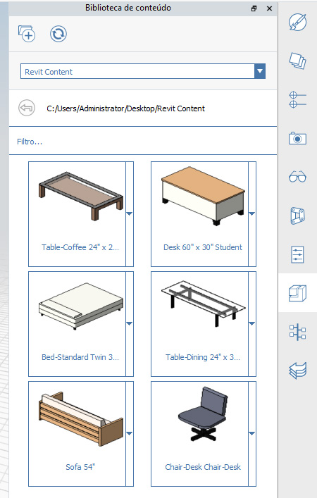

# FormIt + Revit

## Wygoda programu FormIt i możliwości programu Revit 

Program FormIt dla systemu Windows łączy się bezpośrednio z programem Revit, zapewniając płynną komunikację między wczesną koncepcją a projektem szczegółowym.

## Co nowego w połączeniu produktów FormIt + Revit 

### Potęga łączenia w wersji 2023 

* Połącz model programu FormIt (format AXM) z programem Revit za pomocą przycisku _**Połącz CAD**_ na karcie Wstaw w programie Revit.
* Wybierz połączony element programu FormIt w programie Revit i użyj nowego przycisku _**Edytuj w programie FormIt**_, aby uruchomić go w programie FormIt w celu natychmiastowej edycji.
* Użyj nowej _**kolumny Wyślij do programu Revit**_ na palecie Warstwy, aby sterować tym, które warstwy są wysyłane do programu Revit, gdy szkic programu FormIt jest połączony w programie Revit.&#x20;
* Podgląd geometrii, która zostanie wysłana do programu Revit, jest dostępny w dolnej części panelu Warstwy i obok przycisku Wyślij do programu Revit w nowym trybie _**Podgląd wysyłania do wyborów programu Revit**_.
* Dla obiektów programu FormIt w programie Revit są teraz rysowane krawędzie sylwetek.

### **Ulepszenia programu FormIt 2022.1** 

Uruchom program FormIt z programu Revit za pomocą przycisku Szkic 3D i uwzględnij wszystkie lub wybrane dane poziomu programu Revit na palecie Poziomy programu FormIt.

### **Zupełnie nowe w wersji 2022** 

* Uruchom program FormIt bezpośrednio z programu Revit za pomocą nowego przycisku _**Szkic 3D**_ na karcie Modelowanie bryłowe i teren programu Revit.
* Zaprojektuj w programie FormIt i wyślij szkic z powrotem do programu Revit za pomocą przycisku _**Wyślij do programu Revit**_ w programie FormIt po rozpoczęciu z poziomu przycisku _Szkic 3D_.
* Zaimportuj model programu FormIt do programu Revit za pomocą przycisku _**Import CAD**_ na karcie Wstaw programu Revit (jest on bardziej niezawodny i nawet **30 razy szybszy** niż poprzedni przycisk _Importuj z programu FormIt do programu RVT_).
* Nie trzeba pobierać oddzielnego dodatku, aby obsługiwać funkcje programu FormIt.

### **Ulepszenia programu Revit 2021.1** 

* Zwiększono spójność widoczności krawędzi: wygładzone/ukryte krawędzie w programie FormIt pozostają ukryte w programie Revit.
* Zwiększono spójność orientacji materiału: materiały z niestandardowymi nadpisaniami skali/obrotu na powierzchniach programu FormIt zachowają te nadpisania w programie Revit.
* Naprawiono problemy dotyczące kilku przypadków, w których konwertowanie geometrii programu FormIt z programu Revit kończyło się niepowodzeniem lub powodowało zawieszenie programu Revit.

## Pierwsze kroki z połączeniem produktów FormIt + Revit 

### **Intuicyjne szkicowanie 3D bezpośrednio z programu Revit** 

Zarówno na wczesnym etapie, jak i na etapie projektowania szczegółowego można szybko tworzyć iteracje i płynnie eksplorować projekty między programami FormIt i Revit.

* Wypchnij geometrię kontekstową z programu Revit do programu FormIt jednym kliknięciem.
* Projektuj i modeluj w programie FormIt, a następnie wyślij projekt z powrotem do tego samego projektu programu Revit w tej samej sesji.
* Utwórz odniesienie do modelu programu FormIt w programie Revit za pomocą narzędzia _Połącz CAD_ i kontynuuj wizualizację oraz detalowanie w programie Revit.
* Uruchamiaj połączenie programu FormIt z programu Revit za pomocą polecenia _Edytuj w programie FormIt_.

### **Szkic 3D, edycja w programie FormIt i wysyłanie do programu Revit na potrzeby iteracji projektu** 

#### **Sugerowane procesy robocze**

* Zdefiniuj wewnętrzną część modelu programu Revit za pomocą zakresu przekroju, a następnie kliknij przycisk _**Szkic 3D**_, aby otworzyć program FormIt i eksplorować układy wnętrza lub dostosowane elementy projektu. Wyślij nowy projekt do programu Revit jednym kliknięciem.
* Rozpocznij od kontekstu miejskiego już wymodelowanego w programie Revit i kliknij przycisk _**Szkic 3D**_, aby przenieść ten kontekst otoczenia do programu FormIt jako odniesienia przyciągalne. Wyślij nowy projekt do programu Revit jednym kliknięciem.
* Otwórz istniejący model budynku programu Revit i użyj przycisku _**Szkic 3D**_, aby uruchomić program FormIt. Modeluj kilka projektów dla nowo dodawanego komponentu, umieszczając każdy projekt na innej warstwie programu FormIt.
* Wybierz obiekt programu FormIt w programie Revit i uruchom model w programie FormIt za pomocą przycisku _**Edytuj w programie FormIt**_.

* Użyj _**trybu podglądu programu Revit**_, aby wyświetlić podgląd geometrii, która zostanie wysłana do programu Revit, i upewnić się, że udostępniasz odpowiedni projekt, który ma zostać użyty w opracowywaniu szczegółowym.
* Wybierz żądane elementy z projektów i wyślij każdy projekt do programu Revit za pomocą przycisku _**Wyślij do programu Revit**_ lub zapisując model połączony.&#x20;

#### **Korzystanie z narzędzi**

* Przycisk _**Szkic 3D**_, przycisk _**Edytuj w programie FormIt**_ i proces roboczy _**Wyślij do programu Revit**_ są dostępne dla subskrybentów kolekcji Autodesk z zakresu architektury, inżynierii i budownictwa (AEC) oraz dla klientów z określonymi typami dostępu. Nie jest to dostępne w programie Revit LT. [Dowiedz się więcej o kolekcji z zakresu architektury, inżynierii i budownictwa (AEC Collection) tutaj.](https://www.autodesk.pl/collections/architecture-engineering-construction/overview)

* Po uruchomieniu programu Revit 2022.0 lub nowszej wersji na karcie Modelowanie bryłowe i teren dostępny jest nowy przycisk o nazwie **Szkic 3D**. Przycisk jest dostępny tylko w widokach 3D. W widokach 2D w programie Revit będzie on wyświetlany jako wyłączony.
* Upewnij się, że zalogowano się w programie Revit za pomocą poświadczeń Autodesk. Po uruchomieniu przycisku _**Szkic 3D**_ może zostać wyświetlony monit o ponowne zalogowanie się na koncie Autodesk. Ma to na celu sprawdzenie, czy masz odpowiednie uprawnienia.
* Jeśli nie jest zainstalowany program FormIt 2022.0 ani jego nowsza wersja (lub jest zainstalowana wersja starsza niż FormIt 2022.0), program FormIt nie zostanie uruchomiony i zostanie wyświetlony monit o pobranie poprawnej wersji programu FormIt.
* Kliknij przycisk _**Szkic 3D**_, aby uruchomić program FormIt. Wybierz, aby przenieść wszystkie widoczne obiekty lub tylko wybrane obiekty do programu FormIt. Wybór opcji przeniesienia tylko wybranych obiektów jest przydatny, jeśli model programu Revit jest duży, a projekt będzie odnosił się tylko do części tego modelu. Ponadto użyj zakresu przekroju w programie Revit, aby wyizolować wewnętrzny obszar modelu programu Revit w celu przeniesienia go do programu FormIt.

* W przypadku wybrania poziomów w programie Revit zostaną przekazane do programu FormIt. W przeciwnym razie program FormIt otrzyma wszystkie widoczne poziomy w programie Revit.
* Po uruchomieniu programu FormIt dołączona geometria programu Revit będzie wyświetlana na osobnej warstwie w programie FormIt. Warstwa ta ma nazwę „Kontekst programu Revit” i jest domyślnie zablokowana.
* Modeluj w programie FormIt, dodając formy lub stosując materiały, zawartość i nie tylko.
* Zastosuj poziomy do obiektów programu FormIt z palety Poziomy.
* Użyj _**kolumny Wyślij do programu Revit**_ na palecie Warstwy, aby uwzględnić lub wykluczyć geometrię, która ma zostać wysłana do programu Revit.

* Za pomocą _**trybu podglądu programu Revit**_ można opcjonalnie wyświetlić podgląd geometrii, która ma zostać wysłana do programu Revit. Aktywuj tryb podglądu programu Revit, zaznaczając pole wyboru u dołu palety Warstwy lub obok przycisku Wyślij do programu Revit.

* Przenieś geometrię programu FormIt do programu Revit za pomocą przycisku _**Wyślij do programu Revit**_ na pasku narzędzi programu FormIt.
   * Spowoduje to wyświetlenie monitu o zapisanie pliku, co będzie skutkować połączeniem modelu z programem Revit.
      * **Uwaga:** zaleca się zapisanie pliku lokalnie, ponieważ zapisanie w usłudze Autodesk Docs spowoduje przerwanie połączenia między programem FormIt i programem Revit. Zamiast tego do udostępniania modeli w chmurze należy użyć programu [Autodesk Desktop Connector](https://help.autodesk.com/view/CONNECT/PLK/).
   * Po utworzeniu połączenia możesz ponownie zapisać model lub kliknąć przycisk Wyślij do programu Revit za każdym razem, gdy chcesz przenieść zmiany do programu Revit.

.png>)

* Poziomy, warstwy i materiały programu FormIt zostaną przeniesione do programu Revit wraz z geometrią.
   * Materiały programu FormIt można wyświetlić w oknie dialogowym Materiały programu Revit, filtrując listę za pomocą wyrazu „FormIt”.
   * Warstwy programu FormIt można znaleźć w widoku programu Revit na karcie importu w oknie Grafika widoczności. Jest to doskonały sposób na wyświetlanie różnych wariantów projektu programu FormIt w programie Revit.
* Po uruchomieniu programu Revit 2023.0 lub nowszej wersji i wybraniu obiektu programu FormIt można użyć przycisku _**Edytuj w programie FormIt**_, aby uruchomić model w programie FormIt.
* W przewodniku FormIt Primer można znaleźć [przewodnik po procesach roboczych połączenia produktów FormIt i Revit.](../formit-primer/part-ii/2.8-advanced-revit-workflows.md)

### **Importowanie i łączenie modeli programu FormIt: współpraca projektowa między programami FormIt i Revit** 

#### **Sugerowane procesy robocze**

* Udostępnij model programu FormIt współpracownikom, którzy będą następnie mogli zaimportować model programu FormIt do projektu Revit w celu zapoznania się z nim, wizualizacji i detalowania.
* Zaimportuj model programu FormIt bezpośrednio do wariantu projektu programu Revit, aby dokładniej badać i porównywać projekty. Ponieważ warstwy programu FormIt są wprowadzane do programu Revit w procesie roboczym importowania, użytkownik programu Revit może kontrolować, które warstwy programu FormIt będą widoczne w poszczególnych wariantach projektu programu Revit.
* Zaimportuj model programu FormIt do rodziny kategorii brył (a następnie wczytaj go do projektu programu Revit), aby korzystać z narzędzi Poziomy, Zakresy kondygnacji i Według powierzchni oraz stosować rodziny systemowe programu Revit do geometrii programu FormIt.

.png>)

* Połącz istniejący model programu FormIt z programem Revit, aby wysyłać zmiany między tymi programami, aktualizować geometrie i wygląd materiałów podczas ponownego wczytywania oraz używać warstw programu FormIt do sterowania widocznością geometrii.

#### **Korzystanie z narzędzi**

* Określ plik programu FormIt do zaimportowania do bieżącego projektu programu Revit. Otwórz narzędzie _**Import CAD**_ programu Revit. Wybierz plik .AXM z listy dostępnych typów plików. Przejdź do pliku .AXM i kliknij przycisk _Otwórz_.
* Materiały programu FormIt są przenoszone do programu Revit i wyświetlane w oknie dialogowym Materiały programu Revit. Przefiltruj listę materiałów programu FormIt.
   * Materiały, które zostały przeskalowane lub obrócone w programie FormIt, zachowują prawidłową skalę i obrót w programie Revit.
* Poziomy z programu FormIt są przenoszone do programu Revit.
   * Kliknij przycisk „Importuj poziomy FormIt” w oknie dialogowym Import CAD.
* Ukryte krawędzie geometrii zakrzywionej/płaszczyznowej w programie FormIt są przenoszone do programu Revit z ukrytymi krawędziami.
   * Znany problem: krawędzie sylwetki są również ukryte w widoku Ukryte linie w programie Revit.
* Punkt początkowy programu FormIt i punkt bazowy programu Revit są używane do niezawodnego umieszczania zaimportowanych obiektów programu FormIt.
* Geometria programu FormIt zaimportowana do programu Revit jest przenoszona ze wszystkimi warstwami programu FormIt.
   * Warstwy programu FormIt są dostępne na karcie Widoczność/Grafika > Kategorie importowane. W tym miejscu użytkownik zobaczy listę warstw programie FormIt i będzie mógł je włączać i wyłączać za pomocą pól wyboru.
* Narzędzia programu Revit „Według powierzchni” (znane również jako narzędzia Building Maker) mogą generować elementy programu Revit na podstawie geometrii programu FormIt
   * Wymaga to zaimportowania geometrii programu FormIt najpierw do rodziny brył lub rodziny modeli ogólnych, a następnie wczytania do środowiska projektu.
* Geometria programu FormIt jest przekazywana jako jedno wystąpienie importu.
   * Aby zaimportować model programu FormIt jako oddzielny import, wydziel części modelu w programie FormIt i zaimportuj każdą część jako oddzielny plik .AXM.
* Więcej informacji podano w [dokumentacji programu Revit.](https://help.autodesk.com/view/RVT/2023/PLK/?guid=GUID-A5F4B6C1-94CD-4433-A4E2-6B39B4BA8E6D)

#### **Praca z poziomami programu Revit i importami programu FormIt**

* Podczas importowania geometrii programu FormIt do programu Revit obiekty wynikowe mogą znaleźć się na nieoczekiwanej rzędnej z powodu poziomów programu Revit.
   * W widokach elewacji/rzutu zaimportowana geometria programu FormIt będzie wyświetlana w programie Revit na bieżącym poziomie.
   * W widokach 3D zaimportowana geometria programu FormIt będzie domyślnie ustawiona na najniższym poziomie, który może znajdować się poniżej nachylenia.
   * Jeśli geometria jest wyświetlana na nieoczekiwanej wysokości w programie Revit, wybierz zaimportowany obiekt i dostosuj poziom podstawy do odpowiedniego poziomu w programie Revit.

#### **Konwertowanie rodzin programu Revit** 

* Rodziny programu Revit są konwertowane na zawartość programu FormIt za pomocą przycisku _**Konwertuj RFA na format programu FormIt**_ na karcie Dodatki programu Revit, co zwiększa wydajność ponownego użycia istniejącej zawartości programu Revit w kontekście programu FormIt.
* Określ folder plików RFA, które zostaną przekonwertowane na pliki programu FormIt i zapisane w wybranym folderze.
* Jest to doskonały sposób na ponowne wykorzystanie wszystkich już posiadanych elementów programu Revit. Wystarczy przekonwertować zawartość do formatu programu FormIt i wskazać jako bibliotekę elementów programu FormIt folder zawierający przekonwertowane pliki. Następnie na palecie Biblioteka elementów kliknij podgląd miniatury i umieść go w modelu.

#### **Przygotowanie plików programu SketchUp do programu Revit** 

* Otwórz lub zaimportuj zawartość programu SketchUp za pomocą programu FormIt dla systemu Windows
* Opcjonalnie użyj [wbudowanych narzędzi diagnostycznych i naprawczych w celu naprawienia geometrii](https://formit.autodesk.com/blog/post/using-formit-to-get-sketchup-data-into-revit), aby jej bryła była lepsza w przypadku kolejnych operacji
* Zapisz plik programu FormIt i zaimportuj go, korzystając z procesów roboczych **Import CAD** lub **Wyślij do programu Revit** opisanych powyżej

## Przechodzenie z dodatku FormIt Converter 

Połączenie produktów FormIt + Revit 2022 i nowsze wersje zapewniają wbudowaną synergię bez konieczności pobierania dodatkowych składników.

Wskutek tych zmian rozpoczyna się przejście dodatku. Dowiedz się, jak zmieniły się poprzednie procesy robocze.

### **Nowy sposób importowania plików AXM** 

Przycisk _Importuj z programu FormIt do programu RVT_ w dodatku zastąpiono możliwością importowania plików programu FormIt (.AXM) za pomocą narzędzia Import CAD na karcie Wstaw programu Revit.&#x20;

Ten proces roboczy, oprócz tego, że jest **30 razy szybszy**, jest też zwykle **bardziej niezawodny**. Oprócz tego niektóre zachowania uległy zmianie:

### **Geometria podczas importowania**

* Geometria programu FormIt jest importowana jako jedno wystąpienie importu. Kategorie programu FormIt nie stają się już kategoriami programu Revit. Pracujemy nad rozwiązaniem tego problemu w przyszłej aktualizacji.
   * Kategorie programu FormIt są obecnie używane tylko do analizy energetycznej.
* Nie trzeba już dzielić modelu na mniejsze fragmenty — spróbuj wysłać cały model programu FormIt jednocześnie.
* Aby zaimportować model programu FormIt jako oddzielny import, wydziel części modelu w programie FormIt i zaimportuj każdą część jako oddzielny plik .AXM.

### **Materiały podczas importowania**

* Materiały programu FormIt są przenoszone do programu Revit lepiej niż kiedykolwiek wcześniej i można je sortować w oknie dialogowym Materiały.

### **Procesy robocze po imporcie**

* W przypadku procesów roboczych obejmujących narzędzia Zakresy kondygnacji i Według powierzchni (Building Maker) należy najpierw zaimportować model programu FormIt do rodziny brył lub modeli ogólnych programu Revit, a następnie wczytać go do środowiska projektu.
* Ponadto możliwa jest płynniejsza praca dzięki dostępowi do nowego środowiska szkicowania 3D na wczesnym etapie projektu bezpośrednio z programu Revit.

### **Zmiany w rodzinach programu Revit** 

W dalszym ciągu można używać zawartości rodziny programu Revit w programie FormIt za pomocą przycisku _Konwertuj RFA na format programu FormIt_ na karcie Dodatki programu Revit. Ten proces roboczy nie ulega zmianie.

Przycisk _Wczytaj ponownie rodziny_ został usunięty w ramach naszych prac w celu zapewnienia lepszego środowiska pracy.

## Ważne uwagi 

### **Uzyskaj pomoc techniczną** 

Potrzebujesz pomocy dotyczącej połączenia produktów FormIt + Revit? [Poinformuj nas na forach](https://forums.autodesk.com/t5/formit-forum/bd-p/142?profile.language=en).

Pobieranie starego dodatku dla programu Revit\ (2021 lub starszego) 
------------------------------------------------------------------

W przypadku korzystania z programów FormIt i Revit 2022 lub nowszych nie ma potrzeby pobierania oddzielnego dodatku.

W przypadku programu Revit 2021 lub wcześniejszych wersji można znaleźć stare wersje dodatku, klikając poniższe łącze:

[Zobacz stare dodatki dla programu Revit do pobrania](https://formit.autodesk.com/page/download#download-revit-add-in)
