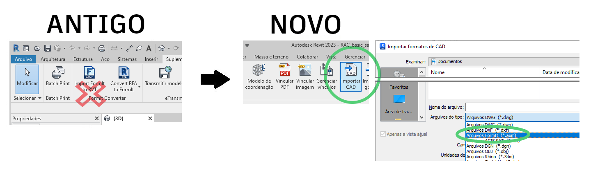

# FormIt a Revit

## Jednoduchost aplikace FormIt se snoubí s výkonem aplikace Revit 

Aplikace FormIt pro systém Windows se přímo propojuje s aplikací Revit a umožňuje bezproblémovou práci na raném konceptu i detailním návrhu.

## Přehled nových funkcí v aplikacích FormIt a Revit 

### Výkon propojení ve verzi 2023 

* Pomocí tlačítka _**Připojit CAD**_ na kartě Vložit v aplikaci Revit můžete připojit model aplikace FormIt (formát AXM) k aplikaci Revit.
* Vyberte připojený prvek aplikace FormIt v aplikaci Revit a pomocí nového tlačítka _**Upravit v aplikaci FormIt**_ jej spusťte v aplikaci FormIt, kde můžete ihned provádět úpravy.
* Pomocí nového sloupce _**Odeslat do aplikace Revit**_ na paletě Hladiny můžete určit, které hladiny budou odeslány do aplikace Revit při připojení náčrtu aplikace FormIt v aplikaci Revit.&#x20;
* Zobrazte si náhled geometrie, která bude odeslána do aplikace Revit, pomocí nového režimu _**Odeslání náhledu do výběrů aplikace Revit**_, který je k dispozici v dolní části panelu Hladiny a vedle tlačítka Odeslat do aplikace Revit.
* U objektů aplikace FormIt se nyní v aplikaci Revit vykreslují obrysové hrany.

### **Vylepšení aplikace FormIt 2022.1** 

Spouštějte aplikaci FormIt z aplikace Revit pomocí tlačítka 3D náčrt a zahrňte všechna nebo vybraná data podlaží z aplikace Revit na paletě Podlaží v aplikaci FormIt.

### **Nové funkce ve verzi 2022** 

* Aplikaci FormIt můžete spouštět přímo z aplikace Revit pomocí nového tlačítka _**3D náčrt**_ na kartě Objemy a pozemek v aplikaci Revit.
* Navrhujte v aplikaci FormIt a odešlete náčrt zpět do aplikace Revit pomocí tlačítka _**Odeslat do aplikace Revit**_ v aplikaci FormIt, kterou jste spustili pomocí tlačítka _3D náčrt_.
* Importujte model aplikace FormIt do aplikace Revit pomocí tlačítka _**Importovat CAD**_ na kartě Vložit v aplikaci Revit (spolehlivější a až **30x rychlejší** než předchozí tlačítko _Importovat soubor FormIt do formátu RVT_).
* Pro funkce aplikace FormIt není nutné stahovat samostatný doplněk.

### **Vylepšení aplikace Revit 2021.1** 

* Vylepšená konzistence viditelnosti hran: Vyhlazené/skryté hrany v aplikaci FormIt zůstanou v aplikaci Revit skryté.
* Vylepšená konzistence orientace materiálu: Materiály s uživatelským nastavením měřítka/otočení na plochách aplikace FormIt si tato nastavení zachovají i v aplikaci Revit.
* Bylo opraveno několik případů, kdy převod geometrie aplikace FormIt z aplikace Revit selhal nebo způsoboval zablokování aplikace Revit.

## Začínáme s aplikacemi FormIt a Revit 

### **Intuitivní 3D kreslení přímo z aplikace Revit** 

Pokud pracujete na počáteční fázi i na detailním návrhu, můžete rychle iterovat a plynule rozvíjet návrhy mezi aplikacemi FormIt a Revit.

* Jediným kliknutím přeneste kontextovou geometrii z aplikace Revit do aplikace FormIt.
* Navrhujte a modelujte v aplikaci FormIt a odešlete svůj návrh zpět do stejného projektu aplikace Revit ve stejné relaci.
* Pomocí nástroje _Připojit CAD_ vytvořte v aplikaci Revit referenci na model aplikace FormIt a pokračujte ve vizualizaci a tvorbě detailů v aplikaci Revit.
* Pomocí tlačítka _Upravit v aplikaci FormIt_ spusťte připojení aplikace FormIt z aplikace Revit.

### **Iterace návrhu pomocí nástrojů 3D náčrt, Upravit v aplikaci FormIt a Odeslat do aplikace Revit** 

#### **Doporučené pracovní postupy**

* Definujte vnitřní část modelu aplikace Revit pomocí ořezového kvádru a poté kliknutím na tlačítko _**3D náčrt**_ otevřete aplikaci FormIt a prozkoumejte rozvržení interiéru nebo přizpůsobené prvky návrhu. Jedním kliknutím odešlete nový návrh do aplikace Revit.
* Začněte s městským kontextem, který je již vymodelován v aplikaci Revit, a kliknutím na tlačítko _**3D náčrt**_ přeneste okolní kontext do aplikace FormIt jako uchopitelné reference. Jedním kliknutím odešlete nový návrh do aplikace Revit.
* Otevřete existující model budovy aplikace Revit a pomocí tlačítka _**3D náčrt**_ spusťte aplikaci FormIt. Vymodelujte několik nových návrhů, přičemž každý návrh umístěte do jiné hladiny aplikace FormIt.
* Vyberte objekt aplikace FormIt v aplikaci Revit a spusťte model v aplikaci FormIt pomocí tlačítka _**Upravit v aplikaci FormIt**_.

* Pomocí _**režimu náhledu aplikace Revit**_ můžete zobrazit náhled geometrie, která bude odeslána do aplikace Revit, abyste se ujistili, že sdílíte správný návrh, který bude použit pro detailní vývoj.
* Vyberte požadované prvky z návrhů a odešlete každý návrh do aplikace Revit pomocí tlačítka _**Odeslat do aplikace Revit**_ nebo uložením připojeného modelu.&#x20;

#### **Použití nástrojů**

* Tlačítko _**3D náčrt**_, _**Upravit v aplikaci FormIt**_ a pracovní postup _**Odeslat do aplikace Revit**_ jsou k dispozici pro předplatitele sady Autodesk Architecture Engineering & Construction Collection (AEC Collection) a zákazníkům s určitými typy přístupu. Nejsou k dispozici pro uživatele aplikace Revit LT. [Další informace o sadě AEC Collection najdete zde.](https://www.autodesk.cz/collections/architecture-engineering-construction/overview)

.

* Při spuštění aplikace Revit 2022.0 nebo novější verze se na kartě Objemy a pozemek zobrazí nové tlačítko s názvem **3D náčrt**. Toto tlačítko je k dispozici pouze v 3D pohledech. Ve 2D pohledech aplikace Revit se zobrazí jako vypnuté.
* Ujistěte se, že jste přihlášeni k aplikaci Revit pomocí přihlašovacích údajů společnosti Autodesk. Po kliknutí na tlačítko _**3D náčrt**_ můžete být vyzváni k novému přihlášení k účtu Autodesk. Tím se kontroluje, zda máte správná oprávnění.
* Pokud není nainstalována aplikace FormIt 2022.0 nebo novější verze (nebo je nainstalována starší verze než 2022.0), aplikace FormIt se nespustí a budete vyzváni ke stažení správné verze aplikace FormIt.
* Kliknutím na tlačítko _**3D náčrt**_ spusťte aplikaci FormIt. Zvolte, zda chcete do aplikace FormIt přenést všechny viditelné objekty nebo pouze vybrané objekty. Přenesení pouze vybraných objektů je vhodné zvolit, pokud je model Revit velký a návrh bude odkazovat pouze na část modelu Revit. Pomocí ořezového kvádru v aplikaci Revit můžete navíc izolovat vnitřní oblast modelu aplikace Revit, kterou chcete přenést do aplikace FormIt.

* Pokud v aplikaci Revit vyberete podlaží, budou do aplikace FormIt přenesena pouze vybraná podlaží. V opačném případě budou do aplikace FormIt přenesena všechna viditelná podlaží v aplikaci Revit.
* Při spuštění aplikace FormIt se zahrnutá geometrie aplikace Revit zobrazí v aplikaci FormIt ve vlastní hladině. Tato hladina se nazývá „Kontext aplikace Revit“ a ve výchozím nastavení je uzamknuta.
* Modelujte v aplikaci FormIt přidáním tvarů nebo použitím materiálů, obsahu a dalších položek.
* Na objekty aplikace FormIt můžete použít podlaží z palety Podlaží.
* Pomocí sloupce _**Odeslat do aplikace Revit**_ na paletě Hladiny můžete zahrnout nebo vyloučit geometrii, která má být odeslána do aplikace Revit.

* Pomocí _**režimu náhledu aplikace Revit**_ můžete volitelně zobrazit náhled geometrie, která má být odeslána do aplikace Revit. Režim náhledu aplikace Revit aktivujte zaškrtnutím políčka v dolní části palety Hladiny nebo vedle tlačítka Odeslat do aplikace Revit.

* Geometrii aplikace FormIt můžete přenést do aplikace Revit pomocí tlačítka _**Odeslat do aplikace Revit**_ na panelu nástrojů aplikace FormIt.
   * Budete vyzváni k uložení souboru, který připojí model k aplikaci Revit.
      * **Poznámka:** Doporučujeme soubor uložit místně, protože uložením ve službě Autodesk Docs dojde k přerušení připojení mezi aplikacemi FormIt a Revit. Ke sdílení modelů v cloudu použijte aplikaci [Autodesk Desktop Connector](https://help.autodesk.com/view/CONNECT/CSY/).
   * Po vytvoření připojení můžete kdykoliv přenést změny do aplikace Revit novým uložení modelu nebo kliknutím na tlačítko Odeslat do aplikace Revit.

.png>)

* Společně s geometrií budou do aplikace Revit podlaží, hladiny a materiály aplikace FormIt.
   * Materiály aplikace FormIt si můžete zobrazit v dialogu Materiály v aplikaci Revit filtrováním seznamu podle položky „FormIt“.
   * V pohledu aplikace Revit najdete hladiny aplikace FormIt pomocí karty Import v dialogu Viditelnost/Zobrazení. Jedná se o skvělý způsob, jak v aplikaci Revit zobrazit různé možnosti návrhu aplikace FormIt.
* Když spustíte aplikaci Revit 2023.0 nebo novější verzi a vyberete objekt aplikace FormIt, můžete pomocí tlačítka _**Upravit v aplikaci FormIt**_ spustit model v aplikaci FormIt.
* Výukový program k pracovním postupům aplikací [FormIt a Revit naleznete v příručce k aplikaci FormIt.](../formit-primer/part-ii/2.8-advanced-revit-workflows.md)

### **Import a připojení modelů aplikace FormIt: Spolupráce na návrhu mezi aplikacemi FormIt a Revit** 

#### **Doporučené pracovní postupy**

* Sdílejte model aplikace FormIt s kolegou, který jej poté může importovat do svého projektu aplikace Revit pro referenci, vizualizaci a tvorbu detailů.
* Model FormIt můžete importovat přímo do varianty návrhu aplikace Revit za účelem dalšího zkoumání a porovnávání návrhů. Do aplikace Revit jsou importovány hladiny aplikace FormIt a uživatel aplikace Revit může určit, které hladiny aplikace FormIt budou viditelné ve které variantě návrhu aplikace Revit.
* Importujte model aplikace FormIt do rodiny objemových kategorií (poté jej načtěte do projektu aplikace Revit), abyste mohli využít nástroje Podlaží, Podlaží objemu a Podle plochy a použít systémové rodiny aplikace Revit na geometrii aplikace FormIt.

.png>)

* Připojte existující model aplikace FormIt do aplikace Revit a posílejte změny tam a zpět, aktualizujte geometrii a vzhled materiálu při opakovaném načtení a pomocí hladin aplikace FormIt řiďte viditelnost geometrie.

#### **Použití nástrojů**

* Určete soubor aplikace FormIt, který chcete importovat do aktuálního projektu aplikace Revit. V aplikaci Revit otevřete nástroj _**Importovat CAD**_. V seznamu dostupných typů souborů vyberte položku .AXM. Vyhledejte soubor AXM a klikněte na tlačítko _Otevřít_.
* Přenos materiálů aplikace FormIt do aplikace Revit a jejich zobrazení v dialogu materiálů aplikace Revit. Vyfiltrujte v seznam materiály aplikace FormIt.
   * Materiály, které byly v aplikaci FormIt otočeny nebo byla změněna jejich velikost, si v aplikaci Revit zachovají správné měřítko a natočení.
* Přenášejte podlaží z aplikace FormIt do aplikace Revit.
   * V dialogu Importovat CAD klikněte na tlačítko Importovat podlaží aplikace FormIt.
* Skryté hrany zakřivené/oploškované geometrie v aplikaci FormIt jsou do aplikace Revit přeneseny se skrytými hranami.
   * Známý problém: Obrysové hrany jsou v pohledu Skryté hrany v aplikaci Revit také skryté.
* Ke spolehlivému umístění importovaných objektů aplikace FormIt slouží bod počátku aplikace FormIt a základní bod aplikace Revit.
* Geometrie aplikace FormIt importovaná do aplikace Revit zahrnuje všechny hladiny aplikace FormIt.
   * Hladiny aplikace FormIt jsou dostupné v dialogu Viditelnost/Zobrazení na kartě Importované kategorie. Zde se uživateli zobrazí seznam hladin aplikace FormIt, které může pomocí zaškrtávacích políček zapínat a vypínat.
* Nástroje Podle plochy aplikace Revit (známé také jako nástroje Building Maker) mohou z geometrie aplikace FormIt generovat prvky aplikace Revit.
   * To vyžaduje, aby byla geometrie aplikace FormIt nejprve importována do rodiny objemů nebo rodiny obecného modelu a poté načtena do prostředí projektu.
* Geometrie aplikace FormIt je přenášena jako jedna instance importu.
   * Chcete-li importovat model aplikace FormIt v několika samostatných importech, izolujte části modelu v aplikaci FormIt a importujte každou část jako samostatný soubor AXM.
* Další informace naleznete v dokumentaci k aplikaci [Revit.](https://help.autodesk.com/view/RVT/2023/CSY/?guid=GUID-A5F4B6C1-94CD-4433-A4E2-6B39B4BA8E6D)

#### **Práce s podlažími aplikace Revit a importy z aplikace FormIt**

* Při importu geometrie aplikace FormIt do aplikace Revit mohou být výsledné objekty v neočekávané výšce vzhledem k podlažím aplikace Revit.
   * V bokorysných/půdorysných pohledech se importovaná geometrie aplikace FormIt zobrazí v aplikaci Revit na aktuálním podlaží.
   * Ve 3D pohledech bude importovaná geometrie aplikace FormIt ve výchozím nastavení použita pro nejnižší podlaží, které může být pod úrovní terénu.
   * Pokud se geometrie v aplikaci Revit zobrazí v neočekávané výšce, vyberte importovaný objekt a v aplikaci Revit upravte podlaží základny na příslušné podlaží.

#### **Převod rodin aplikace Revit** 

* Rodiny aplikace Revit jsou na obsah aplikace FormIt převáděny pomocí tlačítka _**Převést soubor RFA do formátu FormIt**_ na kartě Doplňky, což umožňuje efektivní opakované použití stávajícího obsahu aplikace Revit v kontextu aplikace FormIt.
* Určete složku souborů RFA, které budou převedeny na soubory aplikace FormIt a odeslány do složky dle vašeho výběru.
* Jedná se o skvělý způsob, jak znovu použít veškerý obsah aplikace Revit, který již máte. Stačí převést obsah do formátu aplikace FormIt a nasměrovat knihovnu obsahu FormIt do složky obsahující převedené soubory. Poté na paletě Knihovna obsahu klikněte na náhled miniatury a umístěte jej do modelu.

#### **Příprava souborů aplikace SketchUp pro aplikaci Revit** 

* V aplikaci FormIt pro systém Windows otevřete nebo importujte obsah aplikace SketchUp.
* Volitelně můžete použít [vestavěné diagnostické a opravné nástroje k opravě geometrie](https://formit.autodesk.com/blog/post/using-formit-to-get-sketchup-data-into-revit), aby lépe vyhovovala následným operacím.
* Uložte soubor aplikace FormIt a importujte jej pomocí výše uvedených pracovních postupů **Importovat CAD** nebo **Odeslat do aplikace Revit**.

## Přechod z doplňku FormIt Converter 

Aplikace FormIt a Revit 2022 a novější nabízejí integrovanou synergii bez nutnosti dalšího stahování.

Těmito změnami začíná proces přechodu z tohoto doplňku. Zjistěte, jak se změnily předchozí pracovní postupy.

### **Nový způsob importu souborů AXM** 

Tlačítko _Importovat soubor FormIt do formátu RVT_ v doplňku nahrazuje možnost importovat soubory aplikace FormIt (AXM) pomocí nástroje Importovat CAD na kartě Vložit v aplikaci Revit.&#x20;

Kromě toho, že je tento pracovní postup až **30x rychlejší**, je také celkově **spolehlivější**. Spolu s tím se změnilo i některé chování:

### **Geometrie při importu**

* Geometrie aplikace FormIt se importuje jako jedna instance importu. Kategorie aplikace FormIt se již nestávají kategoriemi aplikace Revit. Řešení tohoto problému přineseme v některé z budoucích aktualizací.
   * Kategorie aplikace FormIt se aktuálně používají pouze pro energetickou analýzu.
* Již není nutné rozdělovat model na menší části – zkuste odeslat celý model aplikace FormIt najednou!
* Chcete-li importovat model aplikace FormIt v několika samostatných importech, izolujte části modelu v aplikaci FormIt a importujte každou část jako samostatný soubor AXM.

### **Materiály při importu**

* Materiály aplikace FormIt se do aplikace Revit přenášejí lépe než kdy dříve a lze je třídit v dialogu Materiály.

### **Pracovní postupy po importu**

* U pracovních postupů zahrnujících nástroje Podlaží objemu a Podle plochy (Building Maker) nejprve importujte model aplikace FormIt do rodiny objemů rodiny nebo obecného modelu aplikace Revit a poté jej načtěte do prostředí projektu.
* Kromě toho si můžete užívat plynulejší práci díky přístupu do nového prostředí 3D náčrtu pro počáteční fázi návrhu přímo z aplikace Revit.

### **Změny rodin aplikace Revit** 

Obsah rodin aplikace Revit můžete nadále používat pomocí tlačítka _Převést soubor RFA do formátu FormIt_ na kartě Doplňky v aplikaci Revit. V tomto pracovním postupu se nic nemění.

Tlačítko _Znovu načíst rodiny_ bylo odstraněno, aby bylo zajištěno lepší prostředí.

## Důležité poznámky 

### **Získání podpory** 

Potřebujete nápovědu k aplikacím FormIt a Revit? [Dejte nám vědět na fórech](https://forums.autodesk.com/t5/formit-forum/bd-p/142?profile.language=en).

Stažení starého doplňku pro aplikaci Revit\
(2021 nebo starší) 
------------------------------------------------------------------

Pokud používáte aplikace FormIt a Revit 2022 nebo novější, není nutné stahovat samostatný doplněk.

Pro aplikaci Revit 2021 nebo předchozí verze naleznete staré verze doplňku na následujícím odkazu:

[Stažení starého doplňku pro aplikaci Revit](https://formit.autodesk.com/page/download#download-revit-add-in)
