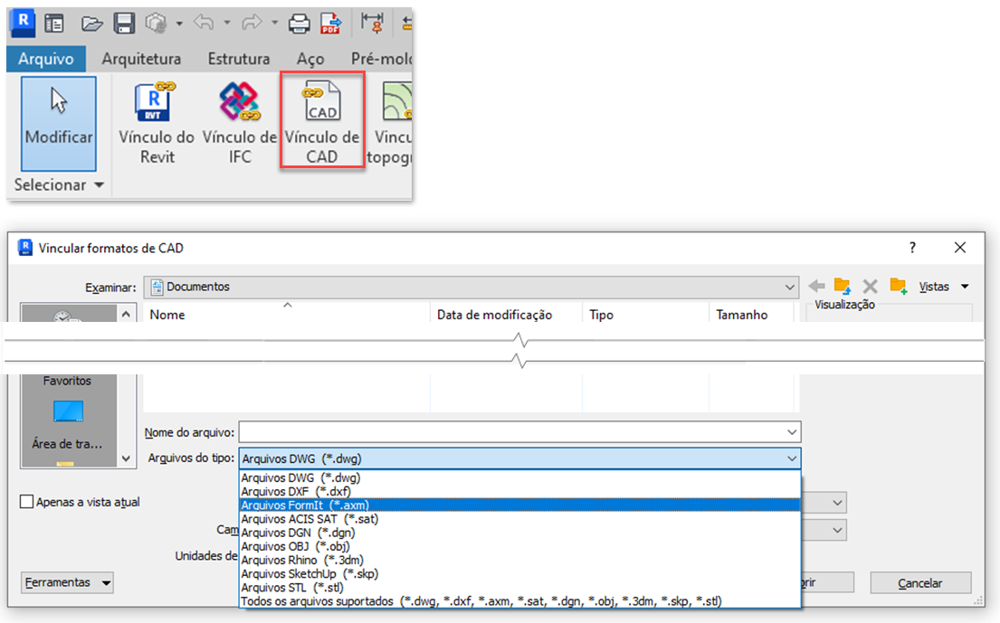

# FormIt + Revit

## FormIt 的易用性与 Revit 的强大功能相得益彰

FormIt for Windows 可直接连接到 Revit，以便在早期概念和详细设计之间实现无缝通信。

## FormIt + Revit 的新特性

### 2023 版的强大链接功能

* 使用 Revit“插入”选项卡中的_**“链接 CAD”**_按钮，将 FormIt 模型（AXM 格式）链接到 Revit。
* 在 Revit 中选择链接的 FormIt 图元，然后使用新的_**“在 FormIt 中编辑”**_按钮以在 FormIt 中启动它以进行即时编辑。
* 使用“图层”选项板中新的_**“发送到 Revit”列**_，以控制在 Revit 中链接 FormIt 草图时将发送到 Revit 的图层。&#x20;
* 使用新的_**“预览发送到 Revit 选择”**_模式（位于“图层”面板底部、“发送到 Revit”按钮旁边），预览将发送到 Revit 的几何图形。
* 现在，会为 Revit 中的 FormIt 对象绘制轮廓边。

### **FormIt 2022.1 改进**

使用“三维草图”按钮从 Revit 启动 FormIt，然后在 FormIt 的“标高”选项板中包含所有或选定的 Revit 标高数据。

### **2022 版的所有新特性**

* 使用 Revit 的“体量和场地”选项卡上的新_**“三维草图”**_按钮，直接从 Revit 启动 FormIt。
* 在 FormIt 中设计，然后使用从_“三维草图”_按钮启动的 FormIt 中的_**“发送到 Revit”**_按钮将草图发送回 Revit。
* 使用 Revit 的“插入”选项卡中的_**“输入 CAD”**_按钮将 FormIt 模型输入到 Revit（比先前的_“将 FormIt 输入到 RVT”_按钮更可靠，速度最多快 **30 倍**）。
* 无需为实现 FormIt 功能下载单独的附加模块。

### **Revit 2021.1 改进**

* 提高了边可见性一致性：FormIt 中的平滑/隐藏边在 Revit 中保持处于隐藏状态。
* 提高了材质方向一致性：在 FormIt 面上有自定义比例/旋转替代的材质会在 Revit 中保持这些替代。
* 修复了从 Revit 转换 FormIt 几何图形会失败或导致 Revit 挂起的若干问题。

## FormIt + Revit 快速入门

### **直接从 Revit 直观地绘制三维草图**

如果您在早期阶段和详图设计阶段工作，则可以在 FormIt 和 Revit 之间快速迭代和平滑地探索设计。

* 只需单击一次，即可将上下文几何图形从 Revit 推送到 FormIt。
* 在 FormIt 中进行设计和建模，然后在同一任务中将设计发送回同一 Revit 项目。
* 在 Revit 中使用_“链接 CAD”_工具参照 FormIt 模型，然后在 Revit 中继续进行可视化和详图设计。
* 使用_“在 FormIt 中编辑”_以从 Revit 启动 FormIt 链接。

### **三维草图、在 FormIt 中编辑和发送到 Revit 进行设计迭代**

#### **建议的工作流**

* 使用剖面框定义 Revit 模型的内部部分，然后单击_**“三维草图”**_按钮以打开 FormIt 并浏览内部布局或定制设计功能。只需单击一下，即可将新设计发送到 Revit。
* 从已在 Revit 中建模的城市上下文开始，然后单击_**“三维草图”**_按钮，以将周围的上下文作为可捕捉的参照输入到 FormIt。只需单击一下，即可将新设计发送到 Revit。
* 打开现有 Revit 建筑模型，然后使用_**“三维草图”**_按钮启动 FormIt。对几个设计进行建模以添加新的附加设计，从而将每个设计都放置在不同的 FormIt 图层上。
* 在 Revit 中选择 FormIt 对象，然后使用_**“在 FormIt 中编辑”**_按钮以在 FormIt 中启动模型。

* 使用_**“Revit 预览”模式**_以预览将发送到 Revit 的几何图形，来确保共享的是用于详图开发的正确设计。
* 从设计中选择所需图元，然后使用_**“发送到 Revit”**_按钮或保存链接模型来将每个设计发送到 Revit。&#x20;

#### **使用工具**

* _**“三维草图”**_按钮、_**“在 FormIt 中编辑”**_按钮和_**“发送到 Revit”**_工作流适用于 Autodesk 工程建设 (AEC) 软件集的订购客户以及具有特定访问类型的客户。它不能通过 Revit LT 使用。[在此处了解有关工程建设软件集的详细信息。](https://www.autodesk.com.cn/collections/architecture-engineering-construction/overview)

* 启动 Revit 2022.0 或更高版本时，“体量和场地”选项卡上会有一个新按钮，名为**“三维草图”**。该按钮仅在三维视图中可用；它在 Revit 的二维视图中将显示为处于禁用状态。
* 确保您已使用 Autodesk 凭据登录到 Revit。启动_**“三维草图”**_按钮时，可能会提示您重新登录到 Autodesk 帐户。这是为了检查您是否有正确的权利。
* 如果未安装 FormIt 2022.0 或更高版本（或已安装 2022.0 之前的 FormIt 版本），则 FormIt 不会启动，并且系统将提示您下载正确版本的 FormIt。
* 单击_**“三维草图”**_按钮以启动 FormIt。选择将所有可见对象或仅将选定对象输入到 FormIt。如果 Revit 模型很大且设计将仅参照 Revit 模型的一部分，则选择仅输入选定对象会很有帮助。 此外，使用 Revit 中的剖面框隔离 Revit 模型的内部区域以输入到 FormIt。

* 如果在 Revit 中选择标高，则 FormIt 会收到这些标高。否则，FormIt 会收到 Revit 中的所有可见标高。
* FormIt 启动后，包含的 Revit 几何图形会在 FormIt 中显示在其自己的图层上。该图层称为“Revit 上下文”，默认情况下处于锁定状态。
* 通过添加形状或应用材质、内容等，以在 FormIt 中建模。
* 从“标高”选项板，将标高应用于 FormIt 对象。
* 使用“图层”选项板中的_**“发送到 Revit”列**_，以包含或排除要发送到 Revit 的几何图形。

* 使用_**“Revit 预览”模式**_，可以选择预览要发送到 Revit 的几何图形。使用“图层”选项板底部或“发送到 Revit”按钮旁边的复选框，激活“Revit 预览”模式。

* 使用 FormIt 工具栏上的_**“发送到 Revit”**_按钮，将 FormIt 几何图形传输到 Revit。
   * 这将提示您保存文件，该文件会将模型链接到 Revit。
      * **注意：**建议您将文件保存在本地，因为保存到 Autodesk Docs 会断开 FormIt 和 Revit 之间的连接。请改用 [Autodesk Desktop Connector](https://help.autodesk.com/view/CONNECT/CHS/) 将模型共享到云。
   * 创建链接后，只要想将更改传输到 Revit，就可以重新保存模型或单击“发送到 Revit”按钮。

.png>)

* FormIt 标高、图层和材质会随几何图形一起传输到 Revit。
   * 在 Revit 的“材质”对话框中，通过按“FormIt”过滤列表即可查看 FormIt 材质。
   * 可以通过“可见性图形”的输入选项卡，在 Revit 视图中找到 FormIt 图层。这是在 Revit 中显示不同 FormIt 设计选项的最佳方式。
* 启动 Revit 2023.0 或更高版本并选择 FormIt 对象时，可以使用_**“在 FormIt 中编辑”**_按钮以在 FormIt 中启动模型。
* 请参见 FormIt Primer，以查找 [FormIt-Revit 工作流教程。](../formit-primer/part-ii/2.8-advanced-revit-workflows.md)

### **输入和链接 FormIt 模型：FormIt 和 Revit 之间的设计协作**

#### **建议的工作流**

* 与同事共享 FormIt 模型，然后同事可以将 FormIt 模型输入到其 Revit 项目中，以便进行参照、可视化和详图设计。
* 将 FormIt 模型直接输入到 Revit 设计选项，以进一步探索和比较设计。由于 FormIt 图层是通过输入工作流传入 Revit 的，因此 Revit 用户可以控制哪些 FormIt 图层在哪些 Revit 设计选项中可见。
* 将 FormIt 模型输入到体量类别族（然后将其载入到 Revit 项目中），以利用“标高”、“体量楼层”和“按面”工具，并将 Revit 系统族应用于 FormIt 几何图形。

.png>)

* 将现有 FormIt 模型链接到 Revit 中，以来回发送更改、在重新加载期间更新几何图形和材质外观，以及使用 FormIt 图层控制几何图形可见性。

#### **使用工具**

* 指定要输入到当前 Revit 项目中的 FormIt 文件。打开 Revit 的_**“输入 CAD”**_工具。从可用文件类型列表中选择“.AXM”。浏览到 .AXM 文件并单击_“打开”_。
* FormIt 材质会传输到 Revit，并显示在 Revit 的材质对话框中。过滤 FormIt 材质列表。
   * 在 FormIt 中缩放或旋转的材质会在 Revit 中保持正确的缩放和旋转。
* 标高从 FormIt 传输到 Revit。
   * 在“输入 CAD”对话框中，单击“输入 FormIt 标高”按钮。
* FormIt 中弯曲/镶嵌面几何图形的隐藏边会带隐藏边输入到 Revit。
   * 已知问题：轮廓边在 Revit 的“隐藏线”视图中也会显示为处于隐藏状态。
* FormIt 原点和 Revit 基点会用于可靠地放置输入的 FormIt 对象。
* 输入到 Revit 中的 FormIt 几何图形会随所有 FormIt 图层一起输入。
   * FormIt 图层可从“可见性图形”>“输入的类别”选项卡进行访问。在此处，用户会看到 FormIt 图层列表，并可以使用复选框来打开/关闭这些图层。
* Revit 的“按面”工具（也称为“Building Maker”工具）可以基于 FormIt 几何图形生成 Revit 图元
   * 这要求先将 FormIt 几何图形输入到体量族或常规模型族中，然后将其载入到项目环境中。
* FormIt 几何图形会作为一个输入实例进行输入。
   * 要将 FormIt 模型作为单独输入进行输入，请在 FormIt 中隔离模型的各个部分，然后将每个部分作为单独的 .AXM 文件输入。
* 要了解更多信息，请参见 [Revit 文档。](https://help.autodesk.com/view/RVT/2023/CHS/?guid=GUID-A5F4B6C1-94CD-4433-A4E2-6B39B4BA8E6D)

#### **使用 Revit 标高和 FormIt 输入**

* 将 FormIt 几何图形输入到 Revit 时，生成的对象可能会因 Revit 标高而处于意外的高程处。
   * 在立面/平面视图中，输入的 FormIt 几何图形会显示在 Revit 中的当前标高处。
   * 在三维视图中，输入的 FormIt 几何图形会默认为最低标高，该标高可能低于坡面。
   * 如果几何图形在 Revit 中显示在意外高度处，则选择输入的对象，然后在 Revit 中将“基准标高”调整到合适的标高。

#### **转换 Revit 族**

* Revit 族会使用 Revit“附加模块”选项卡上的_**“将 RFA 转换为 FormIt”**_按钮转换为 FormIt 内容，从而可以在 FormIt 上下文中高效地重复使用现有 Revit 内容。
* 指定将转换为 FormIt 文件并输出到所选文件夹的 RFA 文件的文件夹。
* 这是重复使用所有已有 Revit 内容的最佳方式。只需将内容转换为 FormIt，并将 FormIt 的内容库指向包含已转换文件的文件夹。然后，在“内容库”选项板中，单击缩略图预览并将其放置在模型中。

#### **为 Revit 准备 SketchUp 文件**

* 使用 FormIt for Windows 打开或输入 SketchUp 内容
* （可选）使用[内置诊断和修复工具来修复几何图形](https://formit.autodesk.com/blog/post/using-formit-to-get-sketchup-data-into-revit)，以便其是更适合下游操作的实体
* 保存 FormIt 文件，然后使用上面所述的**“输入 CAD”**或**“发送到 Revit”**工作流输入它

## 从 FormIt 转换器附加模块转换

FormIt + Revit 2022 及更高版本会提供内置的 Synergy，无需额外下载。

通过这些更改，附加模块将开始转换。了解以前的工作流发生了哪些变化。

### **输入 AXM 文件的新方法**

替换附加模块中的_“输入 FormIt 到 RVT”_按钮后，即可通过 Revit“插入”选项卡中的“输入 CAD”工具来输入 FormIt (.AXM) 文件。&#x20;

除了速度提高 **30 倍**之外，您还会发现此工作流通常也**更可靠**。除此之外，某些行为已发生变化：

### **输入时的几何图形**

* FormIt 几何图形作为一个输入实例进行输入。FormIt 类别不再成为 Revit 类别。我们会在将来的更新中解决此问题。
   * FormIt 类别当前仅用于能量分析。
* 您不再需要将模型分解为更小的部分 - 尝试一次发送整个 FormIt 模型！
* 要将 FormIt 模型作为单独输入项进行输入，请在 FormIt 中隔离模型的各个部分，然后将每个部分作为单独的 .AXM 文件输入。

### **输入时的材质**

* FormIt 材质比以往更好地传输到 Revit，并可以在“材质”对话框中进行排序。

### **输入后工作流**

* 对于涉及体量楼层和“按面”(Building Maker) 工具的工作流，请首先将 FormIt 模型输入到 Revit 体量或常规模型族，然后将其载入到项目环境中。
* 此外，还可以通过直接从 Revit 访问用于早期设计阶段的新三维草图绘制环境，来利用更流畅的工作！

### **对 Revit 族的更改**

通过使用 Revit“附加模块”选项卡上的_“转换 RFA 为 FormIt”_按钮，即可在 FormIt 中继续使用 Revit 族内容；此工作流没有发生任何变化。

_“重新载入族”_按钮已被删除，因为我们致力于提供更好的体验。

## 重要说明 

### **获取支持** 

需要 FormIt + Revit 的帮助？[在论坛上告知我们](https://forums.autodesk.com/t5/formit-forum/bd-p/142?profile.language=zh-CN)。

下载旧版 Revit 附加模块\（2021 版或更早版本）
------------------------------------------------------------------

如果使用的是 FormIt 和 Revit 2022 或更高版本，则无需下载单独的附加模块。

对于 Revit 2021 或先前版本，可以通过下面的链接找到该附加模块的旧版本：

[查看旧版 Revit 附加模块下载](https://formit.autodesk.com/page/download#download-revit-add-in)
