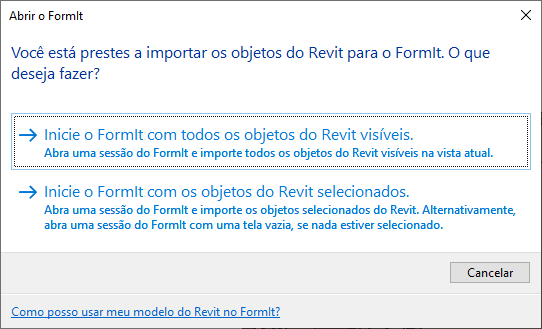

# FormIt + Revit

\

## FormIt の使いやすさを Revit の高機能と組み合わせる

FormIt for Windows は、Revit に直接接続することで、初期のコンセプトと詳細設計の間でシームレスにコミュニケーションを取ることができます。

## FormIt + Revit の新機能

### **FormIt 2023.1 の改善点** 

* 3D スケッチ ボタンを使用して FormIt を起動したときに、Revit で設定された場所が FormIt と同期されるようになりました。
* 3D スケッチ ボタンを使用して FormIt を起動したときの DWG 線種変更の同期が改善されました。
* 3D スケッチで、またはリンクされた FormIt オブジェクトの編集時に、FormIt と Revit 間でカメラをオプションで同期します。

### 2023 でのリンクによる高機能

* Revit の[挿入]タブの _**[CAD をリンク]**_ ボタンを使用して、FormIt モデル(AXM 形式)を Revit にリンクします。
* Revit でリンクされた FormIt 要素を選択して新しい _**[FormIt で編集]**_ ボタンを使用すると、FormIt で起動してすぐに編集できるようになります。
* [レイヤ]パレットの新しい _**[Revit に送信]列**_ を使用すると、FormIt スケッチが Revit にリンクされたときに Revit に送信されるレイヤをコントロールできます。
* _**Revit に送信する選択内容をプレビュー**_ する新しいモードで、Revit に送信されるジオメトリをプレビューできます。このモードは、[レイヤ]パネルの下部および[Revit に送信]ボタンの横にあります。
* シルエット エッジが Revit の FormIt オブジェクトに対して描画されるようになりました。

### **FormIt 2022.1 の改善点** 

3D スケッチ ボタンを使用して Revit から FormIt を起動し、FormIt の[レベル]パレットにすべての Revit レベルまたは選択した Revit レベルのデータを含めます。

### **2022 の新機能** 

* Revit の[マス & 外構]タブの新しい _**[3D スケッチ]**_ ボタンを使用して、Revit から FormIt を直接起動できます。
* _[3D スケッチ]_ ボタンから起動した場合、FormIt で設計を行い、FormIt の _**[Revit に送信]**_ ボタンを使用してスケッチを Revit に戻すことができます。
* Revit の[挿入]タブの _**[CAD 読込]**_ ボタンを使用して、FormIt モデルを Revit に読み込むことができます(以前の _[FormIt を RVT に読み込む]_ ボタンよりも信頼性が向上し、速度は最大で **30 倍**高速なります)。
* FormIt 機能用に個別のアドインをダウンロードする必要はありません。

### **Revit 2021.1 の改善点** 

* エッジの表示設定の一貫性を改善: FormIt のスムーズ化されたエッジと非表示のエッジは Revit で非表示のままになります。
* マテリアルの方向の一貫性を改善: FormIt 面のカスタム尺度や回転のオーバーライドを使用したマテリアルは、これらのオーバーライドを Revit でも維持します。
* Revit からの FormIt ジオメトリの変換に失敗したり、Revit が停止する場合がありましたが、この問題が修正されました。

## FormIt + Revit のスタートアップ

### **直感的な 3D スケッチを Revit から直接実行** 

初期段階設計と詳細設計を両方行っている場合は、FormIt と Revit 間で設計の繰り返し作業を迅速に行い、スムーズに検討できます。

* コンテキスト ジオメトリをワンクリックで Revit から FormIt にプッシュできます。
* FormIt で設計とモデルを作成し、設計を同じセッションの同じ Revit プロジェクトに戻すことができます。
* _[CAD をリンク]_ ツールを使用して Revit で FormIt モデルを参照し、Revit で引き続き可視化と詳細化を行うことができます。
* _[FormIt で編集]_ を使用して、Revit から FormIt リンクを起動できます。

\

### **3D スケッチ、FormIt で編集、設計の繰り返し作業用に Revit に送信** 

### **推奨されるワークフロー**

* 切断ボックスを使用して Revit モデルの内部の部分を定義し、_**[3D スケッチ]**_ ボタンをクリックして FormIt を開き、内部レイアウトや特注の設計内容について検討します。新しい設計をワンクリックで Revit に送信します。
* Revit で既にモデリングされた都市コンテキストから開始し、_**[3D スケッチ]**_ ボタンをクリックして、周囲のコンテキストをスナップ可能な参照として FormIt に取り込みます。新しい設計をワンクリックで Revit に送信します。
* 既存の Revit 建築モデルを開き、_**[3D スケッチ]**_ ボタンを使用して FormIt を起動します。新しく追加する複数の設計をモデリングし、各設計を異なる FormIt レイヤに配置します。
* Revit で FormIt オブジェクトを選択し、_**[FormIt で編集]**_ ボタンを使用して FormIt でモデルを起動します。

![FormIt オブジェクトを選択した後に[FormIt で編集]を使用する](../.gitbook/assets/revit-edit-in-formit-workflow.gif)

* _**Revit のプレビュー モード**_ を使用して Revit に送信されるジオメトリをプレビューし、詳細開発に使用する適切な設計を共有していることを確認します。
* 設計から必要な要素を選択し、_**[Revit に送信]**_ ボタンを使用して各設計を Revit に送信するか、リンク モデルを保存します。

### **ツールを使用する**

* _**[3D スケッチ]**_ ボタン、_**[FormIt で編集]**_ ボタン、および _**[Revit に送信]**_ ワークフローは、Autodesk Architecture, Engineering & Construction (AEC) Collection のサブスクリプションメンバーおよび特定の種類のアクセス権を持つお客様が使用できます。Revit LT では使用できません。[AEC Collection の詳細はこちら](https://www.autodesk.com/collections/architecture-engineering-construction/overview)

### 3D スケッチ ボタン

![3D スケッチで新しいインスタンスを起動し、[FormIt に送信]を使用して Revit リンクを保存および作成する](../.gitbook/assets/revit-3d-sketch-send-to-revit.png)

* Revit 2022.0 以降のバージョンを起動すると、[マス & 外構]タブに **[3D スケッチ]** という新しいボタンが表示されます。このボタンは 3D ビューからのみ使用できます。Revit の 2D ビューでは無効になっています。
* オートデスクの資格情報を使用して Revit にサインインしていることを確認します。_**[3D スケッチ]**_ ボタンを起動すると、Autodesk Account に再度サインインするように求められることがあります。これは、正しい資格があることを確認するためです。
* FormIt 2022.0 以降のバージョンがインストールされていない場合(または 2022.0 より前のバージョンの FormIt がインストールされている場合)、FormIt は起動せず、正しいバージョンの FormIt をダウンロードするよう求められます。

#### 3D スケッチの[FormIt を開く]ダイアログ

* _**[3D スケッチ]**_ ボタンをクリックして、FormIt を起動します。FormIt にすべての表示オブジェクトを取り込むか、選択したオブジェクトのみを取り込むか選択します。
  * 大きな Revit モデルの一部のみを参照する設計の場合には、選択したオブジェクトのみを取り込むことをお勧めします。
  * さらに、Revit の切断ボックスを使用して、Revit モデルの内部領域を分離し、FormIt に取り込みます。

#### 3D スケッチとレベル

* 「表示されているすべての Revit オブジェクト」を選択すると、表示されている Revit レベルは FormIt レベルになり、[[レベル]パレットで表示](../tool-library/levels-and-area.md#creating-and-configuring-levels)したり、[[プロパティ]パレットを使用してオブジェクトに適用](../tool-library/levels-and-area.md#applying-levels)することができます。
* 「選択した Revit オブジェクト」を選択すると、選択したレベルのみが FormIt レベルになります。

#### FormIt の起動後

* FormIt を起動すると、含まれている Revit ジオメトリが FormIt の独自のレイヤに表示されます。レイヤは「Revit コンテキスト」と呼ばれ、既定でロックされています。
* フォームを追加したり、マテリアルやコンテンツなどを適用して、FormIt でモデルを作成します。
* レベルを[[レベル]パレット](../tool-library/levels-and-area.md#applying-levels)から FormIt オブジェクトに適用します。

### Revit に送信ワークフロー

* Revit に送信するジオメトリを含めたり除外するには、[レイヤ]パレットの _**[Revit に送信]列**_ を使用します。

![[レイヤ]パレットの[Revit に送信]列](../.gitbook/assets/revit-send-to-formit-layers-column.png)

* _**Revit プレビュー モード**_ を使用すると、Revit に送信するジオメトリをオプションでプレビューできます。[レイヤ]パレットの下部または[Revit に送信]ボタンの横にあるチェックボックスを使用して、Revit プレビュー モードをアクティブにします。

* FormIt のツールバーの _**[Revit に送信]**_ ボタンを使用して、FormIt ジオメトリを Revit に転送します。
  * これにより、ファイルを保存するよう求めるメッセージが表示され、モデルが Revit にリンクされます。
    * **注:** Autodesk Docs に保存すると FormIt と Revit の接続が切断されるため、ファイルはローカルに保存することをお勧めします。代わりに [Autodesk Desktop Connector](https://help.autodesk.com/view/CONNECT/ENU/) を使用すると、クラウドでモデルを共有できます。
  * リンクの作成後は、モデルを再保存するか、[Revit に送信]ボタンをクリックすると、いつでも Revit に変更を転送できるようになります。

\.png>)

* FormIt のレイヤおよびマテリアルは、ジオメトリとともに Revit に転送されます。
  * Revit の[マテリアル]ダイアログ ボックスを使用して、「FormIt」でリストをフィルタすると FormIt マテリアルを表示できます。
  * FormIt レイヤは、Revit ビューの[表示/グラフィックス]の[読み込み]タブで見つけることができます。この方法は、Revit でさまざまな FormIt デザイン オプションを表示する場合に便利です。
  * Revit にレベルを送信するには、[CAD 読込]ダイアログを使用して AXM を読み込み、下部にある[レベルを読み込む]をオンにする必要があります。

### [FormIt で編集]ボタン

* Revit で FormIt モデルをリンクした後、または _**3D スケッチ**_ で新しい FormIt モデルを作成してモデルを保存した後、FormIt 要素は Revit に保存され、後で編集し直すことができます。
* Revit で FormIt 要素を選択してから、[修正]タブの _**[FormIt で編集]**_ ボタンをクリックすると、FormIt でモデルを起動できます。

\

* [FormIt-Revit ワークフロー チュートリアル](../formit-primer/part-ii/2.8-advanced-revit-workflows.md)については、「FormIt Primer」を参照してください。

### **FormIt モデルの読み込みとリンク: FormIt と Revit 間のデザイン コラボレーション** 

#### **推奨されるワークフロー**

* FormIt モデルを同僚と共有すると、その同僚は FormIt モデルを Revit プロジェクトに読み込んで、参照、可視化、詳細設計を行うことができます。
* FormIt モデルを Revit のデザイン オプションに直接読み込んで、さらにデザインを検討および比較します。FormIt レイヤは読み込みワークフローを通じて Revit に取り込まれるため、Revit ユーザはどの FormIt レイヤをどの Revit デザイン オプションで表示するかをコントロールできます。
* FormIt モデルをマスカテゴリ ファミリに読み込んで(その後、Revit プロジェクトにロードします)、レベル、マス床、面指定のツールを利用し、Revit システム ファミリを FormIt ジオメトリに適用します。

\.png>)

* 既存の FormIt モデルを Revit にリンクして、変更を Revit 間で送受信する、再ロード時にジオメトリとマテリアルの外観を更新する、FormIt レイヤを使用してジオメトリの表示/非表示をコントロールするなどが可能です。

#### **ツールを使用する**

* 現在の Revit プロジェクトに読み込む FormIt ファイルを指定します。Revit の _**[CAD 読込]**_ ツールを開きます。使用可能なファイル タイプのリストから .AXM を選択します。目的の .AXM ファイルを選択して _[開く]_ をクリックします。
* FormIt マテリアルを Revit に転送し、Revit のマテリアルのダイアログ ボックスに表示します。FormIt マテリアルのリストをフィルタします。
  * FormIt で尺度を変更または回転したマテリアルは、Revit でも正しい尺度と回転を保持します。
* FormIt から Revit にレベルを転送します。
  * [CAD 読込]ダイアログ ボックスで[FormIt レベルを読み込み]ボタンをクリックします。
* FormIt の曲線ジオメトリや切り子面ジオメトリの非表示エッジは、Revit に取り込まれ、非表示エッジになります。
  * 既知の問題: シルエット エッジも Revit の隠線処理ビューで非表示になります。
* FormIt の原点と Revit の基準点が使用されるため、読み込んだ FormIt オブジェクトを正確に配置できます。
* Revit に読み込まれた FormIt ジオメトリは、すべての FormIt レイヤに取り込まれます。
  * FormIt レイヤには、[表示グラフィックス] > [読み込みカテゴリ]タブからアクセスできます。ここでは、FormIt レイヤのリストが表示され、チェックボックスを使用して FormIt レイヤのオン/オフを切り替えることができます。
* Revit の「面指定」のツール(Building Maker ツールとも呼びます)を使用すると、FormIt ジオメトリから Revit 要素を生成できます。
  * この場合、最初に FormIt ジオメトリをマス ファミリまたは一般モデル ファミリに読み込み、次にプロジェクト環境にロードする必要があります。
* FormIt ジオメトリは、1 つの読み込みインスタンスとして取り込まれます。
  * FormIt モデルを個別に読み込むには、FormIt でモデルのパーツを分離し、各パーツを個別の .AXM ファイルとして読み込みます。
* 詳細については、[Revit のドキュメント](https://help.autodesk.com/view/RVT/2023/ENU/?guid=GUID-A5F4B6C1-94CD-4433-A4E2-6B39B4BA8E6D)を参照してください。

#### **Revit レベルと FormIt 読み込みを使用する**

* FormIt ジオメトリを Revit に読み込むと、Revit のレベルが原因で、結果のオブジェクトが予期しない高さになることがあります。
  * 立面図ビューまたは平面図ビューでは、読み込まれた FormIt ジオメトリは Revit の現在のレベルに表示されます。
  * 3D ビューでは、読み込まれた FormIt ジオメトリは既定で一番下のレベルに設定され、地下になることもあります。
  * ジオメトリが Revit で予期しない高さに表示される場合は、読み込まれたオブジェクトを選択し、基準レベルを Revit の適切なレベルに合わせて調整します。

#### **Revit ファミリを変換する** 

* Revit ファミリは、Revit の[アドイン]タブの _**[RFA を FormIt に変換]**_ ボタンを使用すると FormIt コンテンツに変換できます。変換することにより、FormIt のコンテキストで既存の Revit コンテンツを効率的に再利用できるようになります。
* RFA ファイルを FormIt ファイルに変換して出力する任意のフォルダを指定します。
* この方法は、既存のすべての Revit コンテンツを再利用する際に便利です。コンテンツを FormIt に変換し、変換されたファイルを入れるフォルダとして FormIt のコンテンツ ライブラリを指定します。次に、[コンテンツ ライブラリ]パレットからサムネイル プレビューをクリックしてモデルに配置します。

#### **Revit 用に SketchUp ファイルを準備する** 

* FormIt for Windows を使用して、SketchUp コンテンツを開いたり読み込むことができます。
* オプションで、[組み込みの診断ツールと修復ツールを使用してジオメトリを修正](https://formit.autodesk.com/blog/post/using-formit-to-get-sketchup-data-into-revit)し、下流の操作に適したソリッドにすることができます。
* FormIt ファイルを保存し、前述の **[CAD 読込]** ワークフローまたは **[Revit に送信]** ワークフローを使用して読み込みます。

## FormIt Converter アドインからの移行

FormIt + Revit 2022 以降はユーザ インタフェースに組み込まれ、追加のダウンロードは必要なくなりました。

これらの変更により、アドインは移行され始めています。以前のワークフローがどのように変更されたかについて説明します。

### **.AXM ファイルを読み込む新しい方法** 

アドインの _[FormIt を RVT に読み込み]_ボタンに代わり、Revit の[挿入]タブの[CAD 読込]ツールを使用して FormIt (.AXM)ファイルを読み込むことができます。

このワークフローでは、速度が最大 **30 倍高速**になるほか、全般的に**信頼性が向上**しています。さらに、いくつかの動作が変更されました。

### **読み込み時のジオメトリ**

* FormIt ジオメトリは、1 つの読み込みインスタンスとして読み込みます。FormIt カテゴリは Revit カテゴリに変換できなくなりました。この問題は、今後の更新で対処できるよう取り組んでいます。
  * FormIt カテゴリは、現在、エネルギー解析にのみ使用されます。
* モデルを小さなパーツに分割する必要がなくなりました。FormIt モデル全体を一度に送信してみてください。
* 1 つの FormIt モデルをパーツごとに個別に読み込む場合は、FormIt でモデルをパーツに分け、それぞれ個別の .AXM ファイルとして読み込みます。

### **読み込み時のマテリアル**

* FormIt マテリアルの Revit への転送が改善され、[マテリアル]ダイアログ ボックスで並べ替えることができるようになりました。

### **読み込み後のワークフロー**

* [マス床]および面指定のツール(Building Maker)を使用するワークフローの場合は、最初に FormIt モデルを Revit のマス ファミリまたは一般モデル ファミリに読み込み、次にプロジェクト環境にロードします。
* また、Revit から初期段階の設計に対応した新しい 3D スケッチ環境に直接アクセスすることで、作業をより流動的に行うことができます。

### **Revit ファミリの変更点** 

Revit の[アドイン]タブの_[RFA を FormIt に変換]_ボタンを使用することにより、FormIt で引き続き Revit ファミリ コンテンツを使用できます。このワークフローに変更はありません。

より良いエクスペリエンスを提供するため、_[ファミリを再ロード]_ボタンが削除されました。

## 重要な注意事項

### **サポートを依頼** 

FormIt + Revit に関するヘルプが必要な場合は、[フォーラムでお知らせください](https://forums.autodesk.com/t5/formit-forum/bd-p/142)。

古い Revit アドインをダウンロードする\
(2021 以前)
------------------------------------------------------------------

FormIt および Revit 2022 以降を使用している場合、別のアドインをダウンロードする必要はありません。

Revit 2021 以前のリリースの場合は、次のリンクから旧バージョンのアドインを確認できます。

[旧バージョンの Revit アドインのダウンロードを参照する](https://formit.autodesk.com/page/download#download-revit-add-in)
