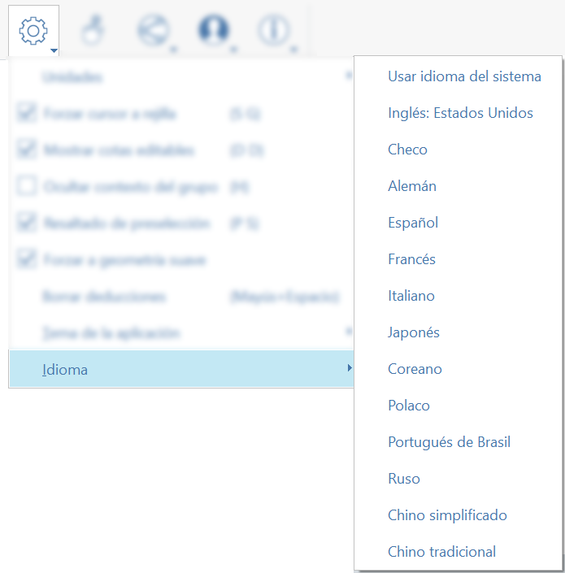
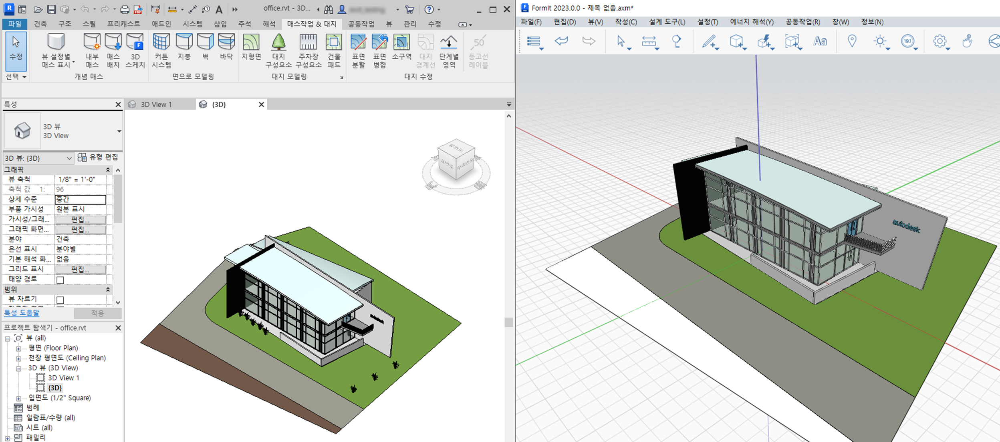

# Languages

FormIt for Windows supports 13 languages: English, Czech, German, Spanish, French, Italian, Japanese, Korean, Polish, Brazilian Portuguese, Russian, Simplified Chinese, and Traditional Chinese.

To change languages, select Settings in the toolbar or menu at the top of the screen, go to Languages, and select a language.&#x20;

The language change will take effect once you restart FormIt.

Additionally, when you launch FormIt from Revit via the 3D Sketch button, the FormIt interface will match the language from Revit, so you can enjoy a consistent experience across applications.

