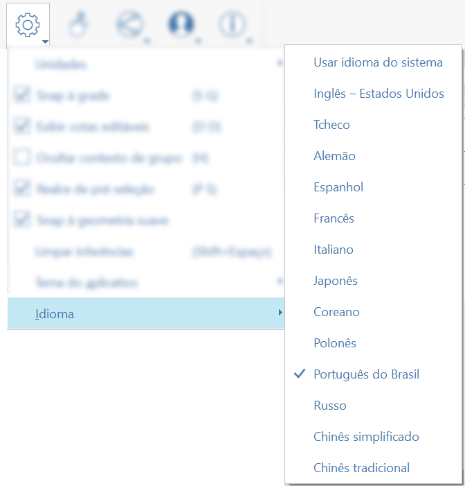

# Idiomas

FormIt para Windows admite 13 idiomas: inglés, checo, alemán, español, francés, italiano, japonés, coreano, polaco, portugués brasileño, ruso, chino simplificado y chino tradicional.

Para cambiar los idiomas, seleccione Configuración en la barra de herramientas o el menú ubicado en la parte superior de la pantalla, vaya a Idiomas y seleccione un idioma.

El cambio de idioma se aplicará cuando reinicie FormIt.

Además, al iniciar FormIt desde Revit mediante el botón Boceto 3D, la interfaz de FormIt coincidirá con el idioma de Revit para que pueda disfrutar de una experiencia coherente entre aplicaciones.

