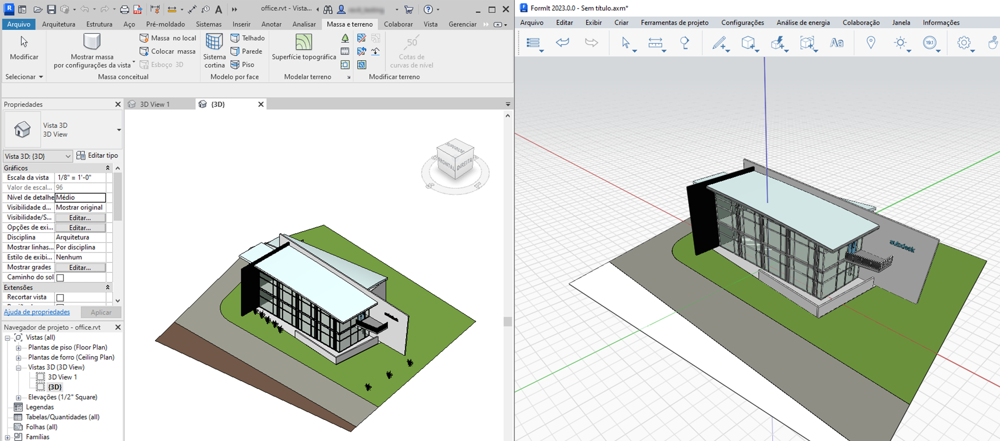

# Sprachen

FormIt for Windows unterstützt 13 Sprachen: Englisch, Tschechisch, Deutsch, Spanisch, Französisch, Italienisch, Japanisch, Koreanisch, Polnisch, Portugiesisch (Brasilien), Russisch, Chinesisch (vereinfacht) und Chinesisch (traditionell).

Um die Sprache zu ändern, wählen Sie im Werkzeugkasten oder im Menü oben auf dem Bildschirm die Option Einstellungen, wechseln Sie zu Sprachen, und wählen Sie eine Sprache aus.

Die Änderung der Sprache wird wirksam, sobald Sie FormIt neu starten.

Wenn Sie FormIt über die Schaltfläche 3D-Skizze in Revit starten, wird die Benutzeroberfläche von FormIt außerdem an die Sprache von Revit angepasst, sodass Sie die Funktionen in allen Anwendungen einheitlich nutzen können.

