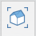
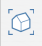
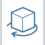

# Nawigowanie po scenie

Łatwo nawiguj w modelach programu FormIt i wokół nich za pomocą myszy lub ekranu dotykowego:

* **Obróć**, klikając prawym przyciskiem myszy i przeciągając myszą lub przesuwając palcem po ekranie w przypadku urządzeń dotykowych. Spowoduje to użycie punktu kursora w przestrzeni 3D jako punktu, wokół którego ma być obracana kamera.
   * Możesz również przytrzymać klawisz Shift, aby przesunąć widok.
* **Powiększ lub pomniejsz**, przewijając kółkiem myszy w górę i w dół albo wykonując gest uszczypnięcia na urządzeniu dotykowym. Spowoduje to użycie punktu w przestrzeni 3D jako punktu odniesienia dla powiększenia. Powiększenie będzie spowalniane w miarę zbliżania się do powierzchni lub innego obiektu.
   * Możesz również przytrzymać naciśnięty klawisz Ctrl, aby powiększać ze stałą szybkością, bez względu na odległość od obiektów.
* **Przesuń**, klikając środkowym przyciskiem myszy i przeciągając lub przesuwając dwoma palcami na urządzeniu dotykowym.

Możesz również przechodzić do określonych trybów widoku za pomocą ruchomego paska narzędzi nawigacji po prawej stronie obszaru rysunku. Skróty wskazano w nawiasach.

 **Widoki prostokątne**: Kliknij, aby wyświetlić menu rozwijane dostępnych [widoków prostokątnych](../tool-library/orthographic-views.md).

 **Domyślny widok 3D (ZD):** uruchamia domyślny widok 3D.

 **Animacja (FT):** tryb „przelotu” umożliwiający spacer po scenie przy użyciu klawiatury. Używaj klawiszy WASD, aby poruszać się do przodu/do tyłu/w lewo/w prawo, oraz klawiszy Q/E, aby poruszać się w górę/w dół. Klawisz spacji umożliwia włączenie „lotu”.

 **Obróć (O):** po włączeniu tej opcji kliknij lewym przyciskiem myszy i przeciągnij, aby orbitować wokół modelu. Można to również zrobić w dowolnym momencie, klikając prawym przyciskiem myszy i przeciągając.

 **Przekręć (SV):** za pomocą narzędzia Przekręć z paska narzędzi nawigacji można rozejrzeć się po scenie ze stałego punktu obserwacyjnego.

 **Przesuń (P):** kliknij środkowym przyciskiem myszy i przeciągnij lub użyj narzędzia Przesuń (ikona dłoni) z paska narzędzi nawigacji, aby przesunąć widok w poprzek sceny.

 **Powiększ (Z):** przewiń kółkiem myszy lub wybierz narzędzie Powiększ z paska narzędzi nawigacji, a następnie kliknij lewym przyciskiem myszy i przeciągnij, aby powiększyć.

 **Powiększ wszystko (ZE lub ZA):** powiększ, aby dopasować cały model do bieżącego widoku.

 **Powiększ wybór (ZS):** powiększ, aby dopasować wszystkie aktualnie wybrane obiekty do bieżącego widoku.
