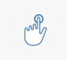

# Setting Up the Project

## Starting Off

When you start FormIt, you'll be in a 3D environment. Take some time to learn how to [navigate around the 3D space](navigating-the-scene.md), then start building a project ([here's how](../formit-primer/)), use the File menu to open an existing FormIt project, or import a variety of other file types.

FormIt allows opening, saving, and exporting to files both locally and on Autodesk Docs. [Using Autodesk Docs in FormIt](https://formit.autodesk.com/page/formit-autodesk-docs/) is a great way to share models in the cloud.

In addition to using the File menu, you can open any importable 3D model in FormIt by dragging and dropping the file into the canvas. To import a file into the current sketch, hold Ctrl while dragging and dropping.

FormIt will [AutoSave your work](../tool-library/autosave.md) once you start making changes to the model. Saving often is still recommended because it will clean up the backup file and save space.

## App Settings

*   Units:

    

    * Setting this will affect the units in all tools and imported geometry, like Dynamo and unitless file types like STL.
* Snap to Grid:
  * Forces tools with placement points to snap to the grid intersection points. Note that you can turn the grid off in [Visual Styles](../formit-primer/part-i/visual-settings.md); if the grid is off, snapping to it will be disabled as well.
* Display Editable Dimensions:
  * Choose whether to keep the dimension boxes visible (we recommend keeping this on if you want to draw with accuracy).
* Hide Context/Show Edited Group Only:
  * This affects whether editing a Group will show its surroundings or not. You can easily change this setting using the shortcut (H). Toggling H while modeling in and out of Groups allows you to view Groups both in isolation and in context as needed.
* Preselection Highlight:
  * By default, FormIt will "preselect" objects when you hover over them. This is useful to ensure the object you want to select is the object you get, but can be distracting when presenting a design. Use this option or the shortcut to quickly toggle back and forth between showing and hiding preselection highlight as necessary. Note that this option needs to be enabled to use features like [Smart Selection](https://www.youtube.com/watch?v=akLeB1FADt4).&#x20;

## Touch Mode

If your computer has a touchscreen, use Touch Mode to easily navigate your model and create geometry. If you're using FormIt for iOS too, this will feel familiar.

When Touch Mode is on, FormIt's interaction becomes more like FormIt on iPad, calibrating navigation and modification tools to work with a touch interface. Because of this, using FormIt with a mouse and keyboard while Touch Mode is on is not recommended.

When Touch Mode is on, you'll see it highlighted in the toolbar, as well as a "Touch Mode" banner in the lower-left corner of the screen.

