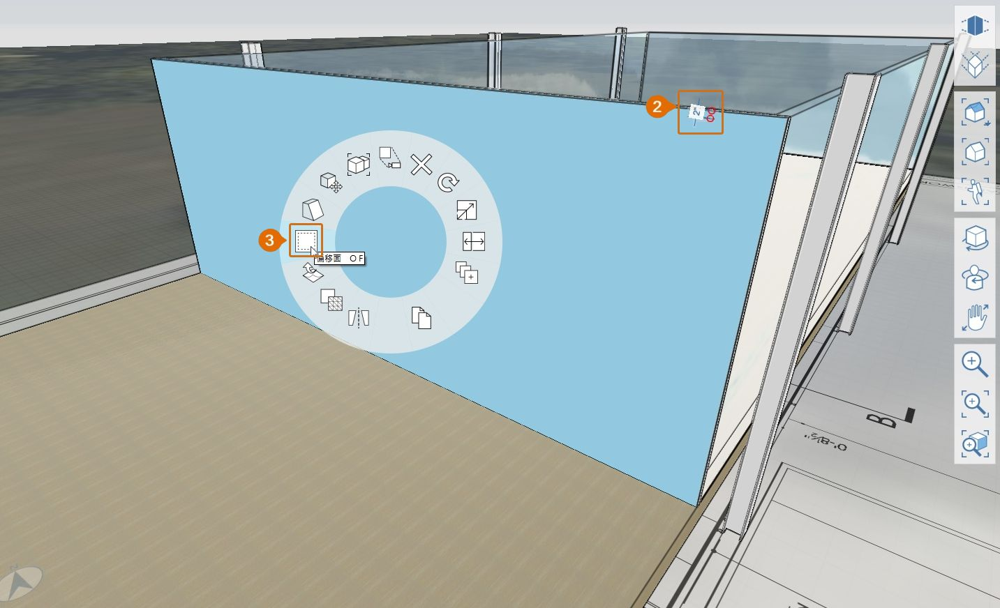

# 1.9 - 添加详图

_FormIt 既是一款出色的体量工具，也是一款出色的建模工具。我们将开始以玻璃盒子的门和竖梃的形式，向 Farnsworth 住宅添加详图。然后，我们将介绍一些其他工具，并练习添加新几何图形、图层、材质和组管理的过程。_

_如果未完成最后一部分，请从_ _**FormIt Primer Part 1 数据集**中下载并打开_ _**1.9 - Adding Details.axm**_ _文件。_

## **创建窗框**

_我们将在玻璃盒子周围创建 2" 的金属框架和竖梃。请注意，这些竖梃将有意地与玻璃盒子重叠。_

1 - 创建一个名为 **“玻璃墙”** 的新图层，并将 **“玻璃墙”** 组移动到该图层。

2 - 为了便于查看，请关闭 **“屋顶”** 图层，以便可以看到整个玻璃盒子。

3 - 开始创建第一个窗框的步骤：

1. 在建筑物的西侧，使用 **“矩形工具(R)”** 在外部玻璃面上直接绘制一个新曲面。确保在 **“玻璃墙”** 组之外创建曲面。
2. 选择新创建的面，并将其朝内部拖动 **2"**。按 **Esc** 键以清除选择。 最终结果应类似于下图。
3. 单击刚刚创建的面。单击鼠标右键以访问 **“关联菜单”** ，来使用 **“偏移面工具(OF)”。**

_**注意：**_ _如果在选择新面时遇到问题，请按_ _**空格键**_ _键在不同可选对象之间进行切换，或临时关闭_ _**“玻璃墙”**_ _图层。_

4 - 要设置偏移尺寸，请将鼠标光标移向面的内侧，然后输入 **“2"”** 以创建一个新的较小矩形。

.png>)

5 - 单击以选择刚刚创建的内部矩形。再次单击该面并将其拖向建筑物的内部，直到它消失。再次单击一下，以完成从结构件几何图形中删除中心体积。

.png>)

6 - 双击以选中刚刚创建的几何图形，然后为其选择 **“组(G)”** 。将该组命名为 **“竖梃框架 – EW”**。

7 - 创建一个名为 **“竖梃”** 的图层，并将新组放置在该图层上。

8 - 设置框架的材质的步骤：

1. 在 **“材质选项板”** 中，通过在 **“金属 - 拉丝 - 着色”** 材质上单击鼠标右键并选择 **“复制材质”** 来复制该材质。
2. 双击新材质的预览磁贴以进行编辑。
3. 将其重命名为 **“金属 – 拉丝 – 灰色”**。
4. 通过单击 **“贴图”** 区域中的 **“颜色”** 磁贴修改材质的颜色，然后通过将 **“值:”** 更改为 **“150”** 使灰色变暗。

.png>)

9 - 单击 **“确定”** 以保存对材质进行的这些更改，然后使用它绘制 **“竖梃框架 - EW”** 组。之后，组的 **“特性选项板”** 应与下图中所示内容匹配：

.jpeg>)

10 - 使用以下任一工具在东侧创建框架的新实例：**“快速复制”**、**“阵列”**或**“镜像”**。

11 - 对玻璃盒子的南北侧重复上述步骤。将新组命名为 **“竖梃框架 – NS”**。不要忘记绘制它们，并将它们放置在 **“竖梃”** 图层上！

 (1).png>)

_**注意：**_ _竖梃框架在角点处彼此重叠。这是有意为之。上述结果显示了在_ _**“玻璃墙”**_ _和_ _**“柱”**_ _图层关闭时所生成的竖梃框架几何图形。_

**创建竖梃**

1 - 在外部玻璃面位于建筑物的南侧或北侧的平面中，绘制一个从竖梃框架底部和顶部之间延伸的 **“2” x 10’-10” 矩形(R)”** 。不必担心矩形沿框架的确切位置，我们将在以下步骤中将其移至适当位置。

.png>)

2 - 将矩形向后拉伸 **2”**，然后为该矩形选择 **“组(G)”** ，并将该组命名为 **“竖梃 - 垂直”**。 将组放置在 **“竖梃”** 图层上，然后使用 **“金属 - 拉丝 - 灰色”** 材质进行绘制。

**定位竖梃**

_现在，我们将设置第一个竖梃的位置，使其中心位于柱的_ _**中点**_ _上。_

1 - 要再次查看柱，请打开 **“柱”** 图层（如果已关闭）。在 **“图层选项板”** 中时，还可以关闭 **“下阶地”** 和 **“平面图像”** 图层，以简化后续步骤。

2 - 将竖梃移动到其新位置的步骤：

1. 单击以选择刚刚创建的垂直竖梃组。**“放大(Z)”** ，然后单击竖梃底部外部边的 **“中点”** （由红色三角形**符号化）。**
2. 开始将几何图形水平移向柱。按 **Shift** 键，以锁定红色轴（即 **X 轴**）中的移动。请注意，一旦锁定移动，红色轴将变厚。
3. 缩小视图，直到可以看到柱的底部。在仍按住 **Shift** 键的同时，单击柱外部面底部的 **“中点”** 。竖梃将继续仅沿红色轴（即 **X 轴**）移动，但会与刚刚单击的 **“中点”** 对齐。

 (1).jpeg>)

_**注意：**_ _竖梃现在位于柱的正后面。关闭_ _**“柱”**_ _图层或_ _**“环绕(O)”**_ _，以可视化竖梃。_

3 - 按 **Esc** 键以清除 **“移动”** 工具。

4 - 使用 **“阵列(AR)”** 或 **“快速复制”** 工具，以沿同一侧再创建四 (4) 个垂直竖梃（间距为 **11’**）。要了解如何使用 **“阵列工具”**，请参见前面各章。

5 - 使用 Tab 键选择所有 **“垂直”** 竖梃组，然后将它们复制到建筑物的另一侧，以便 **“北”** 和 **“南”** 框架具有相同的竖梃布局，如下图所示：

.png>)

## **创建门竖梃**

1 - **“环绕(O)”** 透视视图，直到您看到西竖梃框架的中心。

2 - 与创建竖梃框架类似，绘制一个 **3’-6”** 宽的门板（其中框架为 **2”x 2”**）。使其成为具有以下特性的 **“组(G)”** ：组名称为 **“幕墙门”** ；图层为 **“竖梃”** ；材质为 **“金属 - 拉丝 - 灰色”** 。

3 - 复制此组以创建第二个门框，然后移动它们，以使它们位于 **“竖梃框架 - EW”** 组的中心，如下图所示。

## **使用扫掠创建屋顶檐口**

_现在，我们将使用 FormIt 的高级建模工具之一（_ _**“扫掠”**）创建 Farnsworth 住宅的檐口。要了解其他高级建模，请查看_ _**FormIt Primer - Part II** 中的_**2.2 -** _**高级建模**一章_ _。_

_创建_ _**“扫掠”**_ _的第一步是绘制与扫掠“拉伸”垂直的轮廓。为此，我们将屋顶几何图形用作指导。_

1 - 打开 **“屋顶”** 图层，并放大其一个角。

2 - 使用屋顶的一个垂直边作为参照，绘制两个相邻的矩形。第一个矩形高度为 **6”**，宽度为**4 5/8”**；第二个矩形尺寸为 **2”x 2”**。删除分割两个矩形的线，以创建一个面。结果应如下所示。

.jpeg>)

3 - 创建扫掠的步骤：

1. 在未选择几何图形的情况下，单击 **“标准工具栏”** 中的 **“高级建模工具”** 按钮，然后选择 **“扫掠(SW)”**。
2. **“扫掠选择向导”** 将启动，并提示您 **“选择要用于扫掠轮廓的面(或边)”**。选择刚刚创建的轮廓面。
3. 在选中轮廓后，将提示您 **“选择要用于扫掠路径的面(或边)”，然后单击“完成”**。选定屋顶的顶面。FormIt 将自动使用选定面的边界作为扫掠的路径，并将围绕整个屋顶创建扫掠。

_**注意：**_ _如果在选择其中一个面时遇到问题，请_ _**“环绕(O)”**_ _以更好地查看面，然后重试。作为替代选项，选择屋顶的所有边（而不是屋顶的顶面）以完成扫掠。_

.png>)

4 - 使模型保持井然有序，方法是创建 **“屋顶 - 檐口”** 组、将其添加到 **“屋顶”** 图层，然后为其指定 **“金属 - 拉丝 - 着色”** 材质。

.png>)

5 - 要完成操作，请打开 **“柱”** 图层，您将看到新创建的扫掠与柱顶部相交。通过编辑任一 **“柱高”** 组，然后向下拖动顶面，直到其与檐口底部对齐，即可解决此问题。

.png>)
