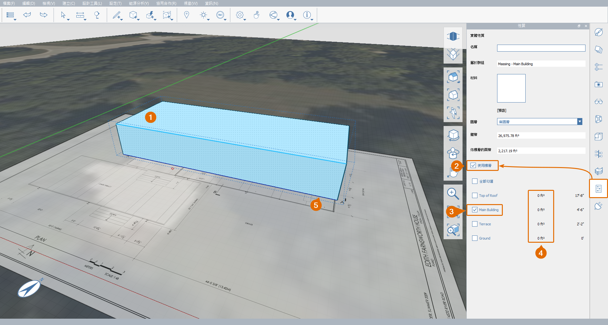

# 1.5 - Raggruppamento di oggetti

_I gruppi in FormIt funzionano in modo simile alle famiglie in Revit e ai componenti in SketchUp. Il raggruppamento di oggetti diversi impedisce l'unione della geometria. Le copie di un gruppo fungono da istanza della geometria originale, pertanto le modifiche apportate ad una copia influiranno su tutte le copie._

_Se non è stata completata l'ultima sezione, scaricare e aprire il file_ _**1.5 - Group Objects.axm**_ _dai_ _**set di dati della Parte I della Guida introduttiva di FormIt**._

## **Creazione di un gruppo**

1 - Selezionare la massa della terrazza superiore facendo doppio clic.

2 - Fare clic con il pulsante destro del mouse e selezionare **Gruppo (G)** oppure premere semplicemente **G**.

.jpeg>)

3 - Notare che dopo la creazione di un gruppo, viene automaticamente aperto lo strumento Sposta.

## **Spostamento di un gruppo**

1 - Per facilitare il processo di modellazione, attivare l'opzione **Snap alla griglia (SG)**, se è disattivata.

.png>)

2 - Per iniziare a spostare l'oggetto selezionato, mentre è ancora attivo il comando **Sposta (M)**, fare clic una volta su qualsiasi angolo inferiore della massa. Spostare quindi il cursore verso l'alto. Dovrebbe essere visualizzata una linea dell'asse blu (Z). Questa linea aiuterà a spostare l'oggetto verso l'alto.

3 - Con l'asse blu visibile, digitare **4'-6"**. Verrà visualizzata una finestra di dialogo per definire la quota. Dopo aver immesso la quota, fare clic su **OK** o premere **INVIO** sulla tastiera. In questo modo, l'intera massa verrà spostata verso l'alto, lontano dal piano del terreno lungo l'**asse Z**.

_**Nota**_ _Analogamente a Revit, è anche possibile digitare_ _**4'6**,_ _**4'6"**_ _o_ _**4.5** e il valore verrà interpretato come 4(piedi) 6(pollici) quando si utilizzano le unità imperiali._

.png>)

## **Modifica di un gruppo**

1 - Per accedere alla **modalità di modifica del gruppo**, fare doppio clic sulla massa.

1. Nella **tavolozza Proprietà**, rinominare il gruppo **Massing - Main Building**.
2. Per salvare le modifiche e uscire dalla **modalità di modifica del gruppo**, fare clic sull'icona del segno di spunta **Termina modifica gruppo** nell'angolo superiore sinistro dell'area di disegno oppure fare doppio clic nello spazio.

 (1).png>)

_**Note**_

* _Per ulteriori informazioni sulle opzioni_ _**Categoria**_ _, consultare il capitolo_ _**Utilizzo di Revit**_ _._‌
* _Ogni gruppo ha una cronologia di annullamento/ripetizione distinta dal progetto generale. È possibile fare clic sulle frecce_ _**Annulla**_ _e_ _**Ripeti**_ _nella_ _**procedura guidata di modifica del gruppo**_ _nell'angolo superiore sinistro dell'area di disegno._

## **Applicazione di livelli ad un gruppo**

_**Nota**_ _Il raggruppamento di una geometria sostituisce le impostazioni precedenti che potrebbero essere state applicate alla geometria. Per questo motivo, è necessario riapplicare i livelli dell'esercizio precedente._

1 - Per applicare livelli ad un gruppo:

1. Fare un singolo clic sul gruppo **Massing** **- Main Building** per selezionarlo.
2. Accedere alla **tavolozza Proprietà** e selezionare **Usa livelli.**
3. Mantenere solo il livello **Main Building** deselezionando tutti gli altri.
4. Nel campo **Area per livello** viene visualizzata l'area lorda degli oggetti attualmente selezionati. L'area di ogni **livello** viene visualizzata davanti al nome di ciascun **livello**.
5. Se non è visibile una linea di livello blu che interseca l'oggetto orizzontalmente, attivare la visualizzazione del livello accedendo al **menu Impostazioni > Stile visualizzazione > Visualizza livelli (DL).**

_**Nota** Se non viene indicata alcuna area per il livello_ _**Main Building**_ _, la geometria potrebbe non intersecare il livello, che dovrebbe essere ad un'altezza di 4'-6". Risolvere i problemi riposizionando la geometria o l'altezza del_ _**livello**_ _in modo che si intersechino._

2 - Deselezionare il gruppo premendo **ESC** o facendo un singolo clic nello spazio. Senza alcun oggetto selezionato, nella **tavolozza Proprietà** viene riportata l'area lorda complessiva del disegno, anziché l'area di un oggetto specifico.

.png>)

## **Gestione dei gruppi**

1 - Per visualizzare e gestire tutti i gruppi nel disegno:

1. Accedere alla **tavolozza Struttura gruppi**. Qui è possibile vedere:
   * Gruppo **Terrain**: gruppo creato automaticamente quando è stata importata l'**immagine satellitare**.
   * **Massing - Main Building**: il gruppo della geometria di massa dell'edificio appena creato.
   * **gruppo 2**: gruppo senza nome contenente l'immagine della pianta del pavimento.
2. Per rinominare il **gruppo 2** mediante la tavolozza Struttura gruppi, fare doppio clic sul **gruppo 2**, quindi digitare **Plan Image**.

.png>)

_**Note **_

* _Per un modello ordinato, consigliamo di mantenere descrittivi i nomi dei gruppi._
* _Questo è un modo comodo per gestire e modificare tutti i gruppi nel modello da un'unica posizione._

2 - Con il gruppo **Plan Image** ancora selezionato, accedere alla **tavolozza Proprietà**. Notare che il nome del gruppo è stato aggiornato anche nel campo **Gruppo**.

.png>)

## **Nascondi contesto gruppo**

_Questo strumento consente di nascondere rapidamente tutta la geometria esterna al gruppo attualmente in corso di modifica. Diventa molto utile quando si dispone di un modello grande e complesso e si inseriscono altre geometrie._

1 - Per isolare un gruppo:

1. Fare doppio clic sulla geometria per modificare il gruppo.
2. Passare a **Impostazioni** nel **Menu principale** e selezionare **Nascondi contesto gruppo** oppure premere semplicemente **H** sulla tastiera. Notare come **Plan Image** scompare.
3. Terminare la modifica del gruppo. Notare che la modalità **Nascondi contesto gruppo (H)** è attiva solo all'interno della **procedura guidata di modifica del gruppo**.
4. Per disattivare nuovamente questa modalità, è sufficiente premere **H**. Questa opzione può essere attivata in qualsiasi momento, all'interno o all'esterno di un gruppo.

.png>)
