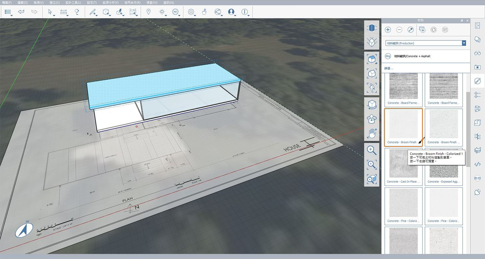
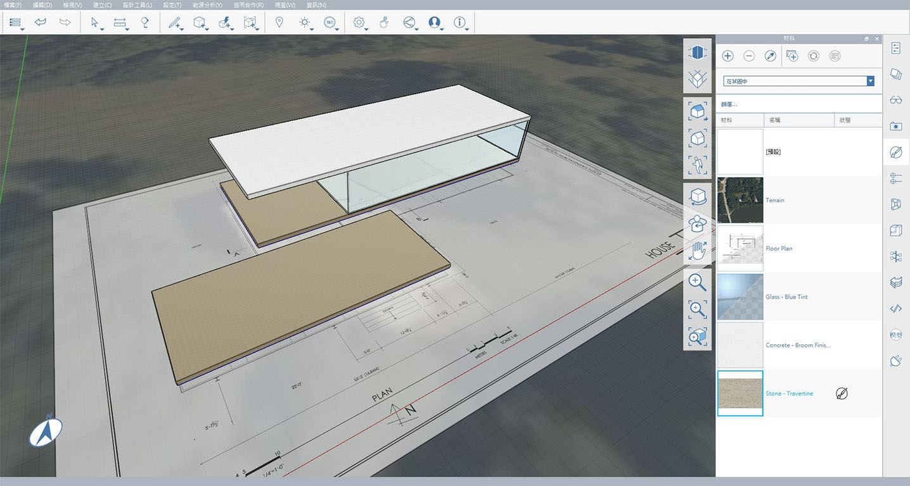

# 1.7 – Malování s materiály

Jak jsme viděli v **dřívějším cvičení**, můžete si vytvořit vlastní materiály a poté s jejich pomocí pomalovat plochy v aplikaci FormIt. V tomto cvičení vytvoříte a upravíte další materiály a také importujete materiály z knihovny materiálů Autodesk.

_Pokud jste nedokončili poslední část, stáhněte a otevřete soubor_ _**1.7 – Paint with Materials.axm**_ _z_ _**datových sad k příručce Základy aplikace FormIt, Část 1**._

## **Vytvoření skleněných stěn**

1 – Zobrazte půdorys obsahující kóty, na které budeme odkazovat: přejděte na **paletu Hladina** a zapněte hladinu **Obrázek půdorysu**.

2 – Vyberte **nástroj Obdélník (R)**. Obdélník vytvoříme přímo nad existující skupinou podlaží. Ujistěte se, že neupravujete skupinu podlaží, ale kreslíte nad existující seskupený objekt.

.png>)

3 – Vytvořte obdélník pro skleněnou plochu:

1. Klikněte na zadní roh existujícího podlaží a přesuňte myš podél jeho kratší hrany.
2. Zadáním hodnoty **28’-8"** definujte délku první hrany a klikněte na tlačítko **OK**. Tato hrana by měla být stejně dlouhá jako existující krátká hrana podlaží.
3. Definujte druhou hranu tak, že začnete pohybovat myší podél delší hrany existujícího podlaží. Zadáním hodnoty **55'-5 ½"** nastavte délku druhé hrany a klikněte na tlačítko **OK**.
4. Stisknutím klávesy **Esc** ukončete nástroj Obdélník. Jedním kliknutím uvnitř nového obdélníku vyberte plochu a začněte ji táhnout nahoru.

 (1).png>)

4 – Definujte výšku: posuňte ukazatel myši nahoru podél **osy Z**, stiskněte klávesu **Tab** a zadejte hodnotu **11'-2"**.

 (1).png>)

_**Poznámka:**_ _Kdykoli používáte nástroj, u kterého můžete zadat kótu, můžete buď stisknout klávesu_ _**Tab**_ _, nebo jednoduše začít psát čísla._

5 – Dvakrát klikněte na novou geometrii a vyberte možnost **Skupina (G)**.

6 – Dvakrát klikněte na skupinu, kterou chcete upravit. Na **paletě Vlastnosti** pojmenujte skupinu **Skleněné stěny**

.png>)

7 – Definujte tloušťku skleněné stěny:

1. Klikněte pravým tlačítkem na horní plochu a vyberte nástroj **Odsadit plochu (OF)**
2. Přesuňte kurzor myši dovnitř a zadejte hodnotu **4"**
3. Dvojitým stisknutím klávesy **Esc** ukončete nástroj a zrušte výběr.

.png>)

​_**Poznámka:**_ _Výchozí jednotkou pro projekty s britskými měrnými jednotkami jsou stopy, podobně jako v aplikaci Revit. Pokud zadáte samotné číslo bez jednotky, například_ _**4**, budou použity_ _**4 stopy (4’)**_ _, nikoli_ _**4 palce (4")**._

8 – Vyřízněte vnitřní oblast tak, že jednou kliknete na vnitřní horní plochu, abyste ji vybrali, a dalším kliknutím zahajte **přetažení plochy**. Zatlačte plochu zcela dolů, dokud nezmizí, a kliknutím do prostoru dokončete akci.

.png>)

_**Poznámka:**_ _Na rozdíl od jiného softwaru nemůžete v aplikaci FormIt nechtěně zatlačit plochu, kterou se pokoušíte odstranit, tak daleko, až by se vytvořilo nové záporné vysunutí._

9 – Dvojitým kliknutím na volné místo nebo stisknutím klávesy **Esc** ukončete režim **Upravit skupinu**

10 – Kliknutím vyberte skupinu **Skleněné stěny** a umístěte ji na hladinu **Podlaží hlavní budovy**.

 (1).png>)

## **Import materiálu z knihovny materiálů Autodesk**

1 –·Znovu dvakrát klikněte na skupinu **Skleněné stěny**, abyste ji mohli upravit.

2 – Importujte do modelu nový materiál:

1. Přejděte na **paletu Materiály**.
2. Výběrem položky **Ukázky materiálu** v rozevírací nabídce v horní části palety přejděte do **knihovny materiálů Autodesk**.
3. Klikněte na složku **Sklo+Zasklení**, abyste ji otevřeli.
4. Vyhledejte materiál **Sklo – modrý odstín** a jednou na něj klikněte, abyste jej přidali do knihovny materiálů **V náčrtu**.
5. Všimněte si, že byste měli být zpět v knihovně **V náčrtu**, která nyní obsahuje nově vybraný materiál.

 (1).png>)

.png>)

3 – Po přidání materiálu by se měl automaticky aktivovat nástroj **Štětec**. Pokud tomu tak není, stačí znovu kliknout na materiál **Sklo – modrý odstín**. Chcete-li pomalovat všechny stěny, dvakrát klikněte na geometrii nástrojem **Štětec**. Tím se vybraný materiál použije na celý objekt. .png>)​

4 – Stisknutím klávesy **Esc** ukončete nástroj **Štětec**. Dalším stisknutím klávesy **Esc** nebo dvojitým kliknutím na volné místo ukončete skupinu.

## **Rychlé zkopírování podlaží za účelem vytvoření střechy**

1 – Chcete-li rychle vytvořit střechu na základě geometrie podlaží, postupujte takto:

1. Jedním kliknutím vyberte skupinu **Podlaží**.
2. Kliknutím na jeden z dolních rohů spusťte nástroj **Přesunout**.
3. Začněte přesouvat podlaží nahoru podél modré osy (**osa Z**). Stisknutím klávesy **Ctrl** vytvořte **rychlou kopii**. Měl by se zobrazit obrys kopie. ​
4. Při pohybu podél modré osy (**osa Z**) začněte psát hodnotu **12' 2"**. Zobrazí se dialog **Kóta**. Kliknutím na tlačítko **OK** nebo stisknutím klávesy **Enter** dokončete umístění.

.png>)

.png>)

## **Úprava střechy**

1 – Se stále vybranou zkopírovanou skupinou použijte příkaz **Vytvořit jedinečné (MU)**, čímž zrušíte přidružení této skupiny ke skupině podlaží.

2 – Dvakrát klikněte na skupinu, abyste ji mohli upravit. Na **paletě Vlastnosti** přejmenujte skupinu na **Střecha**. Skupinu ukončete dvojitým kliknutím na volné místo.

3 – Na **paletě Hladiny** vytvořte novou **hladinu** s názvem **Střecha** a přidejte do ní skupinu **Střecha**. Zapnutím a vypnutím hladiny můžete ověřit, zda jsou na střeše správné prvky. Další informace o práci s **hladinami** naleznete v **kapitole 6**.

4 – Přejděte zpět na **paletu Materiály** a importujte materiál **Beton – povrchová úprava metlou – zbarvený 1** ze složky **Beton+asfalt** v knihovně **Ukázky materiálů** **(produkce)**. Všimněte si, že po kliknutí na materiál bude vybraná geometrie automaticky pomalována a nový materiál bude přidán do knihovny materiálů **V náčrtu**.

_**Poznámka:**_ _Malování skupiny mimo režim_ _**úprav skupiny**_ _je užitečná technika, která umožňuje malovat různé instance stejné skupiny různými materiály._

## **Vytvoření dolní terasy**

1 – V hladině **Obrázek půdorysu** vytvořte dolní terasu jako **obdélník (R)** dlouhý **55' 3"** a široký **22'-7 3/4"** a vysuňte jej o 1’. Umístěte nový obdélník tak, aby byl 8 5/8" daleko od hlavní budovy na jižní straně (hloubka sloupů, které vytvoříme později).

_**Poznámky**:_

* _Informace o kreslení a vysunutí obdélníků naleznete v předchozích kapitolách._
* _Chcete-li kliknout na roh terasy, bude možná nutné zapnout nebo vypnout možnost_ _**Přichytit k osnově**_ _._

2 – Dokončení dolní terasy:

1. **Seskupte (G)** geometrii a pojmenujte ji **Podlaží dolní terasy**.
2. **Posuňte** vytvořenou skupinu **2'-2"** nad základní rovinu.
3. Vytvořte novou **hladinu** s názvem **Dolní terasa** a přidejte do ní skupinu.
4. Přidejte do této skupiny **podlaží terasy**.

.png>)

_**Poznámka:**_ _Tento obrázek nepředstavuje podrobný postup vytváření a přiřazování geometrie ke skupinám, podlažím a hladinám. Další informace o těchto postupech naleznete v předchozích kapitolách této příručky._

3 – Importujte materiál **Kámen > Kámen – travertin**.

4 – Na **paletě Materiály** vyhledejte importovaný materiál **Travertin** a upravte jej:

1. Dvojitým kliknutím na dlaždici náhledu otevřete okno **Editor materiálů**.
2. Kliknutím na náhled **barvy** zobrazte okno **Editor barev**.
3. Do pole **Hodnota** zadejte **190**, aby se ztmavil odstín materiálu.

.png>)

5 – **Vymalujte** skupiny **Podlaží** a **Podlaží dolní terasy** upraveným materiálem **Travertin**.

