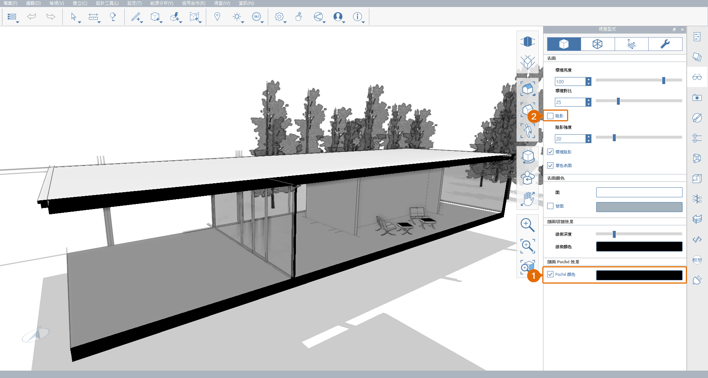

# 1.13. Секущие плоскости

_В этой главе вы узнаете, как использовать_ _**секущие плоскости**_ _для разрезания модели и просмотра внутреннего пространства и элементов конструкции. FormIt поддерживает одновременное использование нескольких_ _**секущих плоскостей**_ _для создания эффекта «Секущая рамка»._

_Если вы не проходили предыдущий раздел, скачайте и откройте файл_ _**1. 13 — Section Planes.axm**_ _из_ _**набора данных для части 1 руководства FormIt Primer**._

1 - Чтобы создать секущую плоскость, выполните следующие действия.

1. Нажмите кнопку **Секущая плоскость (SP)** на **панели инструментов «Стандартная»**.
2. Наведите курсор на модель, чтобы определить плоскость, которая будет использоваться в качестве опорной. Обратите внимание на стрелки в углах **секущей плоскости**, указывающие направление разреза. При необходимости нажмите клавишу **TAB** для переключения между плоскостями.
3. Щелкните, чтобы разместить **секущую плоскость** в любом месте южной стеклянной стены главного здания. Плоскость будет вписана в размер модели и выделена как выбранная.

.png>)

 (1).png>)

2 - Выберите секущую плоскость, щелкните и начните перемещение вглубь для рассечения части главного здания, как показано на рисунке ниже. Процесс похож на перемещение любого другого элемента модели, за исключением того, что секущая плоскость может перемещаться только вдоль оси, перпендикулярной ее плоскости. После выбора нужного положения нажмите клавишу **ESC**, чтобы отменить выбор.

 (1).png>)

_**Примечание.**_ _Одновременно в модель можно добавить до 6 разрезов сечения._

3 - Откройте **палитру** **слоев**. Обратите внимание, что было создано два (2) новых слоя: **Индикаторы сечения** и **Сечение 1**.

1. Отключите и снова включите слой **Сечение 1**. Этот параметр определяет применение сечения к модели.
2. Теперь отключите слой **Индикаторы сечения**. Этот параметр скрывает секущую плоскость и стрелки-индикаторы, но не затрагивает применения сечения.

 (1).png>)

4 - На **вкладке «Поверхность»** палитры **Визуальные стили** **выполните следующие действия.**

1. Установите флажок **Цвет условного материала-отделки**, чтобы включить этот параметр. Он позволяет окрашивать твердые тела, рассеченные секущей плоскостью, заданным цветом. По умолчанию используется черный цвет, но его можно изменить, щелкнув изображение предварительного просмотра цвета.
2. Отключите параметр **Тени (D+S)**.

5 - Для завершения работы с сечением перейдите на **палитру «Сцены»** и создайте новую сцену с именем **Сечение**. Это позволит сохранить текущее положение **камеры**, **слои** видимость и **визуальные стили**.

.png>)
