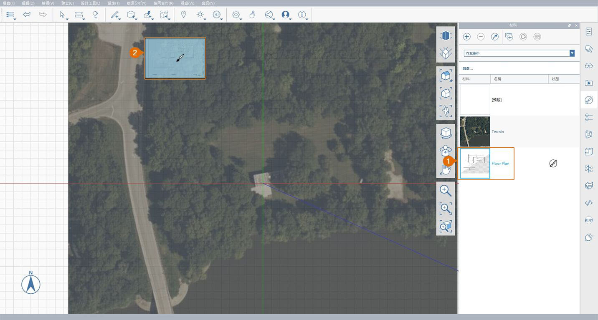
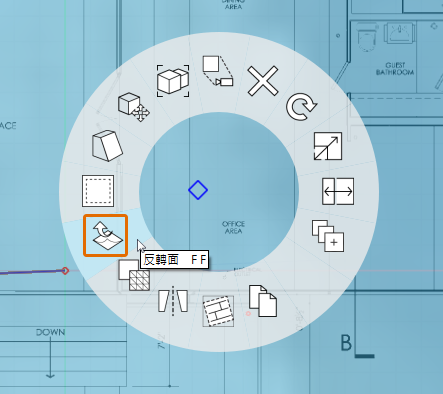

# 1.2 - 使用图像和栅格设置项目

_通过从导航栏中选择“文件”>“输入”，可以将 PNG 或 JPG 图像输入到模型的地平面。但是，为了更好地控制已输入图像的比例和位置，可以创建自定义材质并将其应用于已绘制的矩形。_

_如果未完成最后一部分，请从_ _**“FormIt Primer Part 1 数据集”**_ 下载并打开 _**“1.2 - Project Set Up with Images and Grid.axm”**_ _文件_。

## **计算图像大小**

所提供的 **“plan.png”** 是一个平面的图像，该平面打印在 24” x 26” 图纸 (ARCH D) 上（宽度为 3600 像素，高度为 2400 像素）。通过了解图形比例 (¼"=1'-0") 和图像尺寸标注，可以计算出 1’ = 25 像素，这意味着图像在以全比例输入到 FormIt 中时应为 144'x96'。

\ (2).png>)

## **输入要缩放的图像**

1 - 单击 **“浮动导航栏”** 中的 **“俯视图”** 图标，以从上方查看场景。

\.png>)

2 - 从“三维草图”工具栏中，选择 **“矩形工具(R)”**。

\.png>)

3 - 要创建恰好为 **144’** x **96’** 的矩形，请单击工作空间中的任意位置以定义起点，然后移动鼠标以预览并定义第一个边长。开始键入尺寸标注值以访问一个对话框，在其中可以输入精确的尺寸标注。单击 **“确定”** 或按 **Enter** 键，以提交尺寸标注。重复该过程以设置第二条边的长度，并完成矩形。

\.png>)

\.png>)

\.png>)

4 - 创建新的“楼层平面”材质的步骤：

1. 打开 **“材质选项板”**。
2. 单击 **“+”** 图标，以创建新材质。
3. 将新材质命名为 **“楼层平面”**。
4. 在 **“MAPS”** 下，单击 **“纹理”** 预览磁贴，然后浏览到 **“Farnsworth 住宅数据集”>“支持文件”>“图像”** 文件夹中的 **“plan.png”**。然后，单击 **“打开”**。
5. 在 **“特性”** 下，通过在 **“水平比例”** 字段中输入 **“144'”**、在 **“垂直比例”** 字段中输入 **“96'”**，来更改图像的比例。请注意，可能需要解锁水平和垂直比例（**“链式链接”** 图标），才能插入更改图像比例的值。
6. 选中 **“透明度”**，并将其设置为大约半透明。这将有助于将输入的楼层平面图像与卫星图像对齐。
7. 单击 **“确定”**，以完成材质。

5 - 绘制矩形的步骤：

1. 在 **“材质选项板”** 中，单击 **“楼层平面”材质** 磁贴，以使用此材质进行绘制。
2. 单击以草图方式绘制的矩形，以绘制它。按 **Esc** 键，以退出“笔刷”工具。

6 - 如果材质显示为倒置或反向，则可能需要反转面。为此，可以使用鼠标单击鼠标右键以访问 **“关联菜单”**，然后选择“反转面(FF)”按钮。

## **将输入的图像与卫星图像对齐**

1 - 要移动图像，请先双击矩形以将其选中。然后，单击并拖动该矩形并移动它，直到它与卫星图像中的建筑物重叠。稍后我们会返回以将其完全对齐，现在仅尝试让其靠近。

2 - 旋转矩形以与卫星图像对齐的步骤：

1. 在矩形上单击鼠标右键，以显示上下文菜单。选择 **“旋转(Q)”**。
2. **“旋转控件”** 会显示在矩形的中间。单击一下中间的橙色夹点，以选中该控件。将控件向矩形的左下角移动。它将捕捉到角点。单击以放置它。
3. 键入 **“9”**，然后尺寸标注框即会显示。单击 **“确定”**，以将矩形逆时针旋转 9 度。

## **将栅格与卫星图像对齐**

1 - 现在，我们将栅格与卫星图像和楼层平面对齐。在**地平面**上的任意位置单击鼠标右键，然后选择 **“设置轴(SZ)”**。

2 - **“设置轴”** 控件将显示。将轴向矩形的左下角移动，它应捕捉到的位置。单击以放置它。

3 - 单击红色轴末端的夹点。将夹点向矩形的右下角移动，从而使红色轴与平面的底边对齐。在空白处单击关闭，以提交此更改。

4 - 要将视图与新栅格对齐，请单击“导航栏”中的“俯视图”图标以重置场景。

5 - 要确保两个图像中的建筑重叠，请选择平面以再次移动它，直到它与卫星图像正确重叠。

6 - 卫星图像、矩形和栅格现在已对齐，这将简化三维草图绘制。
