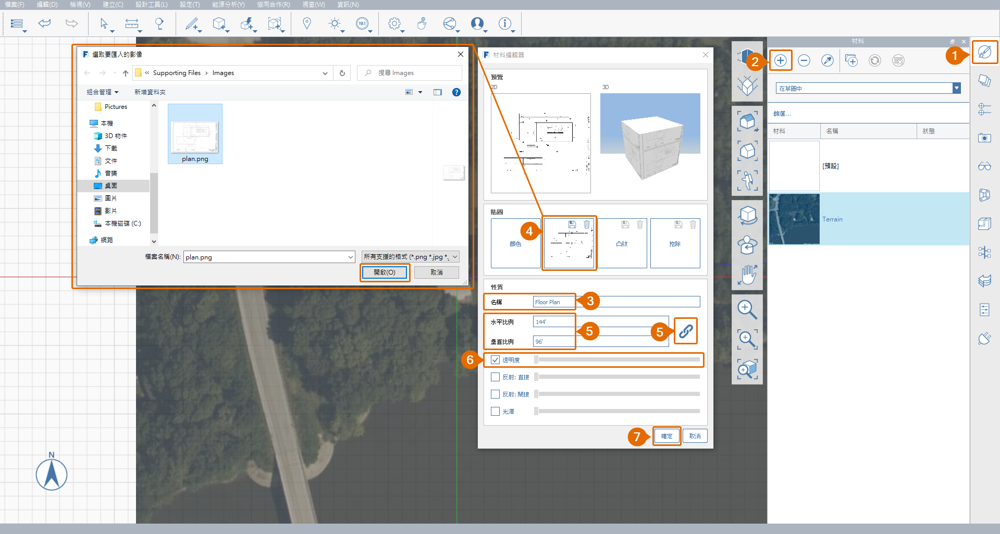

# 1.2 – Nastavení projektu pomocí obrázků a osnovy

_Výběrem možnosti Soubor > Importovat na panelu Navigace můžete do základní roviny modelu importovat obrázky PNG nebo JPG. Chcete-li však získat větší kontrolu nad měřítkem a umístěním importovaného obrázku, můžete vytvořit vlastní materiál a použít jej na obdélník, který jste sami nakreslili._

_Pokud jste nedokončili poslední část, stáhněte a otevřete soubor_ _**1.2 – Project Set Up with Images and Grid.axm**_ _z_ _**datových sad k příručce Základy aplikace FormIt, část 1**._

## **Výpočet velikost obrázku**

Poskytnutý soubor **plan.png** je obrázek půdorysu vytištěného na listu o rozměrech 24" x 26", který je široký 3600 pixelů a vysoký 2400 pixelů. Když znáte měřítko výkresu (¼"=1'-0") a rozměry obrázku, můžete vypočítat, že 1’ = 25 pixelů, což znamená, že obrázek by měl mít po importu do aplikace FormIt v plném měřítku rozměry 144' x 96'.

 (2).png>)

## **Import obrázku v měřítku**

1 – Kliknutím na ikonu **Horní pohled** na **plovoucím panelu nástrojů Navigace** zobrazte scénu shora.

.png>)

2 – Na panelu nástrojů 3D náčrt vyberte nástroj **Obdélník (R)**.

.png>)

3 – Chcete-li vytvořit obdélník o rozměrech přesně **144’** x **96’**, kliknutím kdekoli v pracovním prostoru definujte počáteční bod a poté pohybem myši zobrazte náhled a zadejte délku první strany. Začněte zadávat hodnotu kóty, čímž se zobrazí dialog, do kterého můžete zadat přesnou kótu. Kliknutím na tlačítko **OK** nebo stisknutím klávesy **Enter** potvrďte kótu. Opakujte postup, nastavte délku druhé strany a dokončete obdélník.

.png>)

.png>)

.png>)

4 – Vytvoření nového materiálu „Půdorys podlaží“:

1. Otevřete **paletu Materiál**.
2. Kliknutím na ikonu **+** vytvořte nový materiál.
3. Pojmenujte nový materiál jako **Půdorys podlaží**.
4. V části **MAPY** klikněte na dlaždici náhledu **Textura** a přejděte k souboru **plan.png** ve složce **Farnsworth House·Data·Set·> Supporting Files >Images**. Poté klikněte na tlačítko **Otevřít**.
5. V části **VLASTNOSTI** změňte měřítko obrázku zadáním hodnoty **144'** do pole **Horizontální měřítko** a **96'** do pole **Vertikální měřítko.** Všimněte si, že k vložení hodnot, které mění poměr stran obrázku, může být nutné odemknout horizontální a vertikální měřítko (ikona **řetězu**).
6. Zaškrtněte políčko **Průhlednost** a nastavte hodnotu přibližně na polovinu rozsahu. To usnadní zarovnání importovaného obrázku půdorysu podlaží se satelitním snímkem.
7. Kliknutím na tlačítko **OK** dokončete materiál.

5 – Vykreslení obdélníku:

1. Na **paletě Materiál** klikněte na dlaždici **materiálu Půdorys podlaží**,abyste tímto materiálem mohli malovat.
2. Kliknutím na načrtnutý obdélník jej vykreslete. Stisknutím klávesy **Esc** ukončete nástroj Štětec.

6 – Pokud se materiál zobrazuje převrácený nebo obrácený, bude nutné obrátit plochu. To provedete tak, že kliknutím pravým tlačítkem myši zobrazíte **místní nabídku** a vyberete tlačítko Obrátit plochu (FF).

## **Zarovnání importovaného obrázku se satelitním snímkem**

1 – Chcete-li obrázek přesunout, vyberte nejprve obdélník tím, že na něj dvakrát kliknete. Poté klikněte na obdélník a přesuňte jej, dokud nepřekryje budovu na satelitním snímku. K dokonalému zarovnání se vrátíme později, teď se jen snažte, aby to bylo co nejblíže.

2 – Otočte obdélník tak, aby byl zarovnán se satelitním snímkem:

1. Kliknutím pravým tlačítkem myši na obdélník zobrazte místní nabídku. Vyberte možnost **Otočit (Q)**
2. Uprostřed obdélníku se zobrazí **pomůcka pro otočení**. Vyberte pomůcku kliknutím na oranžový uzel uprostřed. Přesuňte pomůcku do levého dolního rohu obdélníku. Pomůcka se přichytí k rohu. Kliknutím ji umístěte.
3. Zadejte hodnotu **9**. Zobrazí se pole kóty. Kliknutím na tlačítko **OK** otočte obdélník o 9 stupňů proti směru hodinových ručiček.

## **Zarovnání osnovy se satelitním snímkem**

1 – Nyní zarovnáme osnovu se satelitním snímkem a půdorysem podlaží. Klikněte pravým tlačítkem myši kamkoli na **základní rovinu** a vyberte možnost **Nastavit osy (SZ)**.

2 – Zobrazí se pomůcka pro **nastavení os**. Přesuňte osu do levého dolního rohu obdélníku, kde by se měla přichytit. Kliknutím ji umístěte.

3 – Klikněte na uzel na konci červené osy. Přesuňte uzel do pravého dolního rohu obdélníku tak, aby se červená osa zarovnala s dolní hranou roviny. Kliknutím na volné místo potvrďte změnu.

4 – Chcete-li zarovnat pohled s novou osnovou, obnovte scénu kliknutím na ikonu Horní pohled na panelu Navigace.

5 – Chcete-li zajistit, aby se budova na obou snímcích překrývala, vyberte půdorys a znovu jej přesuňte, dokud se nebude správně překrývat se satelitním snímkem.

6 – Satelitní snímek, obdélník a osnova jsou nyní zarovnány, což usnadní 3D kreslení.
