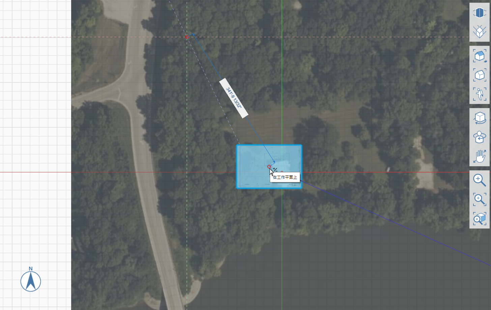

# 1.2 – Projekteinrichtung mit Bildern und Raster

_Sie können PNG- oder JPG-Bilder auf die Grundplatte des Modells importieren, indem Sie in der Navigationsleiste Datei > Importieren auswählen. Um jedoch die Kontrolle über den Maßstab und die Position eines importierten Bilds zu erhalten, können Sie ein benutzerdefiniertes Material erstellen und es auf ein selbst gezeichnetes Rechteck anwenden._

_Wenn Sie den letzten Abschnitt nicht bearbeitet haben, laden Sie die Datei_ _**1.2 – Project Setup with Images and Grid.axm**_ _aus dem Ordner_ _**FormIt Primer Part 1 Datasets**_ herunter und öffnen sie.

## **Berechnen der Bildgröße**

Die bereitgestellte Datei **plan.png** ist ein Bild eines Plans, der auf einem Blatt mit den Maßen 24'' x 26'' (ARCH D) gedruckt wurde, das 3600 Pixel breit und 2400 Pixel hoch ist. Wenn Sie den Zeichnungsmaßstab (¼" = 1'-0") und die Bildabmessungen kennen, können Sie berechnen, dass 1' = 25 Pixel, d. h., das Bild sollte beim Import in FormIt im vollen Maßstab 144' x 96' betragen.

\ (2).png>)

## **Maßstabsgetreues Importieren eines Bilds**

1 – Klicken Sie in der **verschiebbaren Navigationsleiste** auf das Symbol **Draufsicht**, um die Szene von oben anzuzeigen.

\.png>)

2 – Wählen Sie im Werkzeugkasten 3D-Skizze das **Werkzeug Rechteck (R)**.

\.png>)

3 – Um ein Rechteck zu erstellen, das genau **144'** x **96'** entspricht, klicken Sie auf eine beliebige Stelle im Arbeitsbereich, um den Startpunkt zu definieren, und bewegen Sie dann die Maus, um eine Vorschau anzuzeigen und die erste Seitenlänge zu definieren. Beginnen Sie mit der Eingabe eines Bemaßungswerts, um ein Dialogfeld zu öffnen, in dem Sie die genaue Bemaßung eingeben können. Klicken Sie auf **OK**, oder drücken Sie die **EINGABETASTE**, um die Bemaßung zu bestätigen. Wiederholen Sie den Vorgang, um die Länge der zweiten Seite festzulegen und das Rechteck fertigzustellen.

\.png>)

!Geben Sie die Länge für die zweite Seite des Rechtecks ein.](<../../.gitbook/assets/4 (1).png>)

\.png>)

4 – So erstellen Sie das neue Material Floor Plan

1. Öffnen Sie die **Palette Material**.
2. Klicken Sie auf das **+**-Symbol, um ein neues Material zu erstellen.
3. Nennen Sie das neue Material **Floor Plan**.
4. Klicken Sie unter **MAPS** auf die Vorschaukachel **Textur**, und navigieren Sie im Ordner **Farnsworth House Data Set > Supporting Files > Images** zu **plan.png**. Klicken Sie dann auf **Öffnen**.
5. Ändern Sie unter **EIGENSCHAFTEN** den Maßstab des Bilds, indem Sie **144'** in das Feld **Horizontaler Maßstab** und **96'** in das Feld **Vertikaler Maßstab** eingeben. Beachten Sie, dass möglicherweise eine Entsperrung des horizontalen und vertikalen Maßstabs (**Kettenglied**-Symbol) erforderlich ist, um Werte einzufügen, mit denen die Bildproportionen geändert werden können.
6. Aktivieren Sie **Transparenz**, und setzen Sie diese auf ungefähr die Hälfte. Dadurch wird das importierte Grundrissbild am Satellitenbild ausgerichtet.
7. Klicken Sie zum Schließen des Materials auf **OK**.

5 – So versehen Sie das Rechteck mit einem Material

1. Klicken Sie in der **Palette Material** auf die Kachel des **Grundrissmaterials**, um dieses Material zu verwenden.
2. Klicken Sie auf das skizzierte Rechteck, um es mit dem Material zu versehen. Drücken Sie **ESC**, um das Malpinsel-Werkzeug zu beenden.

6 – Wenn das Material invertiert oder rückwärts angezeigt wird, müssen Sie möglicherweise die Fläche umkehren. Klicken Sie dazu mit der rechten Maustaste, um das **Kontextmenü** aufzurufen, und wählen Sie die Schaltfläche Fläche umkehren (FF) aus.

## **Ausrichten des importierten Bilds am Satellitenbild**

1 – Um das Bild zu verschieben, wählen Sie zunächst das Rechteck durch Doppelklicken aus. Klicken Sie dann auf das Rechteck, und ziehen Sie es, bis es das Gebäude im Satellitenbild überlappt. Sie werden es später noch optimal ausrichten. Versuchen Sie vorerst nur, es ungefähr richtig zu positionieren.

2 – So drehen Sie das Rechteck, um es am Satellitenbild auszurichten

1. Klicken Sie mit der rechten Maustaste auf das Rechteck, um das Kontextmenü aufzurufen. Wählen Sie **Drehen (Q).**
2. Das **Drehen-Widget** wird in der Mitte des Rechtecks angezeigt. Wählen Sie das Widget aus, indem Sie einmal auf den orangefarbenen Griff in der Mitte klicken. Verschieben Sie das Widget in die untere linke Ecke des Rechtecks. Es wird an der Ecke gefangen. Positionieren Sie sie per Mausklick.
3. Geben Sie **9** ein. Daraufhin wird das Bemaßungsfeld angezeigt. Klicken Sie auf **OK**, um das Rechteck um 9 Grad gegen den Uhrzeigersinn zu drehen.

## **Ausrichten des Rasters am Satellitenbild**

1 – Jetzt richten Sie das Raster am Satellitenbild und am Grundriss aus. Klicken Sie mit der rechten Maustaste auf eine beliebige Stelle auf der **Grundplatte**, und wählen Sie **Achsen festlegen (SZ)**.

2 – Das Widget **Achse festlegen** wird angezeigt. Verschieben Sie die Achse in die untere linke Ecke des Rechtecks, wo sie gefangen werden soll. Positionieren Sie sie per Mausklick.

3 – Klicken Sie auf den Griff am Ende der roten Achse. Verschieben Sie den Griff in die untere rechte Ecke des Rechtecks, sodass die rote Achse an der unteren Kante der Ebene ausgerichtet ist. Klicken Sie in den Raum, um diese Änderung zu übernehmen.

4 – Um die Ansicht am neuen Raster auszurichten, klicken Sie in der Navigationsleiste auf das Symbol für die Draufsicht, um die Szene zurückzusetzen.

5 – Um sicherzustellen, dass das Gebäude in beiden Bildern überlappt, wählen Sie den Plan aus, um ihn erneut zu verschieben, bis er das Satellitenbild korrekt überlappt.

6 – Das Satellitenbild, das Rechteck und das Raster sind jetzt ausgerichtet, was die 3D-Skizzierung vereinfacht.
