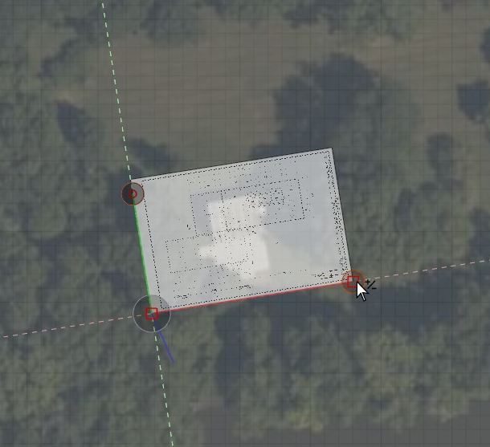

# 1.2 — Konfiguracja projektu z obrazami i siatką

_Obrazy PNG lub JPG można importować na płaszczyznę terenu modelu, wybierając opcje Plik > Importuj na pasku nawigacji. Aby jednak uzyskać większą kontrolę nad skalą i położeniem zaimportowanego obrazu, można utworzyć materiał niestandardowy i zastosować go do samodzielnie narysowanego prostokąta._

_Jeśli ostatnia sekcja nie została ukończona, pobierz i otwórz plik_ _**1.2 — Project Set Up with Images and Grid.axm**_ _z_ _**zestawów danych FormIt Primer Part 1 Datasets**._

## **Obliczanie rozmiaru obrazu**

Dostarczony plik **plan.png** jest obrazem rzutu drukowanym na arkuszu 24" x 26" (ARCH D) o szerokości 3600 pikseli i wysokości 2400 pikseli. Znając skalę rysunku (¼"=1'-0") i wymiary obrazu, można obliczyć, że 1' = 25 pikseli, co oznacza, że obraz powinien mieć rozmiar 144' x 96' w przypadku zaimportowania do formatu programu FormIt w pełnej skali.

\ (2).png>)

## **Importowanie obrazu w skali**

1 — Kliknij ikonę **Widok z góry** na **ruchomym pasku nawigacji**, aby wyświetlić scenę z góry.

\.png>)

2 — Wybierz **narzędzie Prostokąt (R)** na pasku narzędzi Szkic 3D.

\.png>)

3 — W celu utworzenia prostokąta o długości dokładnie **144’** x **96’** kliknij w dowolnym miejscu w obszarze roboczym, aby zdefiniować punkt początkowy, a następnie przesuń wskaźnik myszy, aby wyświetlić podgląd i zdefiniować długość pierwszego boku. Rozpocznij wpisywanie wartości wymiaru, aby uzyskać dostęp do okna dialogowego, w którym można wprowadzić dokładny wymiar. Kliknij przycisk **OK** lub naciśnij klawisz **Enter**, aby zatwierdzić wymiar. Powtórz ten proces, aby ustawić długość drugiego boku i dokończyć prostokąt.

\.png>)

\.png>)

\.png>)

4 — Aby utworzyć nowy materiał „Floor Plan”:

1. Otwórz **paletę Materiał**.
2. Kliknij ikonę **+**, aby utworzyć nowy materiał.
3. Nadaj nowemu materiałowi nazwę „**Floor Plan**”.
4. W obszarze **MAPY** kliknij obszar podglądu **Tekstura** i przejdź do pliku **plan.png** w folderze **Farnsworth House Data Set > Supporting Files > Images**. Następnie kliknij przycisk **Otwórz**.
5. W obszarze **WŁAŚCIWOŚCI** zmień skalę obrazu, wprowadzając wartość **144'** w polu **Skala pozioma** i wartość **96'** w polu **Skala pionowa**. Pamiętaj, że może być wymagane odblokowanie skali poziomej i pionowej (ikona **ogniwa łańcucha**) w celu wstawienia wartości, które zmieniają proporcje obrazu.
6. Zaznacz pole wyboru **Przezroczystość** i ustaw jej wartość równą około połowie. Ułatwi to wyrównanie zaimportowanego obrazu rzutu kondygnacji względem obrazu satelitarnego.
7. Kliknij przycisk **OK**, aby dokończyć materiał.

5 — Aby pomalować prostokąt:

1. Na **palecie Materiał** kliknij jeden raz obszar **Materiał Floor Plan**, aby pomalować tym materiałem.
2. Kliknij naszkicowany prostokąt, aby go pomalować. Naciśnij klawisz **Esc**, aby zakończyć pracę z narzędziem pędzla.

6 — Jeśli materiał jest wyświetlany jako odwrócony, może być konieczne odwrócenie powierzchni. Można to zrobić, klikając prawym przyciskiem myszy, aby uzyskać dostęp do **menu kontekstowego**, i wybierając przycisk Odwróć powierzchnię (FF).

## **Wyrównywanie zaimportowanego obrazu względem obrazu satelitarnego**

1 — Aby przesunąć obraz, najpierw wybierz prostokąt, klikając go dwukrotnie. Następnie kliknij i przeciągnij prostokąt i przesuwaj go, aż nałoży się na budynek na obrazie satelitarnym. O idealne wyrównanie zadbamy później, na razie wystarczy wyrównanie mniej więcej odpowiednie.

2 — Aby obrócić prostokąt w celu wyrównania go względem obrazu satelitarnego:

1. Kliknij prawym przyciskiem myszy prostokąt, aby wywołać menu kontekstowe. Wybierz opcję **Obróć (Q)**.
2. W środku prostokąta zostanie wyświetlony **widżet obracania**. Wybierz widżet, klikając jeden raz pomarańczowy uchwyt w środku. Przesuń widżet do lewego dolnego narożnika prostokąta. Zostanie on przyciągnięty do narożnika. Kliknij, aby umieścić ten element.
3. Wpisz **9**, a pojawi się pole wymiaru. Kliknij przycisk **OK**, aby obrócić prostokąt przeciwnie do ruchu wskazówek zegara o 9 stopni.

## **Wyrównywanie siatki względem obrazu satelitarnego**

1 — Teraz wyrównamy siatkę względem obrazu satelitarnego i rzutu kondygnacji. Kliknij prawym przyciskiem myszy w dowolnym miejscu na **płaszczyźnie terenu** i wybierz opcję **Ustaw osie (SZ)**.

2 — Zostanie wyświetlony widżet **Ustaw oś**. Przesuń oś w lewy dolny narożnik prostokąta, do którego powinna zostać przyciągnięta. Kliknij, aby umieścić ten element.

3 — Kliknij uchwyt na końcu czerwonej osi. Przesuń uchwyt do prawego dolnego narożnika prostokąta, tak aby czerwona oś była wyrównana względem dolnej krawędzi płaszczyzny. Kliknij w innym miejscu poza tym obszarem, aby zatwierdzić tę zmianę.

4 — Aby wyrównać widok względem nowej siatki, kliknij ikonę Widok z góry na pasku nawigacji, aby zresetować scenę.

5 — Aby budynek na obu obrazach się nakładał, wybierz rzut, aby ponownie go przesuwać, aż właściwie nałoży się na obraz satelitarny.

6 — Obraz satelitarny, prostokąt i siatka są teraz wyrównane, co uprości szkicowanie 3D.
