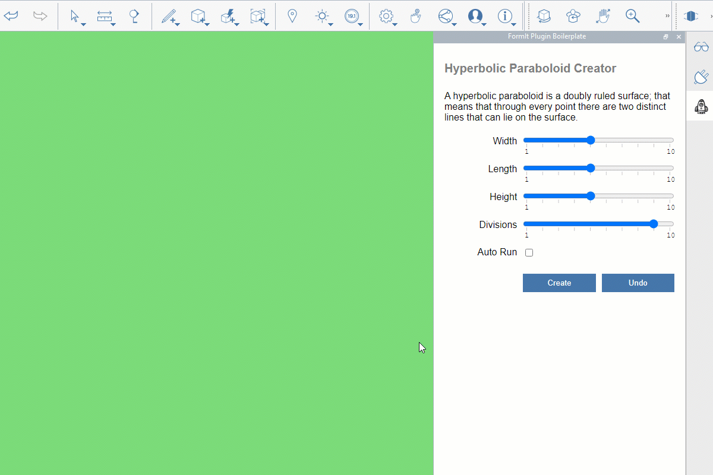

# Plug-ins

Les plug-ins peuvent améliorer votre expérience Autodesk FormIt® en élargissant votre jeu d’outils de modélisation. Vous pouvez répondre à des besoins de conception spécifiques qui ne sont pas couverts par la bibliothèque d’outils de FormIt.

La section Plug-ins de ce guide comprend quatre chapitres :

1. [Introduction aux plug-ins](introduction.md) : informations de base que vous devez connaître sur les plug-ins.
2. [Utilisation des plug-ins](how-to-use-plug-ins.md) : si vous utilisez FormIt et souhaitez tester les plug-ins, cette section vous guidera tout au long du processus d’installation et d’utilisation des plug-ins.
3. [Développement de plug-ins](how-to-develop-plugins/) : si vous êtes développeur et souhaitez aller plus loin, cette section vous guidera tout au long des étapes nécessaires au développement d’un plug-in FormIt.
4. [API FormIt](how-to-develop-plugins/useful-links.md) : liens vers la documentation de l’API FormIt.
5. [Exemples](example-1/) : si vous souhaitez tester des plug-ins existants, cette section contient des descriptions de certains des plug-ins disponibles.
