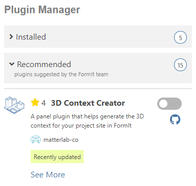

# 3D Context Creator

## What is it?

3D Context Creator is an easy-to-use plugin that will generate 3D context buildings inside FormIt.&#x20;

This plugin can help you visualize your project site with its surrounding context and make informed decisions in the early stage of the design process.

This plugin retrieves data from [Open Street Map](https://www.openstreetmap.org/about) to help transform it into FormIt geometries. The source code for this plugin is available on [Github](https://github.com/matterlab-co/FormIt-Context-Plugin).

## How to use it

To install it, simply enable on the plugin’s toggle from the Plugin manager as you would with any other plugin.

Once toggled on, the plugin should appear on the right side of the app and be ready to use.

.png>)

If your site doesn't already have a location, you can click the **Set Location...** link to set a location and define the boundary that will be used for generating 3D context.

Once you've set your location, the 3D Context Creator will update with the current location and the button will be enabled:

The 3D Context Creator will simply use the extents of the satellite image to generate 3D Context. All you have to do is click **Generate 3D Context**!

Depending on the extents of the satellite image, and the complexity of the buildings, this could take a few seconds to generate.

The 3D context buildings will automatically be placed into a group instance, and placed on a layer called "Context Buildings." You can toggle the visibility of the context using this layer.

If you later decide to change your location, or adjust the scope of the satellite image, you can click **Generate 3D Context** again to regenerate the buildings.&#x20;

_Note that regenerating the context will replace the group instance containing the buildings with a new instance, so any changes made to the buildings will be lost._ To prevent this, you can ungroup the context container, then regroup it.

## **Some examples**

Try to guess what iconic cities are represented in the following contexts:

.png>)

.png>)

.png>)

.png>)
