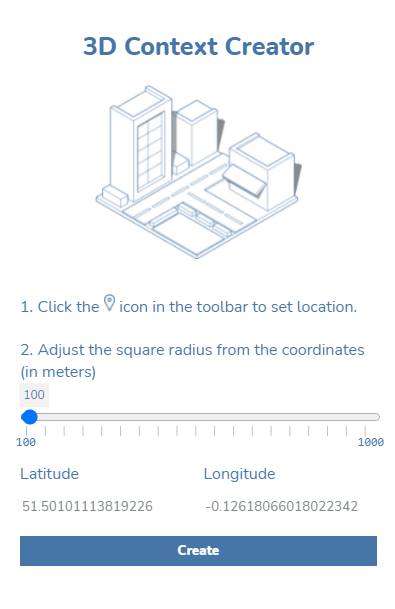
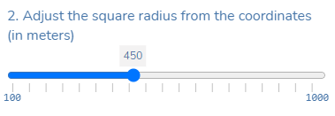

# 3D Context Creator

## 3D Context Creator とは?

3D Context Creator は、FormIt 内で 3D のコンテキストをすばやく生成するのに役立つ、非常に使いやすいプラグインです。このプラグインでは次のことが可能です。

* 周囲のコンテキストに合わせてプロジェクトの敷地を可視化する。
* 特に設計プロセスの初期段階で、情報に基づいて意思決定する。
* FormIt のすべてのユーザが無償でダウンロードできる。&#x20;

このプラグインでは、[Open Street Map](https://www.openstreetmap.org/about) からデータを取得して、FormIt ジオメトリに変換できます。このプラグインのソース コードは、[Github](https://github.com/matterlab-co/FormIt-Context-Plugin) で取得できます。&#x20;

## 使用方法

プラグインをインストールするには、他のプラグインと同様に、プラグインのスイッチをオンにします。

スイッチをオンにすると、プラグインがアプリケーションの右側に表示され、使用できるようになります。

プラグインを使用する前に、まず FormIt のメインのツールバーから敷地の場所を設定します。

.png>)

敷地の場所を検索し、[衛星画像と地形を読み込む]をクリックします。

.png>)

衛星画像が FormIt プロジェクトに正常に読み込まれたら、3D Context Creator プラグインにナビゲートします。

正方形の半径をスライダで調整して、場所点からのコンテキストの距離(メートル単位)を拡張します。

[Create]ボタンをクリックします。これで完了です。

設定に問題がなければ、[Create]ボタンをクリックします。指定した半径のサイズと複雑さによっては、建物の形成の処理に少し時間がかかることがあります。

## **例**

次のコンテキストで表現される象徴的な都市を推測してみてください。

.png>)

.png>)

.png>)

.png>)
