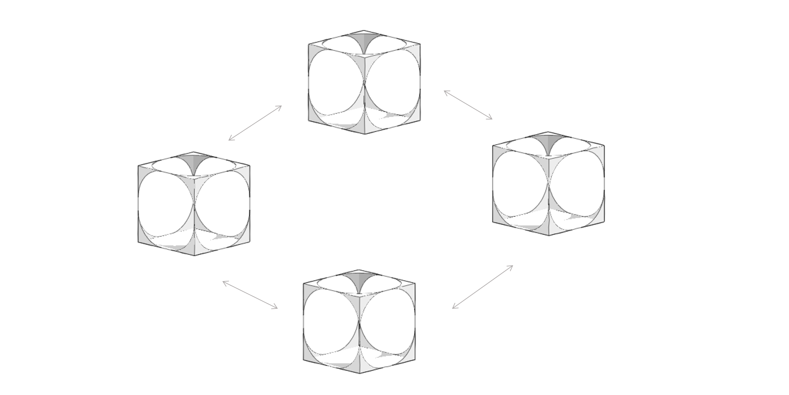

# Komunita modulů plug-in pro aplikaci FormIt

## Hledáte moduly plug-in?

Pokud hledáte inspiraci pro vývoj svého modulu plug-in pro aplikaci FormIt, podívejte se na některé z těchto příkladů:

* [Moduly plug-in komunity](https://github.com/topics/formit-plugin): Moduly plug-in vyvinuté uživateli a vývojáři aplikace FormIt.
* [Moduly plug-in doporučené týmem aplikace FormIt](https://github.com/search?q=org%3AFormIt3D+formit-plugin-recommended): Moduly plug-in vyvinuté komunitou a doporučené týmem aplikace FormIt.
* [Moduly plug-in od týmu aplikace FormIt](https://github.com/FormIt3D): Oficiální moduly plug-in vyvinuté týmem aplikace FormIt.

## Chcete, aby aplikace FormIt obsahovala váš modul plug-in?

Pokud jste vyvinuli modul plug-in, který by byl užitečný pro ostatní uživatele aplikace FormIt, rádi bychom se o něm dozvěděli více. Dejte nám vědět a my váš modul zkontrolujeme a zvážíme jeho přidání do seznamu **doporučených modulů plug-in pro aplikaci Formit** nebo jej použijeme jako [příklad](./) v naší příručce.&#x20;

### Nápověda od komunity a týmu aplikace FormIt

Máte problémy s vytvářením nebo spouštěním modulů plug-in? [Kontaktujte nás!](https://forums.autodesk.com/t5/formit-forum/bd-p/142?profile.language=en)
