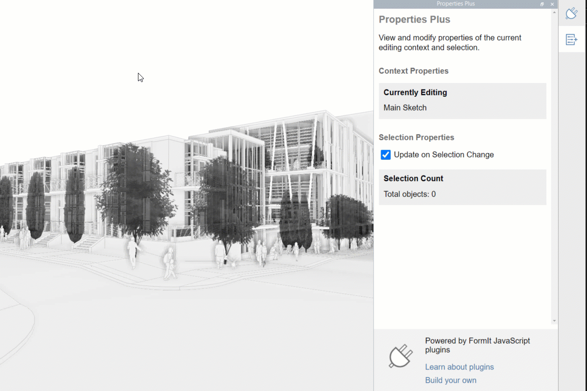

# So entwickeln Sie Plugins

Für die Bastler und Entwickler da draußen ist FormIt ein großartiges Werkzeug für die Entwicklung von Plugins. Es gibt zwei Entwicklungsmodi, aus denen Sie wählen können, je nach Ihren Entwicklungsfertigkeiten und der Komplexität des Projekts, das Sie ausführen möchten.&#x20;

* Wir empfehlen, mit dem Abschnitt [Ihr erstes Plugin](your-first-plugin/) zu beginnen. Dort werden Sie durch das Erstellen eines einfachen Plugins mithilfe von Plugin Playground geführt.
* Wenn Sie ein komplexeres Projekt entwickeln möchten, empfehlen wir die Verwendung des Abschnitts [Erweiterte Entwicklung](advanced-development/).
* Weitere Informationen zum Entwickeln von anderen Arten von Plugins finden Sie im Abschnitt [Zusätzliche Entwicklungsoptionen](additional-development-options/).
* Dokumentationslinks finden Sie auf der Seite [FormIt-APIs](useful-links.md).

