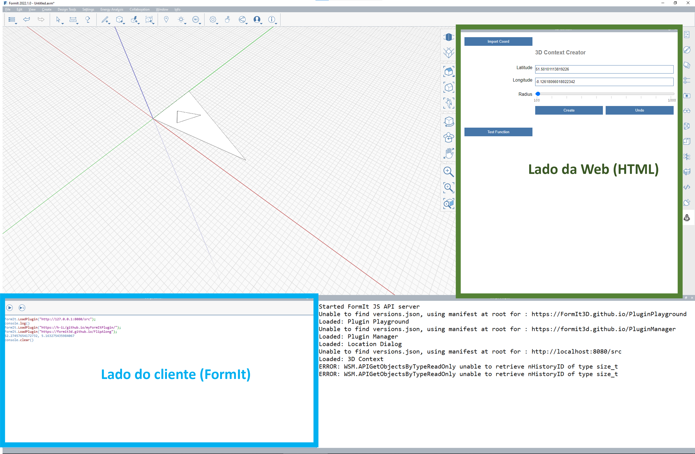

# クライアント側エンジンと Web 側エンジン

FormIt プラグインは、2 つの異なる JavaScript エンジンを使用します。&#x20;

* HTML を表示するパネル(Web 側)
* クライアント側のパネル(FormIt)。FormIt とそのジオメトリ カーネルを呼び出します&#x20;

これら 2 つの JavaScript エンジンは、異なるプロセスで動作します。

## **クライアント側(FormIt)と Web 側(HTML)**

FormIt は複数の JavaScript エンジンを同時に実行します。

* FormIt アプリケーションには独自の JavaScript エンジンがあります
* 各プラグイン ツールバーには独自の JavaScript エンジンがあります
* 各プラグイン パネルには独自の JavaScript エンジンがあります(Chromium)

プラグインでは、JavaScript がロードされる場所を指定できます。



### クライアント側(FormIt)

[manifest.json](https://github.com/FormIt3D/FormItExamplePlugins/blob/master/HelloBlockAsync/v23\_0/manifest.json#L8) を使用して指定されます

```
    "Scripts": [
        "PLUGINLOCATION/blockFormItSide.js",
        "https://formit3d.github.io/FormItExamplePlugins/SharedPluginFiles/PluginUtils18_0.js"
    ]

```

### Web 側(HTML)

[index.html](https://github.com/FormIt3D/FormItExamplePlugins/blob/master/HelloBlockAsync/v23\_0/index.html#L7) を使用して指定されます

* Web 側スクリプトは、Web ページからロードされます。
* Web 側スクリプトは、複数の非同期の呼び出しを使用してクライアント側(FormIt)の JavaScript を呼び出すことができます。

## Web ベースのプラグインからクライアント側(FormIt)のコマンドを呼び出す 3 つのメソッド

### メソッド 1: FormItInterface.CallMethod

`CallMethod` は、FormIt 側で実行される関数名とその引数を取得します。このメソッドを渡された関数は、関数呼び出しの結果とともに呼び出されます。

```
    var args = {
        "w": 10,
        "l": 10,
        "h": 10
    }
    FormItInterface.CallMethod("CreateBlock", args, function(result)
    {
        // Result of the function call
    });
```

**長所:**&#x20;

➕ `await` が不要です。&#x20;

**短所:**&#x20;

➖ 結果を取得するにはコールバックが必要ですが、そのタイミングを決めることができません。&#x20;

➖ スクリプトは 2 つの異なる場所で定義されます。&#x20;

➖ プラグイン ロジックを 2 つの異なるファイルに分割する必要があります。

### **メソッド 2: FormIt.CallJS**&#x20;

**\* FormIt 2022.1 以降でのみ使用可能です**

CallJS は、FormIt 側で呼び出される JavaScript 関数、および arguments.json オブジェクトを取得します。

```
var args =
{
    "w": 10,
    "l": 10,
    "h": 10
};
var result = await FormIt.CallJS("CreateBlock", args);

```

**長所:**&#x20;

➕ 必要なときに結果を利用できます。

**短所:**&#x20;

➖ **** 非同期の呼び出しをすべて await で修飾する必要があります。これを忘れると正しく機能しません。

➖ **** `await` が原因で動作が遅くなる可能性があります。

### **メソッド 3 (async/await)**

```
const pt1 = await WSM.Geom.Point3d(0,0,0);
```

非同期の呼び出しで、Web 側が FormIt 側を呼び出します。この呼び出しは、あるプロセスで開始して別のプロセスに送られ、その結果が開始プロセスに戻されます。そのため、await が必要です。&#x20;

既定では、組み込みの FormIt API のみを呼び出すことができます。

**長所:**&#x20;

➕ 必要なときに結果を利用できます。&#x20;

➕ manifest.json にスクリプトが定義されていなくても、すべてのコードを結合して、Web 側から実行される 1 つの JS ファイルにすることができます。

**短所:**&#x20;

➖ **** 非同期の呼び出しをすべて `await` で修飾する必要があります。これを忘れると正しく機能しません。&#x20;

➖ **** `await.` が原因で動作が遅くなる可能性があります。

### メソッド 4 (RegisterAsyncAPI)&#x20;

**\* FormIt 2023.0 以降でのみ使用可能です**&#x20;

FormIt 側でユーザ定義関数を呼び出すには、関数を登録する必要があります。例:&#x20;

**クライアント側(FormIt)**

```
FormIt.RegisterAsyncAPI("HelloBlockAsync", "CreateBlock", "l, w, h");
// CreateBlock runs from FormIt.
HelloBlockAsync.CreateBlock = function(args)
{
    return { "Result" : "It Worked!!"};
}
```

**Web 側(HTML)**

```
var result = await HelloBlockAsync.CreateBlock(l, w, h);
```

例については、「[HelloBlockAsync](https://github.com/FormIt3D/FormItExamplePlugins/tree/master/HelloBlockAsync/v23\_0)」を参照してください。

**長所:**&#x20;

➕ 必要なときに結果を利用できます。&#x20;

➕ manifest.json にスクリプトが定義されていなくても、すべてのコードを結合して、Web 側から実行される 1 つの JS ファイルにすることができます。

**短所:**&#x20;

➖ **** 非同期の呼び出しをすべて await で修飾する必要があります。これを忘れると正しく機能しません。&#x20;

➖ **** `await.` が原因で動作が遅くなる可能性があります。

##
