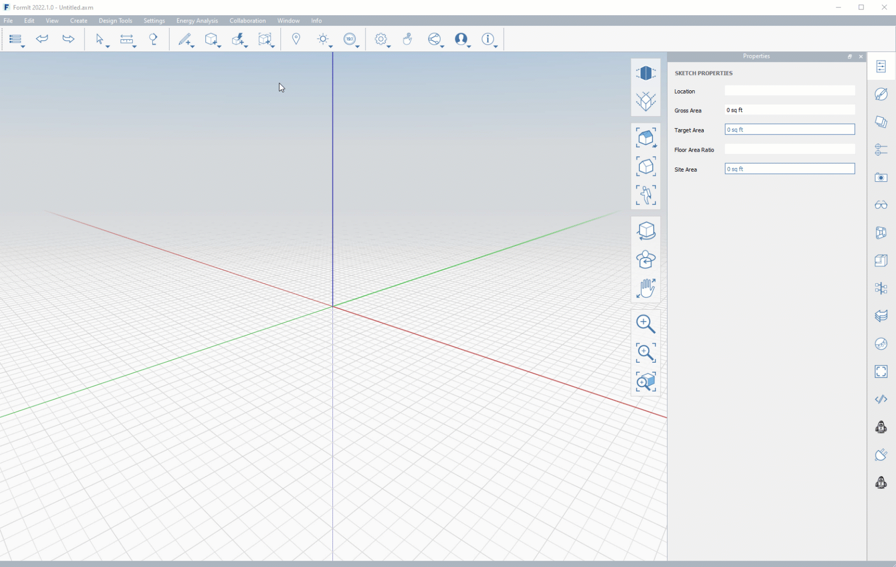
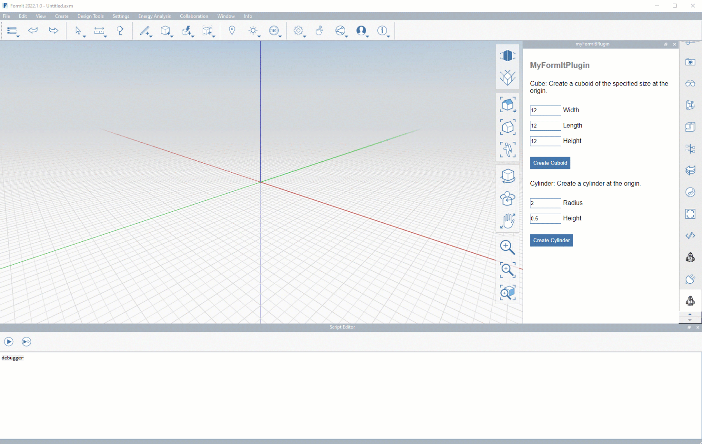
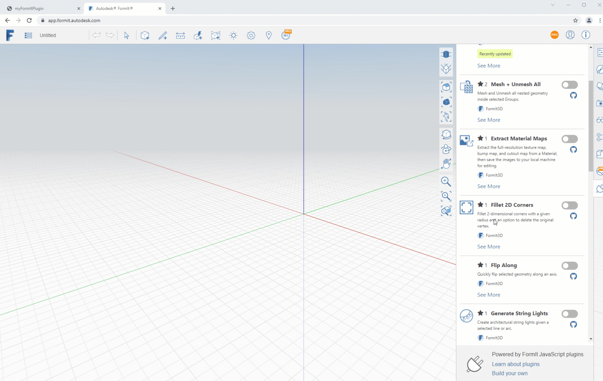

# Depuração

A depuração de um plug-in do FormIt requer procedimentos diferentes dependendo do mecanismo que você esteja depurando. (Para obter mais informações sobre mecanismos, consulte a [seção anterior](client-side-vs-web-side-engines.md))

### **Depuração do lado do cliente (FormIt)**

Para depurar no código FormIt-side, que se aplica a plug-ins baseados em barra de ferramentas e em painel, é possível adicionar uma linha no código para exibir o depurador JS integrado do aplicativo para desktop:

`debugger`

### **Depuração do lado da Web (HTML)**

Os plug-ins do FormIt baseados em painéis oferecem depuração de interface do usuário baseada em HTML, já que os painéis são essencialmente sites HTML com estilização e scripts.

Para depurar o código do lado HTML para plug-ins embutidos em um painel, incluindo scripts e estilização:

* **FormIt para Windows 2021.1 e versões mais recentes**
   * Clique com o botão direito do mouse na página HTML do plug-in e clique em “Depurar” para exibir o depurador HTML integrado do aplicativo.

* **FormIt para Web**
   * Use o atalho F12 ou Ctrl + Shift + I para abrir o depurador HTML do navegador.

