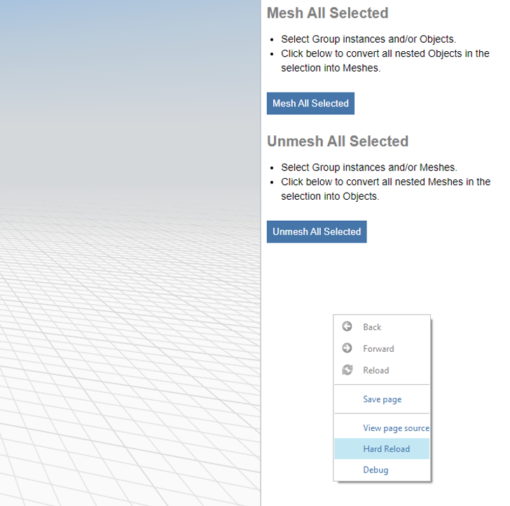

# Volver a cargar para aplicar cambios locales

Al desarrollar un módulo de extensión, es posible que deba volver a cargar rápidamente las actualizaciones más recientes del código sin cargar de nuevo toda la aplicación. Esto se puede realizar tanto en la versión web como en la versión para Windows de FormIt sin necesidad de cargar de nuevo toda la aplicación.

## Volver a cargar en la versión web

?? Para volver a cargar el módulo de extensión en la versión web de FormIt, haga clic con el botón derecho en el código HTML del módulo de extensión y haga clic en `Reload Frame`.

.png>)

## Volver a cargar en la versión para Windows

?? Para volver a cargar el módulo de extensión en la versión para Windows de FormIt, haga clic con el botón derecho en el código HTML del módulo de extensión y haga clic en `Hard Reload`.

