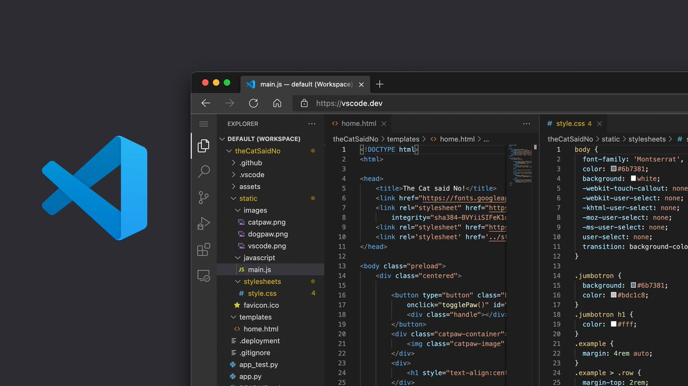

# Utilisation d’un IDE

Le développement de plug-ins avec [Plugin Playground](../your-first-plugin/plugin-playground.md) est simple et pratique. Toutefois, vous pouvez développer des plug-ins à l’aide d’un environnement de développement intégré (IDE) externe. Voici quelques-uns des avantages de l’utilisation d’un IDE : &#x20;

* Vous pouvez utiliser votre IDE préféré, qui fournit éventuellement une correction des erreurs de syntaxe, des extensions, etc.
* Vous pouvez collaborer avec vos collègues pour développer un plug-in FormIt via un référentiel GitHub.
* Vous pouvez développer des plug-ins privés et les héberger sur un serveur local.

### Installer un IDE

[Visual Studio Code](https://code.visualstudio.com/Download) de Microsoft est un IDE gratuit qui fonctionne bien pour le développement de plug-ins FormIt. Cliquez sur le lien pour télécharger le fichier de configuration et mener à bien l’installation.

Nous allons utiliser Visual Studio Code pour cette démonstration, mais vous pouvez choisir un autre éditeur de code. Assurez-vous que votre IDE inclut un terminal pour exécuter votre serveur local.

