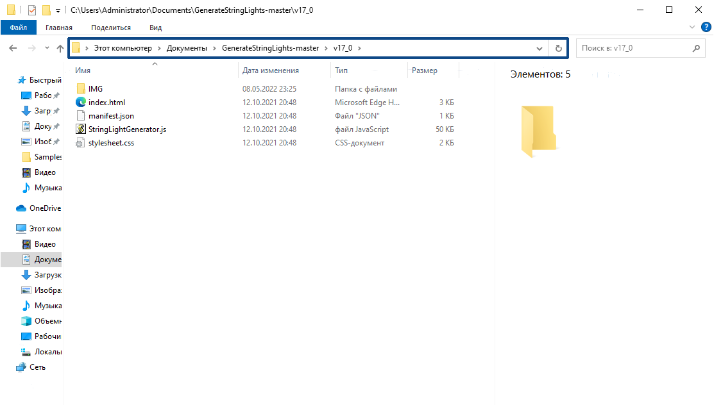
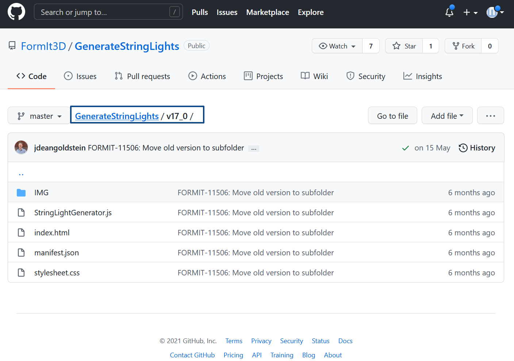
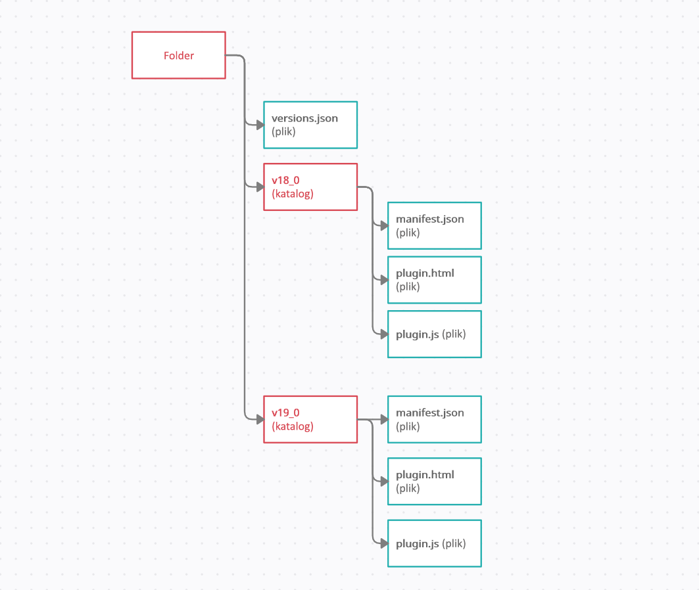

# Správa verzí

Při vývoji a aktualizaci zásuvného modulu může být v určitém okamžiku nutné spravovat verze kódu.

Například rozhraní API aplikace FormIt se mohou mezi verzemi měnit, a i když chcete, aby nová verze modulu plug-in používala nová rozhraní API aplikace FormIt nebo WSM, je vhodné zachovat funkčnost modulu plug-in i ve starších klientech.

Počínaje verzí aplikace FormIt **18.0** můžete implementovat správu verzí modulu plug-in ve 3 jednoduchých krocích:

* Do kořenové složky adresáře modulu plug-in přidejte soubor _versions.json_.
* V souboru _versions.json_ zadejte každou kompatibilní verzi aplikaci FormIt a adresář obsahující soubory modulu plug-in.
* Použijte interní číslo verze aplikace FormIt neboli „číslo sestavení“, které najdete v aplikaci FormIt v nabídce Informace > O aplikaci.


### Jak uspořádat verze pro modul plug-in

Uspořádejte soubory a adresáře modulů plug-in tak, aby odpovídaly souboru _versions.json_.

Soubor _versions.json_ by měl vypadat takto:

```
        [
            {
                "version":{
                    "major":18,
                    "minor":0
                },
                "path":"v18_0"
            },
            {
                "version":{
                    "major":19,
                    "minor":1
                },
                "path":"v19_0"
            }
        ]

```

Výše uvedené cesty _v18\_0_ a _v19\_0_ musí být platné dílčí cesty kořenového adresáře/úložiště.







Skvělým způsobem, jak to vyřešit, je přesunout kód modulu plug-in do podadresářů. Při použití výše uvedeného souboru _versions.json_ by adresářová struktura vypadala takto:

* **versions.json** (soubor)
* **v18\_0** (adresář)

   * **manifest.json** (soubor)
   * **plugin.html** (soubor)
   * **plugin.js** (soubor)


* **v19\_0** (adresář)
   * **manifest.json** (soubor)
   * **plugin.html** (soubor)
   * **plugin.js** (soubor)

Volitelné vlastnosti verze jsou „exactVersion“ a „lastVersion“. „exactVersion“ označuje, že verze musí přesně odpovídat verzi aplikace FormIt. „lastVersion“ označuje poslední verzi, která může být v aplikaci FormIt spuštěna.\


```
[
    {
      "version":{
        "major":18,
        "minor":0,
        "exactVersion":true
        },
        "path":"v18_0"
    },
    {
        "version":{
            "major":19,
            "minor":1,
            "lastVersion":true
       },
        "path":"v19_0"
    }
 ]
```

Pro cesty je také možné použít větve, popisky, nebo příkazy commit systému Git.

Pokud pracujete s předběžnou verzí nebo beta sestavením aplikace FormIt a chcete otestovat změny modulu plug-in, který funguje pouze s předběžnou verzí:

* Postupujte podle výše uvedených kroků kromě použití názvu souboru _versions\_prerelease.json_.
* Jestliže do svého úložiště zapíšete verzi _versions\_prerelease_, měli byste ji odebrat, až bude tato předběžná verze aplikace FormIt vydána.
   * V opačném případě budou budoucí předběžné aplikace FormIt načítat modul plug-in z umístění, které může být zastaralé nebo určené pro starší verzi.
