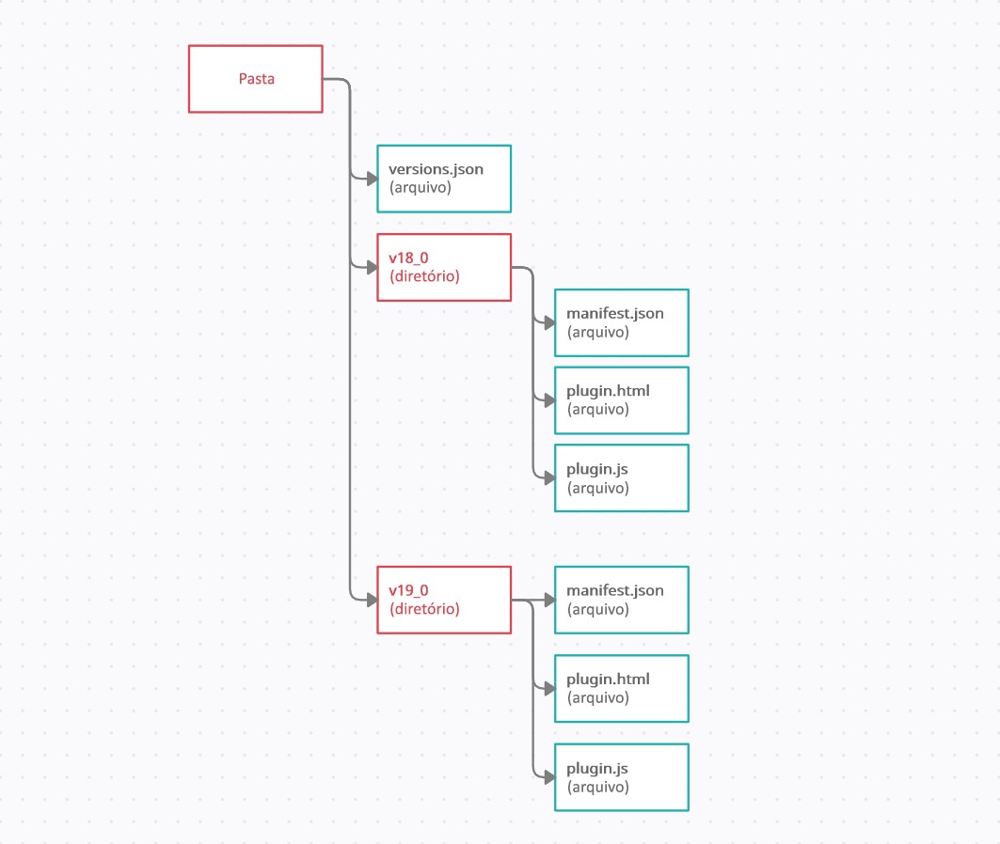

# 버전 관리

플러그인을 개발하고 업데이트하는 경우 특정 시점에 코드의 버전을 관리해야 할 수 있습니다.

예를 들어, FormIt의 API는 릴리스 간에 변경될 수 있으며, 새 버전의 플러그인에서 새 FormIt 또는 WSM API를 사용하도록 하고 싶으면서도 이전 클라이언트에서도 플러그인이 계속 작동하도록 하고 싶을 수 있습니다.

FormIt **v18.0**부터, 다음과 같은 간단한 세 단계로 플러그인의 버전 관리를 구현할 수 있습니다.

* 플러그인 디렉토리의 루트에 _versions.json_ 파일을 추가합니다.
* 호환되는 각 FormIt 버전과 이러한 플러그인 파일이 포함된 디렉토리를 _versions.json_ 에 지정합니다.
* FormIt의 정보 > 정보 아래에 있는 FormIt 내부 버전 번호 또는 "빌드 번호"를 사용합니다.


### 플러그인의 버전 관리를 구성하는 방법

_versions.json_ 과 일치하도록 플러그인 파일 및 디렉토리를 구성합니다.

_versions.json_ 이 다음과 같이 나타나야 합니다.

```
        [
            {
                "version":{
                    "major":18,
                    "minor":0
                },
                "path":"v18_0"
            },
            {
                "version":{
                    "major":19,
                    "minor":1
                },
                "path":"v19_0"
            }
        ]

```

위의 경로 _v18\_0_ 및 _v19\_0_ 은 디렉토리/리포지토리의 루트에서 유효한 하위 경로여야 합니다.




이를 처리하기 위한 좋은 방법은 플러그인 코드를 하위 디렉토리로 옮기는 것입니다. 위의 _versions.json_ 을 사용하면 디렉토리 구조가 다음과 같이 나타납니다.

* **versions.json**(파일)
* **v18\_0**(디렉토리)

   * **manifest.json**(파일)
   * **plugin.html**(파일)
   * **plugin.js**(파일)


* **v19\_0**(디렉토리)
   * **manifest.json**(파일)
   * **plugin.html**(파일)
   * **plugin.js**(파일)

버전의 선택적 특성은 "exactVersion" 및 "lastVersion"입니다. "exactVersion"은 버전이 FormIt 버전과 정확하게 일치해야 함을 나타냅니다. "lastVersion"은 FormIt에서 실행할 수 있는 마지막 버전을 나타냅니다.\


```
[
    {
      "version":{
        "major":18,
        "minor":0,
        "exactVersion":true
        },
        "path":"v18_0"
    },
    {
        "version":{
            "major":19,
            "minor":1,
            "lastVersion":true
       },
        "path":"v19_0"
    }
 ]
```

경로의 git 분기/태그/커밋을 사용할 수도 있습니다.

FormIt의 시험판 또는 베타 빌드로 작업하면서 시험판 버전에서만 작동하는 플러그인에 대한 변경 사항을 테스트하려는 경우:

* 파일 이름 _versions\_prelease.json_ 을 사용하는 것을 제외하고 위의 단계를 따릅니다.
* 리포지토리에 _versions\_prelease_ 를 커밋하는 경우 FormIt의 시험판 버전이 릴리즈될 때 제거하고 싶을 것입니다.
   * 그렇지 않으면 이후의 시험판 FormIt 버전은 오래되었거나 이전 버전용일 수 있는 위치에서 플러그인을 로드합니다.
