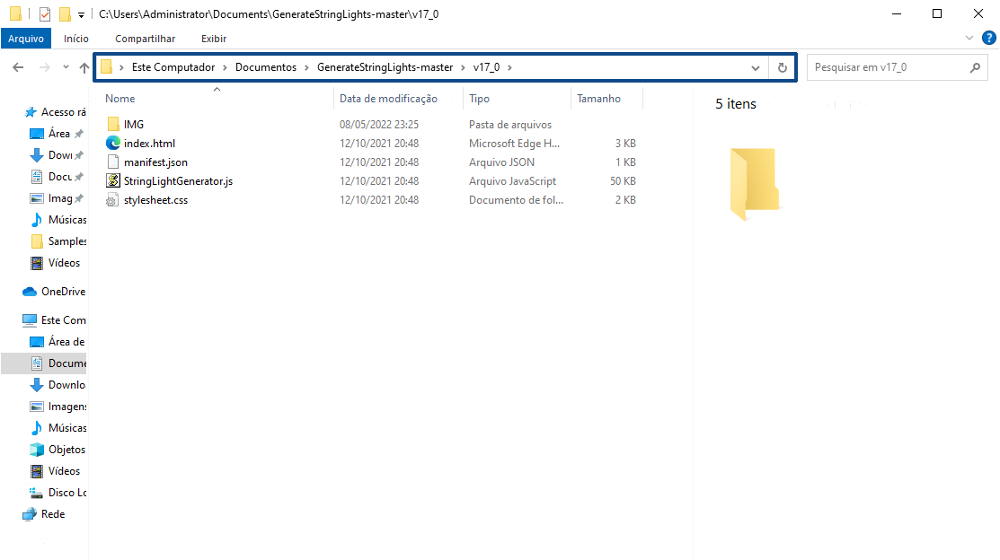

# Controllo delle versioni

Durante lo sviluppo e l'aggiornamento del plug-in, ad un certo punto potrebbe essere necessario specificare una versione del codice.

Ad esempio, le API di FormIt possono cambiare da una release all'altra e, sebbene si desideri la nuova versione del plug-in per utilizzare le nuove API di FormIt o WSM, si desidera anche mantenere funzionante il plug-in in client meno recenti.

A partire da FormIt **v18.0**, è possibile implementare il controllo delle versioni per il plug-in in 3 semplici passaggi:

* Aggiungere un file _versions.json_ alla directory principale del plug-in.
* Specificare ogni versione compatibile di FormIt e la directory contenente tali file di plug-in in _versions.json_.
* Utilizzare il numero di versione interna di FormIt, o il numero di build, disponibile in FormIt in Info > Informazioni su.


### Come organizzare il controllo delle versioni per il plug-in

Organizzare i file e le directory dei plug-in in modo che corrispondano a _versions.json_.

Il file _versions.json_ dovrebbe essere simile al seguente:

```
        [
            {
                "version":{
                    "major":18,
                    "minor":0
                },
                "path":"v18_0"
            },
            {
                "version":{
                    "major":19,
                    "minor":1
                },
                "path":"v19_0"
            }
        ]

```

I percorsi precedenti _v18\_0_ e _v19\_0_ devono essere percorsi secondari validi della directory principale/del repository.




Un modo efficace per gestire questa situazione consiste nello spostare il codice del plug-in nelle sottodirectory. Utilizzando il file _versions.json_ riportato sopra, una struttura di directory sarebbe simile alla seguente:

* **versions.json** (file)
* **v18\_0** (directory)

   * **manifest.json** (file)
   * **plugin.html** (file)
   * **plugin.js** (file)


* **v19\_0** (directory)
   * **manifest.json** (file)
   * **plugin.html** (file)
   * **plugin.js** (file)

Le proprietà facoltative della versione sono "exactVersion" e "lastVersion". "exactVersion" indica che la versione deve corrispondere esattamente a quella di FormIt. "lastVersion" indica l'ultima versione consentita per l'esecuzione in FormIt.\


```
[
    {
      "version":{
        "major":18,
        "minor":0,
        "exactVersion":true
        },
        "path":"v18_0"
    },
    {
        "version":{
            "major":19,
            "minor":1,
            "lastVersion":true
       },
        "path":"v19_0"
    }
 ]
```

È inoltre possibile utilizzare rami/tag/commit Git per i percorsi.

Se si utilizza una build pre-release o beta di FormIt e si desidera testare le modifiche apportate ad un plug-in che funziona solo con la versione pre-release:

* Seguire i passaggi descritti sopra, tranne l'utilizzo del nome file _versions\_prerelease.json_.
* Se si conferma _versions\_prerelease_ nel repository, sarà necessario rimuoverlo quando viene rilasciata la versione pre-release di FormIt.
   * In caso contrario, le versioni di FormIt pre-release future caricheranno il plug-in da una posizione che potrebbe essere obsoleta o destinata ad una versione precedente.
