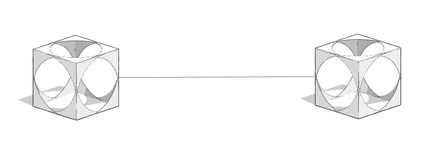

# API FormIt

Pour accéder à la documentation de l’API FormIt, utilisez les liens suivants :

* [API JS de base FormIt](https://formit3d.github.io/FormItExamplePlugins/docs/FormItJSAPI/group\_\_mod\_\_jsapi\_\_formit.html)
* [API JS du noyau de modélisation FormIt (WSM)](https://formit3d.github.io/FormItExamplePlugins/docs/FormItJSAPI/group\_\_mod\_\_jsapi\_\_wsm.html)
* [API C++ de base FormIt](https://formit3d.github.io/FormItExamplePlugins/docs/FormItCPPAPI/index.html)
* [API C++ du noyau de modélisation FormIt](https://formit3d.github.io/FormItExamplePlugins/docs/FormItCPPAPI/group\_\_mod\_\_wsm\_\_api\_\_ref.html)

