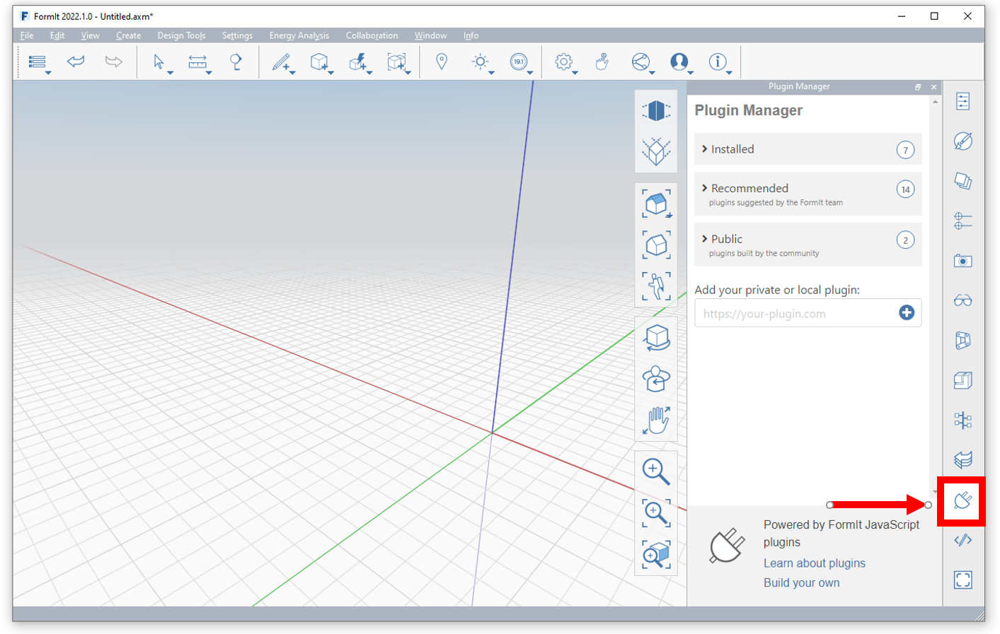
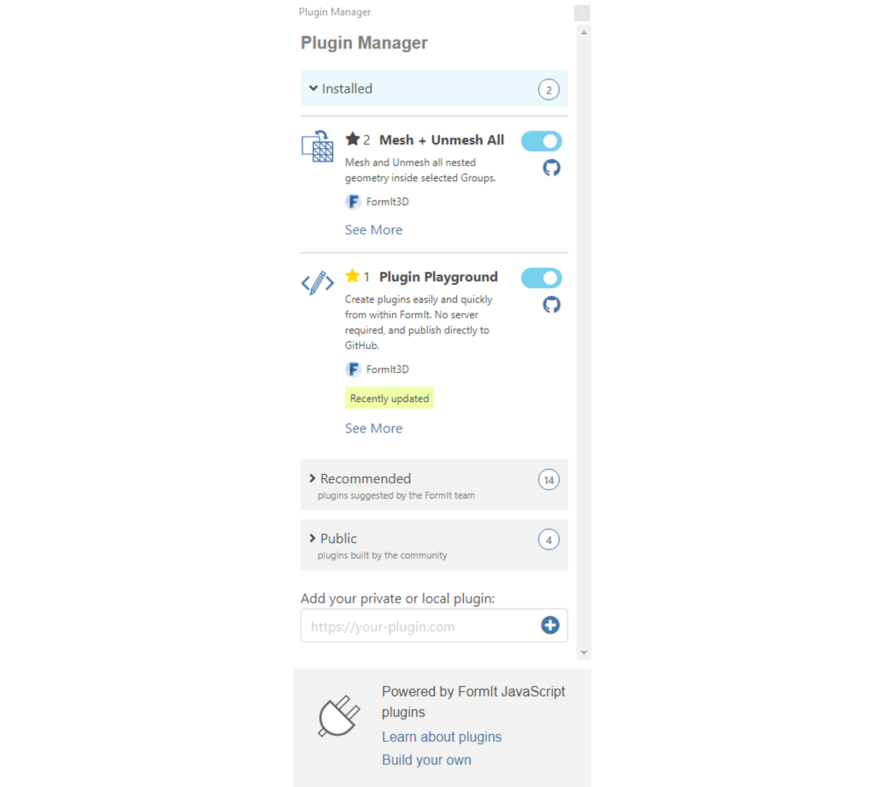
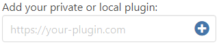
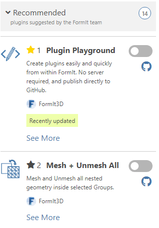
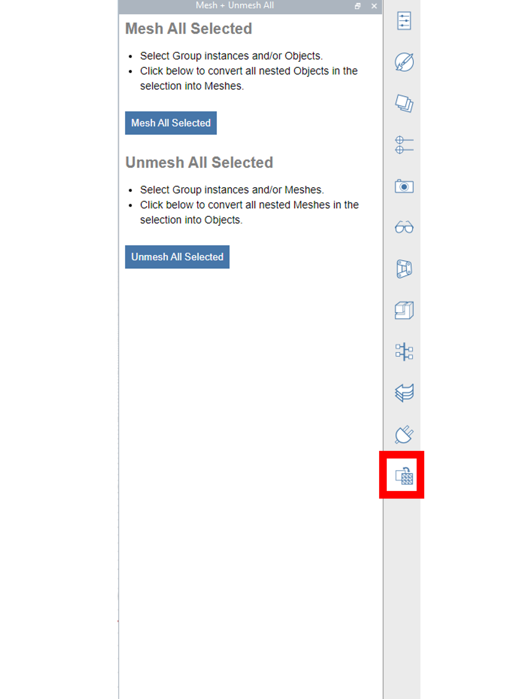
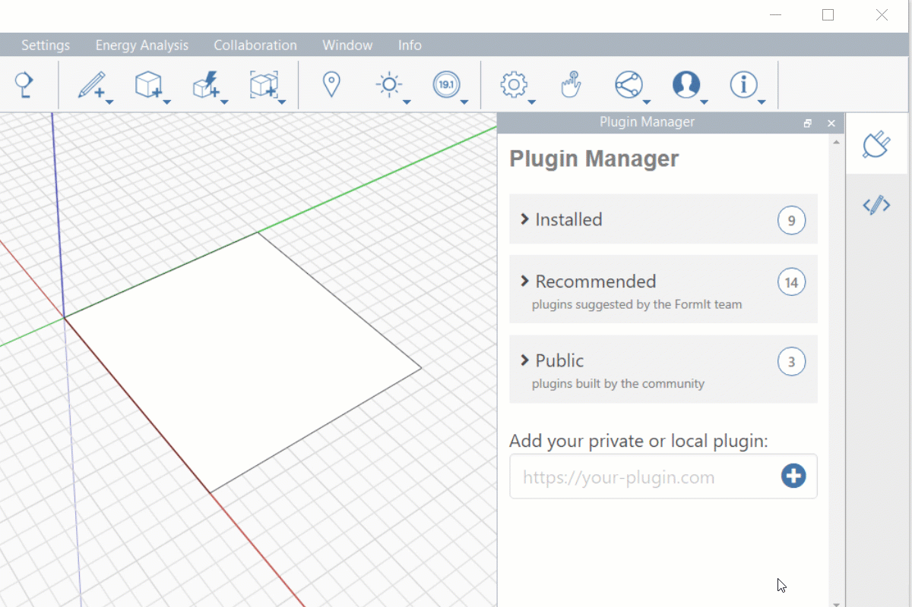

# 如何使用外掛程式

.gif>)

## Plugin Manager

FormIt Plugin Manager 是您用來探索和管理外掛程式的一站式商店。

只要 FormIt 有網際網路的存取權，當 FormIt 啟動時，Plugin Manager 就會自動載入。

按一下應用程式右側的頁籤圖示 ，即可存取此功能：

## 外掛程式品類

Plugin Manager 將外掛程式組織成品類，以協助您尋找您最感興趣的外掛程式。

**Installed 外掛程式：**使用者已安裝的外掛程式。&#x20;

**Recommended 外掛程式：**FormIt 團隊建議的外掛程式，用於擴充 FormIt 的核心功能並解鎖新的工作流程。社群開發的外掛程式被 FormIt 團隊核准後，會顯示在這裡。\GitHub 標籤：_formit-plugin-recommended_

**Public 外掛程式：**社群建置的外掛程式。此品類中的外掛程式尚未被 FormIt 團隊審閱或核准。\GitHub 標籤：_formit-plugin_

**For Developers 外掛程式**：由社群建置的外掛程式，可供建立新的 FormIt 外掛程式。\GitHub 標籤：_formit-plugin-developers_

## 加入您私人或本端的外掛程式

如果您要[開發自己的外掛程式](how-to-develop-plugins/)，可以將其私人 URL 填入面板底端的欄位，然後按一下「(+)」：

如需加入私人或本端外掛程式的更多資訊，請參閱[在 Plugin Manager 中預覽外掛程式。](how-to-develop-plugins/advanced-development/previewing-a-plugin-in-the-plugin-manager.md)

## 重設 Plugin Manager

Plugin Manager 使用 Windows 上的登錄機碼儲存您安裝的儲存庫和外掛程式。如果您需要將 Plugin Manager 重置為其預設值，請刪除以下登錄機碼：

`Computer\HKEY_CURRENT_USER\Software\Autodesk\FormIt 360\Plugins`

⚠️ 注意: 這會解除安裝所有使用者加入的儲存庫和外掛程式，將 Plugin Manager 重設為只包括內建的儲存庫和外掛程式。

## 安裝外掛程式

[Plugin Manager](how-to-use-plug-ins.md#plugin-manager) 包括許多外掛程式，並組織在不同品類下。每個外掛程式都有名稱、描述、GitHub 連結和安裝開關。&#x20;

若要安裝外掛程式，只需開啟外掛程式名稱旁邊的開關即可。&#x20;

所選外掛程式的圖示將顯示在右側面板中。按一下該圖示可顯示外掛程式的使用者介面。

## 使用外掛程式

每個外掛程式都有其開發人員定義的唯一使用者介面。外掛程式通常有一組如何使用的指示、一組參數 (文字方塊、滑棒、勾選方塊等)，以及一個或多個按鈕來執行它。

例如，我們使用 Plugin Manager 其中一個比較簡單的範例：Fillet 2D Corners。我們先從 Plugin Manager 的「Recommended」區段載入外掛程式。然後，依照開發人員提供的指示，設定圓角半徑，選取要建立圓角的一組面，然後按一下「Fillet Corners」按鈕。

##

