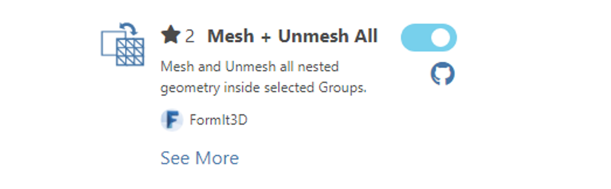

# Использование подключаемых модулей

.gif>)

## Диспетчер подключаемых модулей

Диспетчер подключаемых модулей FormIt — это универсальное средство обнаружения подключаемых модулей и управления ими.

Он загружается автоматически при запуске FormIt, если у FormIt есть доступ к Интернету.

Для доступа к нему щелкните значок вкладки  в правой части приложения.

## Категории подключаемых модулей

Диспетчер подключаемых модулей распределяет подключаемые модули по категориям, чтобы было легче искать нужные подключаемые модули.

**Установленные подключаемые модули**: подключаемые модули, уже установленные пользователем.&#x20;

**Рекомендуемые подключаемые модули**: подключаемые модули, которые команда FormIt рекомендует использовать для расширения базовых функций FormIt и доступа к новым рабочим процессам. В этой категории отображаются подключаемые модули, разработанные сообществом и проверенные командой FormIt.\
Тег GitHub: _formit-plugin-recommended_

**Общедоступные подключаемые модули**: подключаемые модули, созданные сообществом. Подключаемые модули этой категории не были проверены или утверждены командой FormIt. \
Тег GitHub: _formit-plugin_

**Для подключаемых модулей разработчиков**: подключаемые модули, разработанные сообществом для создания новых подключаемых модулей FormIt. \
Тег GitHub: _formit-plugin-developers_

## Добавление частного или локального подключаемого модуля

Если вы [разрабатываете собственный подключаемый модуль](how-to-develop-plugins/), можно добавить его закрытый URL-адрес в поле в нижней части панели и нажать (+).

Дополнительные сведения о добавлении частного или локального подключаемого модуля см. в разделе [«Предварительный просмотр подключаемого модуля в Диспетчере подключаемых модулей». ](how-to-develop-plugins/advanced-development/previewing-a-plugin-in-the-plugin-manager.md)

## Сброс Диспетчера подключаемых модулей

Для хранения установленных хранилищ и подключаемых модулей Диспетчер подключаемых модулей использует разделы реестра Windows. Если требуется восстановить настройки Диспетчера подключаемых модулей по умолчанию, удалите следующий раздел реестра.

`Computer\HKEY_CURRENT_USER\Software\Autodesk\FormIt 360\Plugins`

⚠️ Обратите внимание, что при этом будут удалены все добавленные пользователем хранилища и подключаемые модули, а в Диспетчере подключаемых модулей будут отображаться только встроенные хранилища и подключаемые модули.

## Установка подключаемых модулей

[Диспетчер подключаемых модулей](how-to-use-plug-ins.md#plugin-manager) содержит несколько подключаемых модулей, распределенных по разным категориям. Каждый подключаемый модуль имеет имя, описание, ссылку GitHub и переключатель установки.&#x20;

Чтобы установить подключаемый модуль, просто включите переключатель рядом с именем этого модуля.&#x20;

Значок выбранного подключаемого модуля появится на панели справа. Щелкните его, чтобы отобразить пользовательский интерфейс подключаемого модуля.

## Использование подключаемых модулей

Каждый подключаемый модуль имеет уникальный пользовательский интерфейс, определенный его разработчиком. Обычно подключаемый модуль имеет набор инструкций по его использованию, набор параметров (текстовые поля, регуляторы, флажки и т. д.) и одну или несколько кнопок для его выполнения.

В качестве примера рассмотрим один из простых примеров в диспетчере подключаемых модулей: Fillet 2D Corners. Сначала загружаем подключаемый модуль из раздела рекомендуемых модулей Диспетчера подключаемых модулей. Затем в соответствии с инструкциями разработчика задаем радиус кривизны, выбираем группу граней для скругления и нажимаем кнопку Fillet Corners (Скруглить углы).

##

