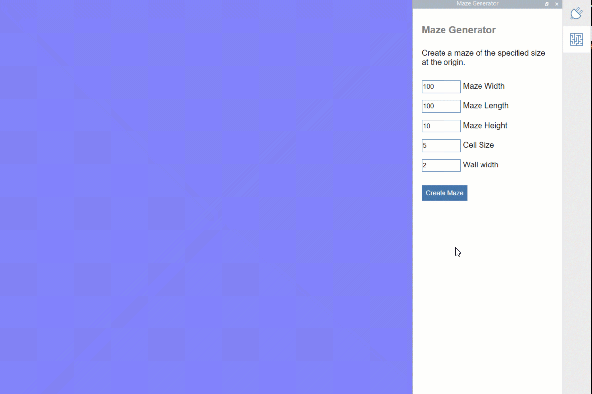
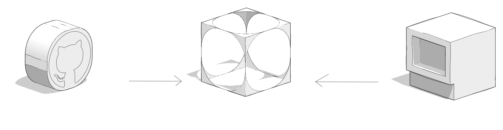
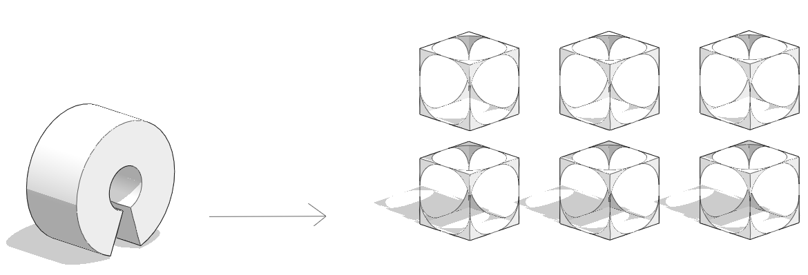
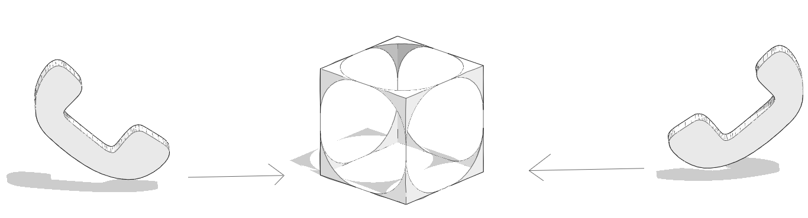

# 플러그인 소개

플러그인은 FormIt의 핵심 기능을 확장하는 사용자 소프트웨어 추가 기능입니다. 플러그인은 FormIt의 3D 모델링 워크플로우를 개선하고, 강화하고, 간소화할 수 있습니다.&#x20;

플러그인은 객체를 생성하거나 기존 객체를 수정하거나 객체에 대한 정보를 추출하는 데 사용할 수 있습니다. 또한 플러그인은 풍부한 웹 인터페이스를 사용하여 데이터를 표시하고 응용프로그램에 직접 컨트롤 및 입력을 제공할 수 있습니다.&#x20;

## 플러그인 액세스

플러그인은 인터넷에 연결되어 있으면 데스크톱의 [Plugin Manager](how-to-use-plug-ins.md#plugin-manager)와 FormIt의 웹 버전으로 사용할 수 있습니다. 플러그인은 GitHub 또는 로컬 서버(자체적으로 빌드하는 경우)에서 호스트되는 일련의 파일 및 폴더로 구성됩니다.&#x20;

### 플러그인을 사용하려면 인터넷 액세스가 필요함

외부 플러그인(로컬로 호스트되지 않은 플러그인)을 처음 로드하려면 인터넷 연결이 필요합니다. 이는 다음을 의미합니다.

* FormIt을 시작할 때 인터넷 연결이 감지되지 않으면 외부 플러그인이 로드되지 않습니다. 로드된 일부 외부 플러그인은 해당 세션에 대해 오프라인 모드로 계속 작동할 수 있지만, 그 외의 다른 플러그인은 연결이 복원될 때까지 중단될 수 있습니다.&#x20;
* 외부 플러그인은 실행할 때마다 서버에 최신 코드를 로드합니다. 따라서 작성자가 변경사항을 푸시할 때마다 해당 기능이 업데이트됩니다. 플러그인은 비동기적으로 로드됩니다. 이는 FormIt 인터페이스의 플러그인 순서가 새 세션이 나올 때마다 변경될 수 있음을 의미합니다.

## 원본 열기

플러그인은 오픈 소스이므로 [Plugin Manager](how-to-use-plug-ins.md#plugin-manager)의 플러그인을 무료로 사용하고, 플러그인을 쉽게 게시 및 공유하고, GitHub에서 다른 플러그인을 찾아 빌드된 방식을 파악할 수 있습니다.&#x20;

개발자로서 플러그인을 게시하는 방법에 대한 자세한 내용을 알아보려면 [GitHub에서 플러그인 호스팅](how-to-develop-plugins/advanced-development/hosting-a-plugin-on-github.md)을 참고하십시오.&#x20;

개인적으로 사용할 플러그인을 만들고자 하는 경우에는 로컬 서비스를 사용하여 플러그인을 개발하고 호스팅할 수 있습니다. 자세한 내용은 [IDE 사용 ](how-to-develop-plugins/advanced-development/using-an-ide.md)

## 연락처

FormIt 플러그인에 대한 도움이 필요한 경우 [FormIt 포럼](https://forums.autodesk.com/t5/formit-forum/bd-p/142)에 문의하십시오.

&#x20;

&#x20;
