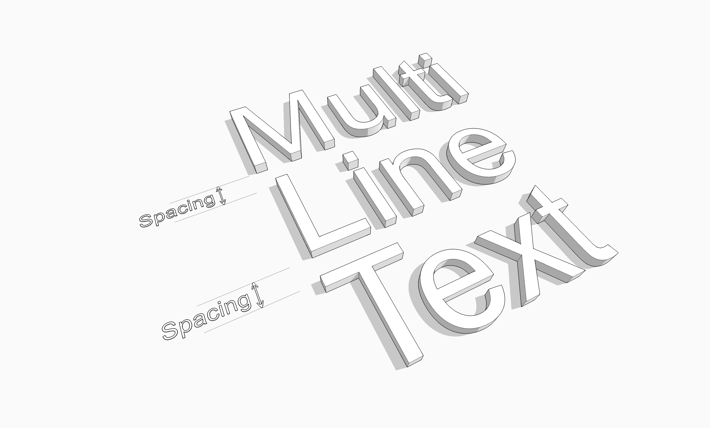

# Tekst 3D

## Obsługiwane przez dodatek Dynamo

W programie FormIt 2021 i jego nowszych wersjach można generować i modyfikować obiekty tekstu 3D obsługiwane przez dodatek Dynamo. Dodatek Dynamo umożliwia edycję czcionki, rozmiaru i innych właściwości tekstu lokalnie, bez konieczności ponownego generowania i zmiany położenia tekstu, gdy potrzebne są zmiany.

.gif>)

## Umieszczanie tekstu 3D

* Przejdź do panelu Dynamo w programie FormIt dla systemu Windows i upewnij się, że znajdujesz się w katalogu Dynamo Samples.
* Kliknij przykładowy tekst 3D („3D Text”).
* Przesuń kursor na obszar rysunku. Na kursorze pojawi się tekst 3D.
   * Zanim umieścisz tekst, możesz ustawić kursor na geometrii, aby inaczej ustawić orientację tekstu 3D — na przykład na pionowej powierzchni, aby wyrównać tekst pionowo. Możesz również klikać klawisz Tab, aby przełączać się między orientacjami.
* Kliknij, aby umieścić tekst 3D, który zostanie wygenerowany wewnątrz grupy FormIt.
* Po umieszczeniu zostanie wyświetlony panel Właściwości zawierający opcje dostępne dla tekstu 3D.

## Iteracja lokalna

Zaleta generowania tekstu 3D za pomocą dodatku Dynamo polega na tym, że edycja tekstu jest łatwa, a tekst pozostaje w bieżącym położeniu, co umożliwia szybką iterację.

Opcje tekstu 3D są dostępne w panelu Właściwości po wybraniu grupy tekstu 3D lub podczas edycji grupy.

Po wstępnym umieszczeniu tekstu 3D automatycznie zostanie wyświetlony panel Właściwości. Możesz również wybrać grupę i samodzielnie przełączyć się na panel Właściwości lub kliknąć dwukrotnie grupę, aby zrobić to automatycznie.

.png>)

### Text

Wprowadź tekst, który ma być wyświetlany w geometrii tekstu 3D. To pole zawiera również podgląd wybranej czcionki i wyrównania. Naciśnij klawisz Enter/Return, aby uzyskać wiele linii.

### Czcionka

Wybierz czcionkę dla tekstu 3D. Na tej liście zostaną wyświetlone czcionki dostępne na komputerze, a wybranie nowej czcionki spowoduje aktualizację pola Tekst.

Pamiętaj, że niektóre czcionki mają bardziej złożoną geometrię i wygenerowanie ich za pomocą dodatku Dynamo może zająć więcej czasu.

### Wyrównanie

Ta opcja spowoduje przesunięcie tekstu w celu wyrównania go względem początku lokalnego układu współrzędnych grupy.

* Ustawienie Left zapewni, że tekst będzie zaczynał się na początku grupy i rozwijał w prawo.
* Ustawienie Center zapewni, że tekst będzie zawsze wyśrodkowany względem początku grupy.
* Ustawienie Right spowoduje, że tekst będzie kończył się na początku grupy.

### Rozmiar tekstu

Wysokość tekstu. Jednostka jest oparta na węźle [FormItLengthString](https://formit.autodesk.com/page/formit-dynamo/#dynamo-formit-nodes) i można użyć dowolnej jednostki.

### Extrusion Depth

Wielkość wyciągnięcia 3D tekstu w jednostkach ustawionych przez węzeł [FormItLengthString](https://formit.autodesk.com/page/formit-dynamo/#dynamo-formit-nodes). Tekst 3D jest zaprojektowany jako bryła, dlatego ta wartość nie może wynosić zero, natomiast może być bardzo bliska 0, aby jego wyciągnięcie nie było oczywiste.

### Śledzenie

Śledzenie przydaje się podczas dopasowywania domyślnych odstępów między literami z określonej czcionki. Używa jednostki ustawionej przez węzeł [FormItLengthString](https://formit.autodesk.com/page/formit-dynamo/#dynamo-formit-nodes) i może ona być dodatnia lub ujemna. Na przykład w przypadku stóp wartość 0,25 spowoduje dodanie odstępu o szerokości 3" między poszczególnymi literami. I na odwrót: wartość -0,25 przybliży wszystkie litery do siebie o 3".

### Multi-Line Spacing

Jeśli w polu Tekst znajduje się wiele wierszy, ta wartość określa wielkość odstępu między poszczególnymi wierszami tekstu. Używa jednostki ustawionej przez węzeł [FormItLengthString](https://formit.autodesk.com/page/formit-dynamo/#dynamo-formit-nodes).

### Invert Text

Gdy ta opcja ma wartość True, wokół tekstu zostanie utworzona bryła, z której zostanie usunięty tekst, dając w rezultacie efekt „odwróconego” tekstu — jak gdyby tekst został wycięty z materiału.

### Inverted Text Border

Ma zastosowanie tylko w sytuacji, gdy opcja Invert Text ma wartość True. Określa wielkość obramowania wokół tekstu używanego względem bryły, z której jest usuwany tekst. Używa jednostki ustawionej przez węzeł [FormItLengthString](https://formit.autodesk.com/page/formit-dynamo/#dynamo-formit-nodes).

### Curve Faceting Quality

Krzywe z czcionek są przekształcane na segmenty linii za pomocą tekstu 3D, dlatego ta wartość określa, z jak wielu płaszczyzn składają się krzywe.

Mniejsze liczby spowodują utworzenie mniej precyzyjnych płaszczyzn (dłuższych segmentów), a większe — bardziej precyzyjnych (krótszych segmentów). Ta wartość zastępuje ustawienia płaszczyzn krzywej i powierzchni w Preferencjach programu FormIt.

### Uruchom

Po zakończeniu edycji opcji kliknij przycisk „Run”, aby uruchomić podstawowy wykres dodatku Dynamo i wygenerować nowe wyniki. Po zmianie parametrów przycisk zmienia kolor na niebieski, dzięki czemu wiesz, że należy kliknąć przycisk „Run”, aby zobaczyć aktualizacje w końcowej geometrii.‌

### Edit Embedded Graph

Kliknięcie tego przycisku spowoduje uruchomienie środowiska edytora wykresów Dynamo, aby można było wyświetlić i edytować podstawowy wykres Dynamo w celu szybkiej zmiany parametrów i wyświetlenia aktualizacji na żywo bądź sprawdzenia/dopasowania logiki. Nie jest to wymagane, ale może się przydać do rozwiązywania problemów lub szybszej edycji. W dalszej części znajdują się dodatkowe informacje.

## Szybsze iteracje w dodatku Dynamo

Iteracja opcji tekstu 3D może być szybsza dzięki uruchomieniu edytora wykresów Dynamo, który umożliwi dostosowywanie parametrów i wyświetlanie zmian w czasie rzeczywistym. Umożliwia on również sprawdzanie logiki wykresu w przypadku wystąpienia problemów.

Aby uruchomić edytor wykresów Dynamo, można kliknąć przycisk Edytuj osadzony wykres w panelu Właściwości.

.png>)

## Rozwiązywanie problemów

Dodatek Dynamo jest używany przez funkcję tekstu 3D w tle. Do generowania geometrii przekazywanej z powrotem do formatu FormIt służy jądro modelowania o nazwie ASM.

Niektóre czcionki mogą powodować tworzenie „samoprzecinających się krzywych” lub innej problematycznej geometrii będącej przyczyną błędów w jądrze ASM.

Jeśli podczas próby uruchomienia tekstu 3D wystąpi błąd lub litery znikną, warto kliknąć opcję „Edit Embedded Graph”, aby zobaczyć, co dzieje się z wykresem i gdzie mógł wystąpić błąd.

Niektóre czcionki mają również znane problemy, które uniemożliwiają przekształcenie ich w prawidłową geometrię. Jednym z przykładów takiej czcionki jest Bahnschrift. Jeśli natrafisz na inną problematyczną czcionkę, [poinformuj nas o tym na forach ](https://forums.autodesk.com/t5/formit-forum/bd-p/142?profile.language=en). Zrobimy wszystko, co w naszej mocy, aby rozwiązać problemy z określonymi czcionkami.
