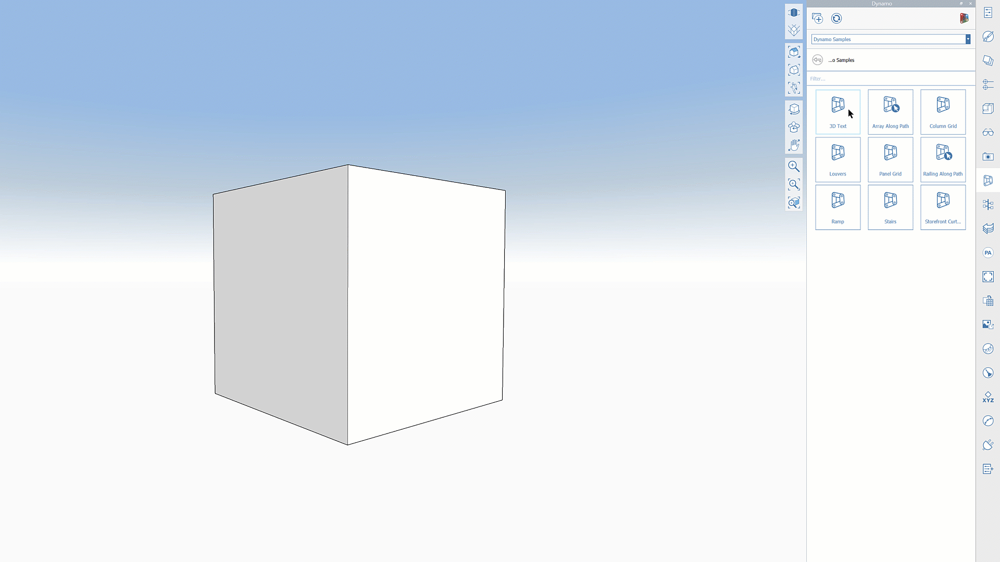
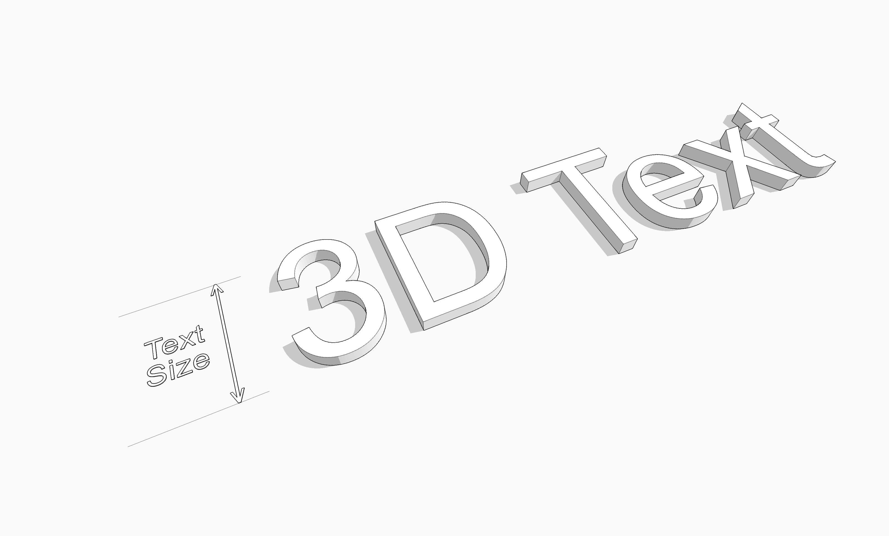

# 3D-Text

## Powered by Dynamo

In FormIt 2021 und höher können Sie 3D-Textobjekte erstellen und ändern, die von Dynamo unterstützt werden. Dynamo ermöglicht die direkte Bearbeitung von Schriftart, Größe und anderen Eigenschaften des Texts, ohne dass der Text im Falle von erforderlichen Änderungen neu generiert und positioniert werden muss.

.gif>)

## Platzieren von 3D-Text

* Wechseln Sie zur Gruppe Dynamo in FormIt for Windows, und stellen Sie sicher, dass Sie sich im Verzeichnis Dynamo Samples befinden.
* Klicken Sie auf das 3D-Textbeispiel.
* Bewegen Sie den Cursor in den Ansichtsbereich. Der 3D-Text wird am Cursor angezeigt.
   * Vor dem Platzieren können Sie den Cursor über die Geometrie bewegen, um den 3D-Text anders auszurichten, beispielsweise auf einer vertikalen Fläche, damit der Text vertikal ausgerichtet wird. Sie können auch die TABULATORTASTE drücken, um zwischen den Ausrichtungen zu wechseln.
* Klicken Sie, um den 3D-Text zu platzieren, der in einer FormIt-Gruppe erstellt wird.
* Nach dem Platzieren wird die Gruppe Eigenschaften geöffnet, in der die verfügbaren Optionen für 3D-Text angezeigt werden.

## Erstellen von Iterationen an Ort und Stelle

Der große Vorteil bei der Verwendung von Dynamo zum Erstellen von 3D-Text besteht darin, dass die Bearbeitung einfach ist und der Text an seiner aktuellen Position verbleibt. Dadurch können Sie schnell Iterationen erstellen.

3D-Textoptionen sind in der Gruppe Eigenschaften verfügbar, wenn die 3D-Textgruppe ausgewählt ist oder wenn die Gruppe bearbeitet wird.

Nach dem erstmaligen Platzieren des 3D-Texts wird die Gruppe Properties (Eigenschaften) automatisch angezeigt. Sie können auch die Gruppe auswählen und selbst zu Eigenschaften wechseln oder auf die Gruppe doppelklicken, um automatisch zur Gruppe Properties (Eigenschaften) zu wechseln.

.png>)

### Text

Geben Sie den Text ein, der in der 3D-Textgeometrie angezeigt werden soll. In diesem Feld wird außerdem eine Vorschau der ausgewählten Schriftart und Ausrichtung angezeigt. Drücken Sie die EINGABETASTE, um mehrere Zeilen zu verwenden.

### Font (Schriftart)

Wählen Sie die Schriftart für den 3D-Text aus. In dieser Liste werden die auf dem Computer verfügbaren Schriftarten angezeigt. Wenn Sie eine neue Schriftart auswählen, wird das Textfeld aktualisiert.

Beachten Sie, dass einige Schriftarten eine komplexere Geometrie aufweisen und die Generierung mit Dynamo möglicherweise mehr Zeit in Anspruch nimmt.

### Justification (Ausrichtung)

Hiermit wird der Text relativ zum Ursprung des lokalen Koordinatensystems der Gruppe ausgerichtet.

* Mit Left (Links) wird sichergestellt, dass der Text am Ursprung der Gruppe beginnt und nach rechts erweitert wird.
* Mit Center (Mitte) wird sichergestellt, dass der Text immer am Ursprung der Gruppe zentriert ist.
* Mit Right (Rechts) wird sichergestellt, dass der Text am Ursprung der Gruppe endet.

### Text Size (Textgröße)

Die Höhe des Texts. Die Einheit basiert auf dem [FormItLengthString](https://formit.autodesk.com/page/formit-dynamo/#dynamo-formit-nodes)-Block. Es kann eine beliebige Einheit verwendet werden.

### Extrusion Depth (Extrusionstiefe)

Der Umfang der 3D-Extrusion des Texts in der durch den [FormItLengthString](https://formit.autodesk.com/page/formit-dynamo/#dynamo-formit-nodes)-Block festgelegten Einheit. 3D-Text ist als Volumenkörper konzipiert, daher kann dieser Wert nicht null sein, aber Sie können einen Wert angeben, der sehr nahe an 0 ist, sodass die Extrusion weniger offensichtlich ist.

### Tracking (Zeichenabstand)

Tracking (Zeichenabstand) ist hilfreich, um den Vorgabeabstand zwischen Buchstaben einer bestimmten Schriftart anzupassen. Dabei wird die durch den [FormItLengthString](https://formit.autodesk.com/page/formit-dynamo/#dynamo-formit-nodes)-Block festgelegte Einheit verwendet. Diese kann positiv oder negativ sein. Beispiel: Bei Verwendung von Fuß ergibt 0.25 einen Abstand von 3" zwischen jedem Buchstaben. Umgekehrt bedeutet -0.25, dass alle Buchstaben um 3" näher beieinander liegen.

### Multi-Line (Spacing) Mehrzeiliger Abstand

Wenn das Textfeld mehrere Zeilen umfasst, wird mit diesem Wert der Abstand zwischen den einzelnen Textzeilen festgelegt. Dabei wird die durch den [FormItLengthString](https://formit.autodesk.com/page/formit-dynamo/#dynamo-formit-nodes)-Block festgelegte Einheit verwendet.

### Invert (Text) Invertieren von Text

Wenn diese Option auf True eingestellt ist, wird ein Volumenkörper um den Text erstellt, und der Text wird entfernt. Dadurch entsteht invertierter Text, als ob der Text aus einem Material ausgeschnitten worden wäre.

### Inverted Text Border (Invertierter Textrahmen)

Nur verfügbar, wenn Text invertieren auf True gesetzt ist. Legt die Größe des Rahmens um den Text fest, der für den Volumenkörper verwendet wird, aus dem der Text entfernt wird. Dabei wird die durch den [FormItLengthString](https://formit.autodesk.com/page/formit-dynamo/#dynamo-formit-nodes)-Block festgelegte Einheit verwendet.

### Curve Faceting Quality (Kurvenfacettierungsqualität)

Kurven aus Schriftarten werden mithilfe von 3D-Text in Liniensegmente konvertiert. Dieser Wert steuert daher, wie fein die Kurven facettiert werden.

Niedrigere Werte führen zu gröberer Facettierung (längere Segmente), höhere Werte zu feineren Facettierungen (kürzere Segmente). Dieser Wert überschreibt die Einstellungen für die Facettierung von Kurven und Flächen in FormIt in den Voreinstellungen.

### Run (Ausführen)

Klicken Sie nach dem Bearbeiten der Optionen auf die Schaltfläche Run (Ausführen), um das zugrunde liegende Dynamo-Diagramm auszuführen und neue Ergebnisse zu generieren. Diese Schaltfläche wird blau, wenn Parameter geändert wurden. So erkennen Sie, dass Sie auf Run (Ausführen) klicken müssen, um die Aktualisierungen in der endgültigen Geometrie zu sehen.‌

### Edit Embedded Graph (Eingebettetes Diagramm bearbeiten)

Wenn Sie auf diese Schaltfläche klicken, wird die Dynamo-Diagramm-Editor-Umgebung geöffnet, in der Sie das zugrunde liegende Dynamo-Diagramm anzeigen und bearbeiten können, um Parameter schnell zu ändern, Live-Aktualisierungen anzuzeigen oder die Logik zu prüfen bzw. anzupassen. Dies ist nicht erforderlich, kann jedoch zur Fehlerbehebung oder zur schnelleren Bearbeitung nützlich sein. Weitere Informationen finden Sie weiter unten.

## Iterate Faster in Dynamo (Schnellere Iterationen in Dynamo)

Wenn Sie 3D-Textoptionen iterieren, ist es möglicherweise schneller, den Dynamo-Diagramm-Editor zu starten, mit dem Sie Parameter anpassen und die Änderungen in Echtzeit sehen können. Auf diese Weise können Sie auch die Logik hinter dem Diagramm überprüfen, falls Probleme auftreten.

Sie können in der Gruppe Properties (Eigenschaften) auf die Schaltfläche Edit Embedded Graph (Eingebettetes Diagramm bearbeiten) klicken, um den Dynamo-Diagramm-Editor zu starten.

.png>)

## Troubleshooting (Fehlerbehebung)

Bei 3D-Text wird Dynamo im Hintergrund verwendet, und Dynamo verwendet einen Modellierungs-Kernel namens ASM, um die Geometrie zu generieren, die an FormIt zurückgegeben wird.

Bei einigen Schriftarten werden möglicherweise sich selbst schneidende Kurven oder andere problematische Geometrien erstellt, die Fehler in ASM verursachen.

Wenn Sie beim Ausführen von 3D-Text eine Fehlermeldung erhalten oder Buchstaben nicht mehr angezeigt werden, können Sie auf Edit Embedded Graph (Eingebettetes Diagramm bearbeiten) klicken, um zu sehen, welcher Fehler im Diagramm aufgetreten ist und wo der Fehler liegt.

Einige Schriftarten weisen außerdem bekannte Probleme auf, die verhindern, dass sie in die richtige Geometrie umgewandelt werden. Ein Beispiel dafür ist die Bahnschrift. Wenn Sie eine andere Schriftart verwenden, die Probleme verursacht, [teilen Sie uns dies über die Foren](https://forums.autodesk.com/t5/formit-forum/bd-p/142?profile.language=de) mit. Wir werden unser Bestes tun, um Probleme mit bestimmten Schriftarten zu beheben.
