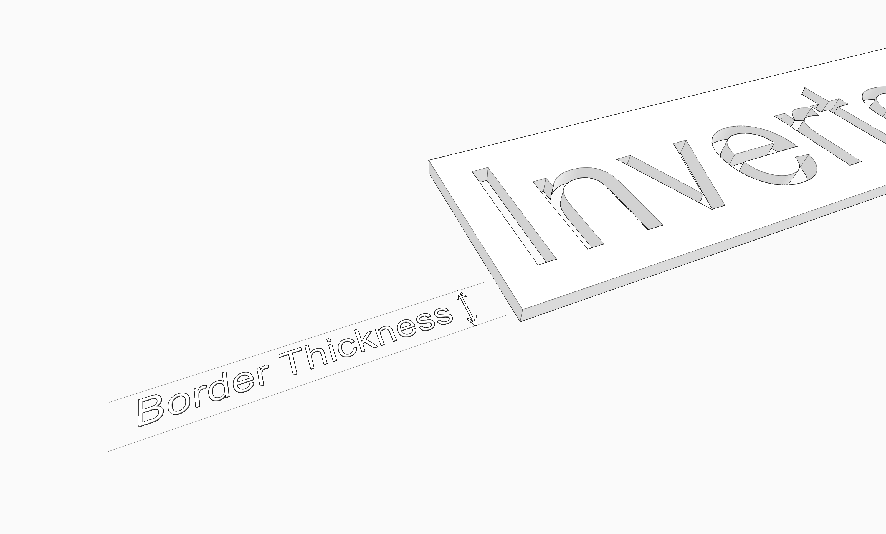

# 三维文字

## 由 Dynamo 提供支持

在 FormIt 2021 及更高版本中，可以生成和修改由 Dynamo 提供支持的三维文字对象。Dynamo 支持在位编辑文字的字体、大小和其他特性，而无需在需要编辑时重新生成和重新定位文字。

.gif>)

## 放置三维文字

* 转到 FormIt for Windows 中的 Dynamo 面板，确保位于“Dynamo 样例”目录中。
* 单击“三维文字”样例。
* 将光标移动到画布上，您会看到三维文字显示在光标上。
   * 放置之前，可以将光标悬停在几何图形上以不同方式定向三维文字（例如，悬停在垂直曲面上使文字垂直对齐）。还可以按 Tab 键循环切换方向。
* 单击以放置将在 FormIt 组内生成的三维文字。
* 放置后，“特性”面板将显示，以显示三维文字的可用选项。

## 在位迭代

使用 Dynamo 生成三维文字的好处是：编辑它非常简单，并可以将文字保留在其当前位置，以便快速迭代。

选择“三维文字组”或编辑“组”时，“特性”面板中会提供“三维文字”选项。

最初放置三维文字后，将自动显示“特性”面板。还可以选择“组”并自行切换到“特性”，或双击“组”以自动切换到“特性”面板。

.png>)

### 文字

输入希望三维文字几何图形显示的文字。此字段还可预览选定的字体和对正。按 Enter 键/回车键可输入多行文字。

### 字体

选择三维文字的字体。此列表将显示计算机上可用的字体，选择新字体将会更新“文字”字段。

请注意，某些字体有更复杂的几何图形，使用 Dynamo 生成可能需要更多时间。

### 对正

这将移动文字以相对于组的局部坐标系原点对齐。

* “左侧”将确保文字从组的原点开始，并向右展开。
* “居中”将确保文字始终以组的原点为中心。
* “右侧”将确保文字于组的原点处结束。

### 文字大小

文字高度。单位基于 [FormItLengthString](https://formit.autodesk.com/page/formit-dynamo/#dynamo-formit-nodes) 节点，并且可以使用任何单位。

### 拉伸深度

文字的三维拉伸量，以 [FormItLengthString](https://formit.autodesk.com/page/formit-dynamo/#dynamo-formit-nodes) 节点设置的单位表示。三维文字设计为实体样式，因此该值不能为零；但可以让其接近为 0，以便它在拉伸时不太明显。

### 追踪

跟踪对于调整特定字体中字母之间的默认间距非常有用。它使用由 [FormItLengthString](https://formit.autodesk.com/page/formit-dynamo/#dynamo-formit-nodes) 节点设置的单位，可以是正值或负值。例如，在英尺中，0.25 将在每个字母之间增加 3" 的间距。相反，-0.25 将使所有字母靠近 3"。

### 多行间距

如果“文字”字段中有多行，则此值控制每行文字之间的间距。它使用由 [FormItLengthString](https://formit.autodesk.com/page/formit-dynamo/#dynamo-formit-nodes) 节点设置的单位。

### 反转文字

如果为 True，此选项将围绕文字创建实体，并从中删除文字，从而得到“反转”文字的结果 - 就像文字从材质中剪除一样。

### 反转的文字边框

仅当“反转文字”为“True”时才适用。指定要用于删除其中文字的实体的文字周围边框数量。它使用由 [FormItLengthString](https://formit.autodesk.com/page/formit-dynamo/#dynamo-formit-nodes) 节点设置的单位。

### 曲线镶嵌面质量

使用三维文字将字体中的曲线转换为线段，因此该值控制曲线镶嵌面的精细程度。

数字越小，镶嵌面越粗糙（分段较长）；数字越大，镶嵌面越精细（分段较短）。该值会替换“首选项”中 FormIt 的“曲线”和“曲面”镶嵌面设置。

### 运行

编辑选项后，单击“运行”按钮以运行基础 Dynamo 图形，并生成新结果。当参数更改后，此按钮将变为蓝色，以便让您知道需要单击“运行”才能看到最终几何图形中的更新。‌

### 编辑嵌入的图形

单击此按钮将启动 Dynamo 图形编辑器环境，以便可以查看和编辑基础 Dynamo 图形以快速更改参数并查看实时更新，或检查/调整逻辑。这并不是必需的，但对于故障排除或更快的编辑可能很有用。有关详细信息，请参见下文。

## 在 Dynamo 中更快地迭代

如果要迭代三维文字选项，则启动 Dynamo 图形编辑器可能会更快，这样就可以调整参数并实时查看更改。这还允许您检查图形背后的逻辑，以防出现问题。

可以单击“特性”面板中的“编辑嵌入的图形”按钮，以启动 Dynamo 图形编辑器。

.png>)

## 疑难解答

三维文字在后台使用 Dynamo，而 Dynamo 使用称为“ASM”的建模内核生成其几何图形（该几何图形将传递回 FormIt）。

某些字体可能会创建“自交曲线”或其他有问题的几何图形，这会导致 ASM 出现错误。

如果尝试运行三维文字时出现错误，或者字母消失，则有必要单击“编辑嵌入的图形”以查看图形的问题所在以及可能发生问题的位置。

某些字体还存在已知问题，导致它们无法转换为正确的几何图形。Bahnschrift 就是其中一个例子。如果遇到其他有问题的字体，请[在论坛上告知我们](https://forums.autodesk.com/t5/formit-forum/bd-p/142?profile.language=zh-CN)。我们将尽我们所能解决特定字体的问题。
