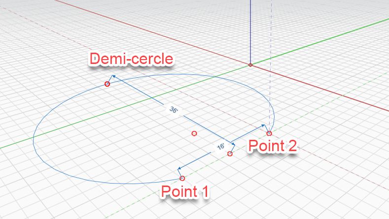

# Arco 

Utilice la herramienta Arco para crear medio círculo o arcos simétricos. Existen dos formas de crear arcos.

## Arco por tres puntos

Un arco se define mediante tres puntos y se puede dibujar en los ejes X, Y y Z. Defina el primer punto y, a continuación, determine una distancia desde el primer punto hasta el segundo. Por último, defina un tercer punto para la altura del arco. Se le proporcionará automáticamente un punto de "medio círculo" al que puede forzar el cursor; además, la línea de arco se extenderá más allá de los primeros dos puntos.

Puede ver la longitud entre el primer punto y el segundo mientras determina la próxima ubicación del segundo punto; para especificar manualmente una longitud, simplemente introduzca un valor y aparecerá un cuadro de cota.

Después de dibujar el arco, puede crear una cara mediante la [herramienta Línea](line-tool.md) para conectar el primer punto y el segundo.

## Arco por centro

.png>)

Seleccione el punto medio del arco y, a continuación, arrastre para elegir el centro y definir la longitud del arco. Solo tiene que empezar a escribir un valor para introducir un número preciso de grados para el arco.

## Edición de un arco

También puede modificar un arco que ya se haya colocado. Para ello, haga clic con el botón derecho en él y seleccione Editar arco en la parte inferior:

<figure><figcaption></figcaption></figure>

Aparecerán los pinzamientos de edición de arcos, que permiten cambiar el radio, el ángulo o la alineación del arco. El nuevo arco aparecerá como un contorno durante la edición.

<figure><figcaption></figcaption></figure>

Para completar la edición, salga de la herramienta. Para ello, haga clic en un espacio vacío o pulse ESC. El nuevo arco reemplazará al actual.
