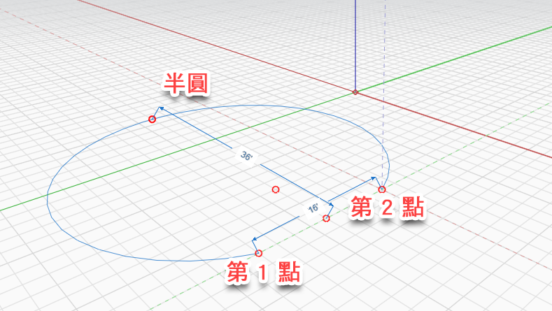

# Oblouk

Pomocí nástroje Oblouk můžete vytvářet poloviční kružnice nebo symetrické oblouky. Oblouky lze vytvářet dvěma způsoby.

## Oblouk pomocí tří bodů

Oblouk je definován třemi body a lze jej nakreslit na osách X, Y a Z. Definujte první bod, poté určete vzdálenost od prvního bodu ke druhému a nakonec zadáním třetího bodu definujte výšku oblouku. Automaticky se zobrazí bod „poloviční kružnice“, ke kterému se můžete přichytit. Za tímto bodem se čára oblouku protáhne za první dva body.

Při určování umístění druhého bodu se zobrazuje vzdálenost mezi prvním a druhým bodem. Chcete-li vzdálenost zadat ručně, stačí zadat hodnotu a zobrazí se pole kóty.

Po nakreslení oblouku můžete vytvořit plochu pomocí [nástroje Čára](line-tool.md), který spojí první a druhý bod.

## Oblouk pomocí středu

.png>)

Vyberte středový bod oblouku, poté tažením vyberte střed a tažením definujte délku oblouku. Chcete-li definovat přesný počet stupňů oblouku, jednoduše zadejte požadovanou hodnotu.

## Úpravy oblouku

Již umístěný oblouk můžete také upravit tak, že na něj kliknete pravým tlačítkem myši a v dolní části vyberete možnost Upravit oblouk:

<figure><figcaption></figcaption></figure>

Zobrazí se uzly pro úpravy oblouku, pomocí kterých můžete změnit poloměr, úhel nebo zarovnání oblouku. Nový oblouk se při úpravách zobrazí jako obrys.

<figure><figcaption></figcaption></figure>

Úpravy dokončíte kliknutím do prázdného prostoru nebo stisknutím klávesy Esc. Nový oblouk nahradí aktuální oblouk.
