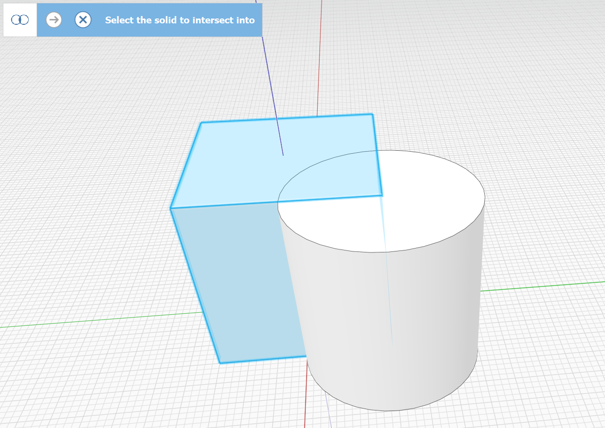

# Boolean Intesect

You can cut out the intersection of two objects or groups with the Intersect Tool. There are two ways to access the Intersect tool:

## Intersect from the Toolbar

Keyboard: I G

Run the Intersect command and follow the mode instruction in the upper left of the screen

Single-click to select an object to cut into:

Single click to select an object(s) or group(s) to take the intersection with:

.png>)

Click the checkmark to finish the command. The first object is replaced with the intersection of the selected geometry.

## Intersect from the Context Menu

1. Double-click to select the object to be cut into. (Single-click for a Group)
2. Holding the **CTRL key** double click an overlapping object(s) to intersect with.
3.  Right-click on the object that will be cut, and choose the **Intersect tool** in the Context Menu.&#x20;

    <figure><figcaption></figcaption></figure>
