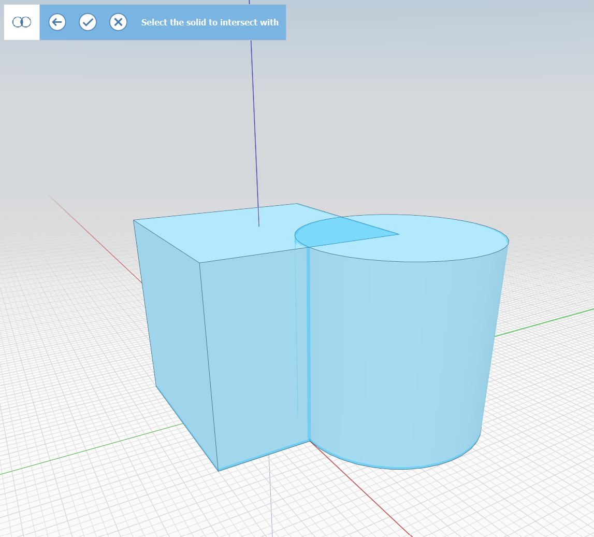

# ブール演算による交差 

[交差]ツールを使用して、2 つのオブジェクトまたはグループの交差を切り取ることができます。[交差]ツールにアクセスするには、次の 2 つの方法があります。

## ツールバーから交差を使用する

キーボード ショートカット: [I]、[G]

[交差]コマンドを実行し、画面の左上に表示されるモードの指示に従います。

切り取られる側のオブジェクトをシングルクリックで選択します:

<figure><figcaption></figcaption></figure>

交差を取得するオブジェクト、またはグループをシングルクリックで選択します。

<figure><figcaption></figcaption></figure>

チェックマークをクリックしてコマンドを終了します。1 つ目のオブジェクトは、選択したジオメトリの交差に置き換えられます。必要ない場合はオブジェクトを削除できます。

<figure><figcaption></figcaption></figure>

## コンテキスト メニューから交差する

1. 切り取られる側のオブジェクトをダブルクリックで選択します。(グループの場合はシングルクリック)
2. 交差する側の重なっているオブジェクトを、**[Ctrl]キー**を押しながらダブルクリックします。
3.  切り取るオブジェクトを右クリックし、コンテキスト メニューで**[交差]ツール**を選択します。

    <figure><figcaption></figcaption></figure>
