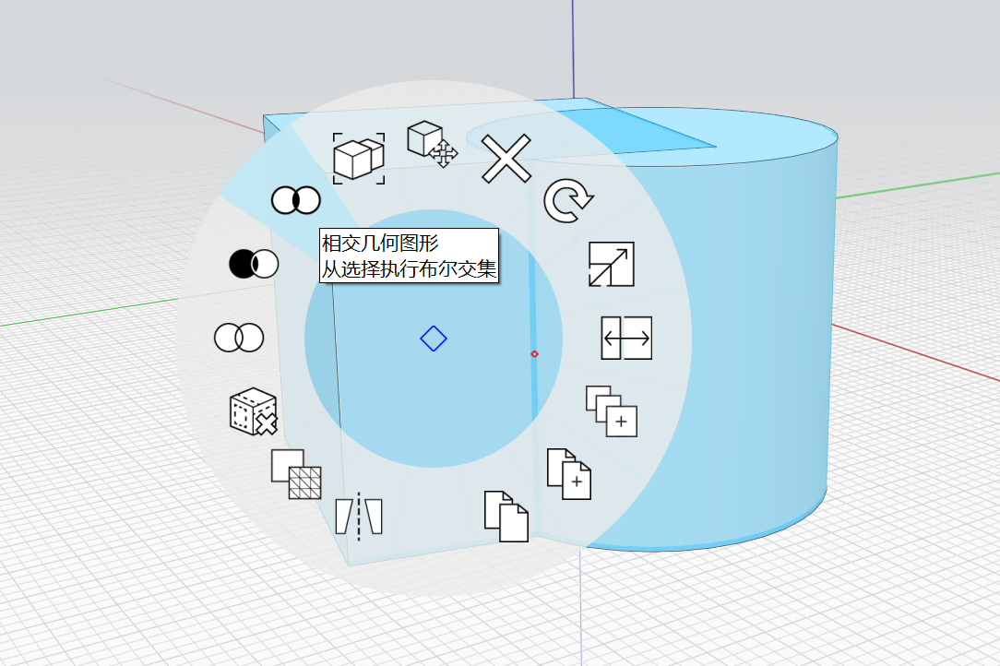

# 부울 교차 

교차 도구를 사용하여 두 객체 또는 그룹의 교차점을 잘라낼 수 있습니다. 교차 도구에 액세스하는 방법은 두 가지가 있습니다.

## 도구막대의 교차

키보드: I G

교차 명령을 실행하고 화면 왼쪽 위에 있는 모드 지침을 따릅니다.

한 번 클릭하여 잘라낼 객체를 선택합니다.

<figure><figcaption></figcaption></figure>

한 번 클릭하여 교차할 객체 또는 그룹을 선택합니다.

<figure><figcaption></figcaption></figure>

확인 표시를 클릭하여 명령을 완료합니다. 첫 번째 객체는 선택한 형상의 교차점으로 대치됩니다. 객체가 필요하지 않은 경우 삭제할 수 있습니다.

<figure><figcaption></figcaption></figure>

## 상황에 맞는 메뉴에서 교차

1. 잘라낼 객체를 두 번 클릭하여 선택합니다. (그룹의 경우 한 번 클릭)
2. **Ctrl 키**를 누른 상태에서 교차할 겹치는 객체를 두 번 클릭합니다.
3.  절단할 객체를 마우스 오른쪽 버튼으로 클릭하고 상황에 맞는 메뉴에서 **교차 도구**를 선택합니다. 

    <figure><figcaption></figcaption></figure>
