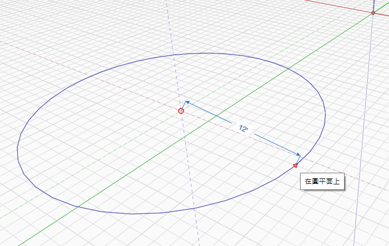
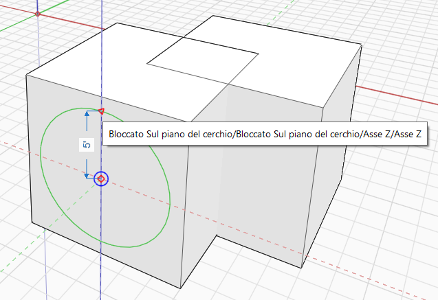
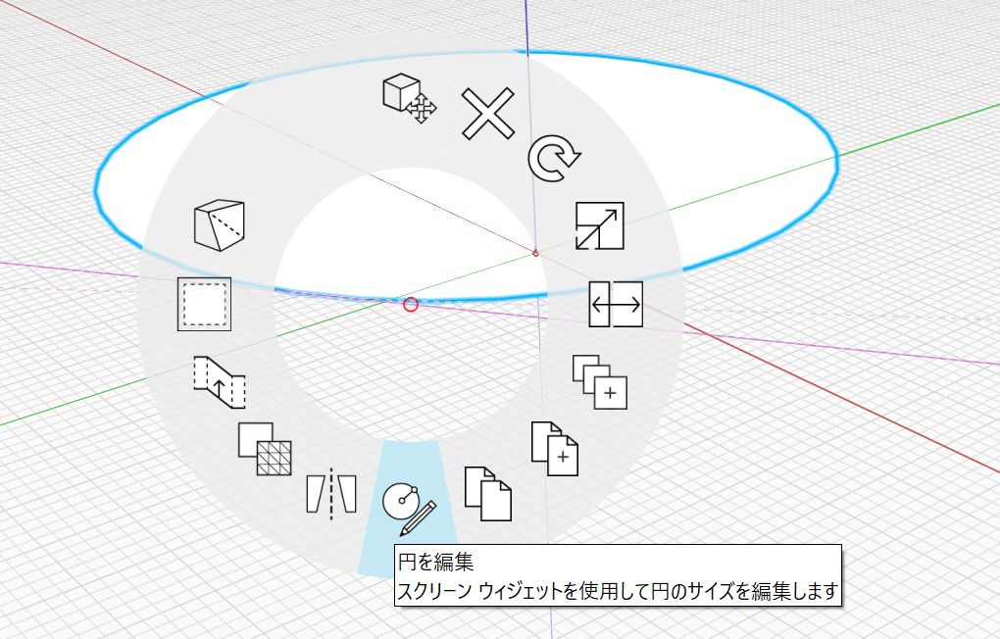

# Círculo 

## Dibujo de un círculo

Utilice la herramienta Círculo para dibujar un círculo en el espacio o en otro objeto.

Método abreviado de teclado: C

Para dibujar un círculo, seleccione primero el centro y, a continuación, especifique el radio del círculo. A continuación, el círculo se convierte automáticamente en una cara.

## Edición de un círculo

También puede modificar un círculo que ya se haya colocado. Para ello, haga clic con el botón derecho en él y seleccione Editar círculo en la parte inferior:

<figure><figcaption></figcaption></figure>

Aparecerán los pinzamientos de edición de círculos, que permiten cambiar el tamaño o la orientación del círculo. El nuevo círculo aparecerá como un contorno durante la edición.

Aparecerán los siguientes pinzamientos:

* El pinzamiento central controla el origen del círculo.
* El pinzamiento a lo largo del borde controla el radio del círculo.
* El pinzamiento de la parte superior controla la normal o la orientación del círculo.

<figure><figcaption></figcaption></figure>

Para completar la edición, salga de la herramienta. Para ello, haga clic en un espacio vacío o pulse ESC. El nuevo círculo reemplazará al actual.
